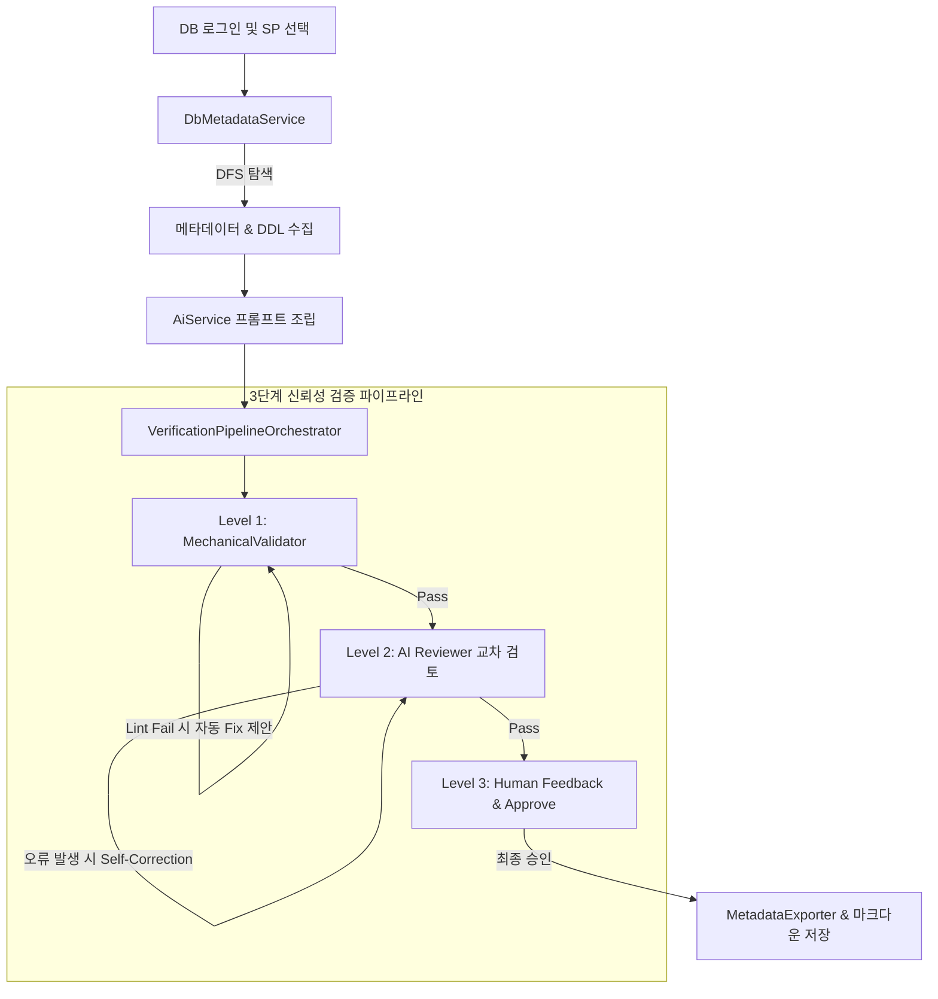

# 🤖 SP Analyzer Agent Guidelines (AGENTS.md)

이 문서는 **SQL Server Stored Procedure Reverse Engineering Tool (SP Analyzer)** 프로젝트를 분석하고, 수정하며, 확장하고자 하는 AI 에이전트를 위한 시스템 지침서입니다. 코드의 정합성과 아키텍처 설계를 유지하기 위해 다음 규칙들을 반드시 준수해 주십시오.

---

## 📌 프로젝트 개요 (Overview)

본 프로젝트는 SQL Server 2022에 구현된 Stored Procedure(SP)를 재귀적으로 분석하여 비즈니스 기능 명세서(`*_Spec.md`)와 여러 SP 기반의 통합 배치 전환 계획서(`*_BatchMigrationPlan.md`)를 작성하는 .NET Core 기반 CLI/TUI 도구입니다.

- **핵심 목표**: 레거시 DB 비즈니스 로직(SP)을 효율적으로 역공학하여 현대적인 애플리케이션 아키텍처(C#, Java Spring Batch 등)로 마이그레이션하기 위한 설계 산출물을 자동 생성 및 검증하는 것입니다.
- **신뢰성 보장**: AI가 단순 생성만 하고 끝나는 것이 아니라 **3단계 신뢰성 검증 파이프라인**을 통해 마크다운 문법, AI 자가 교정, 인간 피드백을 수렴하여 고품질의 설계를 유도합니다.

---

## 📂 프로젝트 구조 및 핵심 파일 (Structure & Key Links)

에이전트는 코드 수정 시 다음 구성 요소를 참조하고 알맞은 디렉토리에 변경사항을 작성해야 합니다.

### 1. Core 라이브러리: [SpAnalyzer.Core](file:///home/moondae/git-root/sp-reverse-engineering/src/SpAnalyzer.Core)
- **도메인 모델 ([Models](file:///home/moondae/git-root/sp-reverse-engineering/src/SpAnalyzer.Core/Models))**
  - [SpDefinition.cs](file:///home/moondae/git-root/sp-reverse-engineering/src/SpAnalyzer.Core/Models/SpDefinition.cs): 분석된 SP 메타데이터(소스코드 DDL, 컬럼, 의존성 등)를 관리하는 루트 데이터 클래스.
  - [DependencyInfo.cs](file:///home/moondae/git-root/sp-reverse-engineering/src/SpAnalyzer.Core/Models/DependencyInfo.cs): 재귀적으로 수집된 DB 개체(테이블, 뷰, 다른 SP 등) 의존성을 표현하는 모델.
  - [ColumnInfo.cs](file:///home/moondae/git-root/sp-reverse-engineering/src/SpAnalyzer.Core/Models/ColumnInfo.cs): 컬럼명, 데이터타입, PK/FK 정보 및 한글 설명을 수집하는 모델.
  - [HumanReviewResult.cs](file:///home/moondae/git-root/sp-reverse-engineering/src/SpAnalyzer.Core/Models/HumanReviewResult.cs): L3 피드백 및 개발자 승인 여부를 모델링.
- **비즈니스 서비스 ([Services](file:///home/moondae/git-root/sp-reverse-engineering/src/SpAnalyzer.Core/Services))**
  - [DbMetadataService.cs](file:///home/moondae/git-root/sp-reverse-engineering/src/SpAnalyzer.Core/Services/DbMetadataService.cs): SQL Server 메타데이터(Extended Properties, DDL, 의존성 관계)를 DFS 재귀 탐색을 활용해 수집하는 인터페이스([IDbMetadataService.cs](file:///home/moondae/git-root/sp-reverse-engineering/src/SpAnalyzer.Core/Services/IDbMetadataService.cs)) 구현체.
  - [AiService.cs](file:///home/moondae/git-root/sp-reverse-engineering/src/SpAnalyzer.Core/Services/AiService.cs): 수집한 정보를 프롬프트로 다듬어 AI 공급자에 분석 요청을 보내는 인터페이스([IAiService.cs](file:///home/moondae/git-root/sp-reverse-engineering/src/SpAnalyzer.Core/Services/IAiService.cs)) 구현체.
  - [Clients/](file:///home/moondae/git-root/sp-reverse-engineering/src/SpAnalyzer.Core/Services/Clients): 다중 AI 공급자(OpenAI, Google, Anthropic, Ollama)를 대응하는 [IAiClient.cs](file:///home/moondae/git-root/sp-reverse-engineering/src/SpAnalyzer.Core/Services/IAiClient.cs) 인터페이스 및 [AiClientFactory.cs](file:///home/moondae/git-root/sp-reverse-engineering/src/SpAnalyzer.Core/Services/Clients/AiClientFactory.cs)를 통한 팩토리 패턴 구현.
  - [MechanicalValidator.cs](file:///home/moondae/git-root/sp-reverse-engineering/src/SpAnalyzer.Core/Services/MechanicalValidator.cs): Markdig 파서 및 Mermaid 린터를 활용해 산출물 뼈대 및 다이어그램 문법을 정적 검증하는 클래스.
  - [VerificationPipelineOrchestrator.cs](file:///home/moondae/git-root/sp-reverse-engineering/src/SpAnalyzer.Core/Services/VerificationPipelineOrchestrator.cs): 3단계 검증 파이프라인의 오케스트레이션을 담당.
  - [MetadataExporter.cs](file:///home/moondae/git-root/sp-reverse-engineering/src/SpAnalyzer.Core/Services/MetadataExporter.cs): 원본 DB 메타데이터를 JSON, TXT 프롬프트, 개별 DDL/MD 파일 등으로 보존하고, 외부 코딩 에이전트용 개별 가이드라인 번들(`*_MigrationInstructions.md`) 및 통합 마이그레이션 지시서 번들(`{JobName}_MigrationInstructions.md`)을 생성하는 기능 구현체.
  - [CacheManager.cs](file:///home/moondae/git-root/sp-reverse-engineering/src/SpAnalyzer.Core/Services/CacheManager.cs): SHA-256 해시 기반 로컬 증분 분석 캐싱 서비스 구현체 ([ICacheManager.cs](file:///home/moondae/git-root/sp-reverse-engineering/src/SpAnalyzer.Core/Services/ICacheManager.cs) 포함).
  - [ICodingEngine.cs](file:///home/moondae/git-root/sp-reverse-engineering/src/SpAnalyzer.Core/Services/ICodingEngine.cs): 외부 코딩 에이전트 연동용 마이그레이션 생성기 추상 인터페이스.
  - [ExternalCliCodingEngine.cs](file:///home/moondae/git-root/sp-reverse-engineering/src/SpAnalyzer.Core/Services/ExternalCliCodingEngine.cs): CLI 기반 외부 에이전트 프로세스(Claude, agy, codex 등) 기동 및 콘솔 상속 연동 구현체.

### 2. CLI 실행 엔트리: [SpAnalyzer.Cli](file:///home/moondae/git-root/sp-reverse-engineering/src/SpAnalyzer.Cli)
- [Program.cs](file:///home/moondae/git-root/sp-reverse-engineering/src/SpAnalyzer.Cli/Program.cs): CLI 진입점이자 Spectre.Console 기반 TUI 메뉴 제어, 사용자 세션 검증, 배치(CLI) 모드 라우팅 및 흐름 오케스트레이션을 담당합니다.
- [ConsoleUserInteraction.cs](file:///home/moondae/git-root/sp-reverse-engineering/src/SpAnalyzer.Cli/ConsoleUserInteraction.cs): TUI와 사용자 간의 인터랙션 콘솔 처리를 정의한 구현체.
- [CodingEngineFactory.cs](file:///home/moondae/git-root/sp-reverse-engineering/src/SpAnalyzer.Cli/CodingEngineFactory.cs): 설정 파일에 기반해 다형적 외부 코딩 에이전트(`ICodingEngine`)를 구성하고 생성하는 팩토리 클래스.
- [appsettings.json](file:///home/moondae/git-root/sp-reverse-engineering/src/SpAnalyzer.Cli/appsettings.json): 데이터베이스 정보 및 AI 설정 정보를 관리하는 구성 파일.
- [instructions.md](file:///home/moondae/git-root/sp-reverse-engineering/src/SpAnalyzer.Cli/instructions.md): AI 프롬프트에 동적으로 바인딩되는 세부 분석 가이드라인 템플릿.

### 3. 단위 테스트: [SpAnalyzer.Core.Tests](file:///home/moondae/git-root/sp-reverse-engineering/tests/SpAnalyzer.Core.Tests)
- 핵심 DB 메타데이터 파싱, 예외 상황 대응, AI 연동, 3단계 검증기 단위 테스트가 작성되어 있습니다.

### 4. 코드 검증 Core 라이브러리: [SpAnalyzer.Validator.Core](file:///home/moondae/git-root/sp-reverse-engineering/src/SpAnalyzer.Validator.Core)
- **추상화 및 도메인 모델 ([Abstractions](file:///home/moondae/git-root/sp-reverse-engineering/src/SpAnalyzer.Validator.Core/Abstractions), [Models](file:///home/moondae/git-root/sp-reverse-engineering/src/SpAnalyzer.Validator.Core/Models))**
  - [IValidatorPlugin.cs](file:///home/moondae/git-root/sp-reverse-engineering/src/SpAnalyzer.Validator.Core/Abstractions/IValidatorPlugin.cs): C#, Java 등 언어별 L1 정적 구조 및 명칭 검증을 구현하는 플러그인 인터페이스.
  - [IRuntimeRunner.cs](file:///home/moondae/git-root/sp-reverse-engineering/src/SpAnalyzer.Validator.Core/Abstractions/IRuntimeRunner.cs): 타겟 런타임 코드 실행을 위한 인터페이스 규격 정의.
  - [ValidationResult.cs](file:///home/moondae/git-root/sp-reverse-engineering/src/SpAnalyzer.Validator.Core/Models/ValidationResult.cs): 검증 대상의 L1/L2/L3 전체 상태를 관리하는 데이터 모델.
  - [GapReport.cs](file:///home/moondae/git-root/sp-reverse-engineering/src/SpAnalyzer.Validator.Core/Models/GapReport.cs): AI가 분석한 로직, 입출력, 예외 처리의 불일치(Gap) 명세 및 해결 가이드 모델.
  - [RunnerDtos.cs](file:///home/moondae/git-root/sp-reverse-engineering/src/SpAnalyzer.Validator.Core/Models/RunnerDtos.cs): 레거시 및 타겟 런타임 입출력 수집 데이터 구조 정의.
- **검증 비즈니스 서비스 ([Services](file:///home/moondae/git-root/sp-reverse-engineering/src/SpAnalyzer.Validator.Core/Services), [Plugins](file:///home/moondae/git-root/sp-reverse-engineering/src/SpAnalyzer.Validator.Core/Plugins))**
  - [FileMappingService.cs](file:///home/moondae/git-root/sp-reverse-engineering/src/SpAnalyzer.Validator.Core/Services/FileMappingService.cs): 설계서 파일(`*_Spec.md`)과 마이그레이션된 소스 파일을 스캔하여 1:1로 매핑하는 서비스. 상대경로 중복 접두사 자동 보정 기능 포함.
  - [ValidatorAiService.cs](file:///home/moondae/git-root/sp-reverse-engineering/src/SpAnalyzer.Validator.Core/Services/ValidatorAiService.cs): AI에게 설계서와 소스코드를 전달하여 의미론적 일치성을 검사하고 GapReport 구조로 파싱하는 서비스.
  - [SpExecutionService.cs](file:///home/moondae/git-root/sp-reverse-engineering/src/SpAnalyzer.Validator.Core/Services/SpExecutionService.cs): SQL Server DB에서 Stored Procedure를 동적으로 실행하고 다중 ResultSet 결과를 JSON으로 덤프하는 서비스.
  - [CSharpReflectionRunner.cs](file:///home/moondae/git-root/sp-reverse-engineering/src/SpAnalyzer.Validator.Core/Services/CSharpReflectionRunner.cs): 마이그레이션된 C# DLL 리플렉션 로드 및 DbTransaction 롤백 자동 격리 실행기.
  - [JavaProcessRunner.cs](file:///home/moondae/git-root/sp-reverse-engineering/src/SpAnalyzer.Validator.Core/Services/JavaProcessRunner.cs): Java 컴파일 JAR/클래스를 외부 프로세스로 기동하여 stdin/stdout 통신을 수행하는 실행기.
  - [DataComparisonService.cs](file:///home/moondae/git-root/sp-reverse-engineering/src/SpAnalyzer.Validator.Core/Services/DataComparisonService.cs): 레거시 vs 타겟 JSON 데이터의 행 수, 컬럼 타입, 개별 값을 1:1 대조하여 마크다운 리포트 생성하는 서비스.
  - [CodeVerificationOrchestrator.cs](file:///home/moondae/git-root/sp-reverse-engineering/src/SpAnalyzer.Validator.Core/Services/CodeVerificationOrchestrator.cs): L1(정적) -> L2(AI Gap분석) -> L3(사용자 승인) 흐름 제어 및 `validation_summary.md` 결과 마크다운 Export 서비스.

### 5. 코드 검증 CLI 실행 엔트리: [SpAnalyzer.Validator.Cli](file:///home/moondae/git-root/sp-reverse-engineering/src/SpAnalyzer.Validator.Cli)
- [Program.cs](file:///home/moondae/git-root/sp-reverse-engineering/src/SpAnalyzer.Validator.Cli/Program.cs): 검증기 CLI 진입점. 취소 바인딩, 동적 디렉토리 자동완성 Choices 로직 및 기밀 파일 다중 경로 대체 스캔 탑재.
- [ConsoleUserInteraction.cs](file:///home/moondae/git-root/sp-reverse-engineering/src/SpAnalyzer.Validator.Cli/ConsoleUserInteraction.cs): TUI 경로 입력 대화창(ShowChoices(false) 설정) 및 Gap 분석 결과 패널 렌더링.

---

## 🛠 아키텍처 및 작업 흐름 (Workflow)



---

## 🚨 개발 에이전트 핵심 준수 규칙 (Development Rules)

### 1. 보안 최우선 법칙
- **절대 비공개 API Key를 소스 코드나 [appsettings.json](file:///home/moondae/git-root/sp-reverse-engineering/src/SpAnalyzer.Cli/appsettings.json)에 포함하여 커밋하지 마십시오.**
- 로컬 개발용 API Key는 Git 추적 제외 대상인 `src/SpAnalyzer.Cli/appsettings.local.json`을 새로 생성하여 관리해야 합니다.

### 2. 안전한 Soft Fail (예외 격리 정책)
- SQL Server DB 메타데이터 수집([DbMetadataService.cs](file:///home/moondae/git-root/sp-reverse-engineering/src/SpAnalyzer.Core/Services/DbMetadataService.cs)) 시, 특정 테이블이나 뷰에 대한 스키마 조회 권한이 없는 경우 전체 프로세스를 크래시(`throw`)하지 마십시오.
- 권한 오류가 나면 경고 목록(`Warnings`)에 기록하고 안전하게 소프트 스킵하여, AI 프롬프트 및 TUI 화면에 수집 오류가 명시적으로 고지되도록 설계해야 합니다.
- 원천 데이터 파일 덤프([MetadataExporter.cs](file:///home/moondae/git-root/sp-reverse-engineering/src/SpAnalyzer.Core/Services/MetadataExporter.cs)) 과정에서 디스크 쓰기 오류(용량 부족 등)가 발생하더라도 핵심 산출물 저장은 끝까지 완료될 수 있도록 에러 핸들러로 감싸주어야 합니다.

### 3. Spectre.Console 렌더링 충돌 예방 (Escape 처리)
- 렌더링할 텍스트에 대괄호(`[...]`)가 포함되어 있으면 Spectre.Console은 이를 마크업 태그로 오인하여 `System.InvalidOperationException`을 던집니다.
- DB 메타데이터나 AI 분석 원문, 파일 경로 등 대괄호가 포함될 여지가 있는 모든 정보를 TUI에 출력할 때는 반드시 **`Markup.Escape()`** 메소드를 호출하여 출력해야 합니다.
- 예: `AnsiConsole.MarkupLine($"[green]Analyzed:[/] {Markup.Escape(spName)}")`

### 4. 3단계 검증 파이프라인의 명확한 역할 분리
- **L1 (정적 검증)**: [MechanicalValidator.cs](file:///home/moondae/git-root/sp-reverse-engineering/src/SpAnalyzer.Core/Services/MechanicalValidator.cs)에서 Markdig 파서 구조적 필수 섹션 헤더 검증과 Mermaid 다이어그램 린팅을 엄격히 수행하십시오. L1 검증 실패 시 즉시 보완 프롬프트 제안을 리턴합니다.
- **L2 (AI 교차 검토)**: [AiService.cs](file:///home/moondae/git-root/sp-reverse-engineering/src/SpAnalyzer.Core/Services/AiService.cs)를 통해 분석가 에이전트와 검토자(Reviewer) 에이전트를 분리하고 `Self-Correction` 한도(`MaxL2Attempts`)를 넘지 않도록 자가 보완 루프를 제어합니다.
- **L3 (인간 승인)**: 대화형 CLI 모드에서는 [IVerificationUserInteraction.cs](file:///home/moondae/git-root/sp-reverse-engineering/src/SpAnalyzer.Core/Services/IVerificationUserInteraction.cs)의 인터페이스 지침에 맞추어 미리보기를 제공하고 승인 혹은 추가 피드백 입력을 대기시킵니다. 무인 배치 모드에서는 자동으로 승인된 것으로 처리하도록 설계해야 합니다.

### 5. 신규 AI 공급자 추가 가이드
- 새로운 LLM 공급자 연동이 필요한 경우, [IAiClient.cs](file:///home/moondae/git-root/sp-reverse-engineering/src/SpAnalyzer.Core/Services/IAiClient.cs)를 상속하여 클라이언트를 생성하고, [AiClientFactory.cs](file:///home/moondae/git-root/sp-reverse-engineering/src/SpAnalyzer.Core/Services/Clients/AiClientFactory.cs) 및 `appsettings.json` 내 `AiSettings`에 매핑 설정을 신규 노드로 추가해 주십시오.

### 6. 단위 테스트 회귀 방지
- 변경 사항이 발생하면 반드시 `dotnet test` 명령을 활용하여 기존 단위 테스트 및 신규 Validator 단위 테스트([tests/SpAnalyzer.Core.Tests/ValidatorTests.cs](file:///home/moondae/git-root/sp-reverse-engineering/tests/SpAnalyzer.Core.Tests/ValidatorTests.cs))를 모두 통과하는지 확인해야 합니다.

### 7. TUI 디렉토리 입력 피드백 및 이스케이프 준수
- 프로그램 구동 시 필수 디렉토리 경로가 존재하지 않는다면 무조건 종료(Crash)하기보다, TUI 상에서 사용자에게 올바른 경로를 입력하도록 재요청하는 프롬프트를 반드시 띄우십시오.
- 입력을 유도하는 프롬프트(Spectre.Console `TextPrompt`) 작성 시, 디렉토리 내 슬래시('/') 문자가 선택지 구분선으로 렌더링되어 지저분해지는 현상을 막기 위해 반드시 **`.ShowChoices(false)`**를 결합하여 화면 노출을 방지하십시오.
- 경로 계산의 기준점은 항상 현재 실행 중인 쉘 경로인 **`Directory.GetCurrentDirectory()`**로 설정하여 사용자가 `../../` 없이 직관적인 경로를 사용하게 하십시오.

### 8. 데이터 정합성 검증 DB 실행의 Soft Fail 정책
- Stored Procedure 실행 데이터를 Legacy SQL Server에서 수집할 때(`SpExecutionService`), 서버 네트워크 차단이나 패스워드 만료 등으로 데이터베이스 연결(`conn.OpenAsync`)이 실패하더라도 검증 프로그램 전체가 비정상 크래시(Crash)나 예외 중단되게 하지 마십시오.
- 연결 실패(또는 쿼리 수행 오류) 등은 반드시 `try-catch` 블록으로 안전하게 격리하고, 결과 JSON DTO의 각 테스트 케이스에 상태를 `FAIL`로 전환하고 구체적인 예외 메시지를 `ErrorCode` 필드에 기재하여 Soft Fail 형태로 데이터를 안전하게 직렬화해 내보내야 합니다.

### 9. DDL 해시 기반 로컬 증분 캐싱 규칙
- 분석 대상 SP 정의 문자열과 모든 의존성 스펙 DDL 문자열을 SHA-256 해시 처리하고 키로 정렬하여 Composite Signature Hash를 일관되게 생성해야 합니다.
- 캐시 인덱스 `.sp_cache_index.json` 파일을 조작하거나 처리할 때의 예외는 반드시 try-catch로 격리(Soft Fail)하여, 캐싱 모듈의 에러로 인해 전체 마이그레이션 파이프라인 분석이 중단되지 않도록 방지해 주십시오.

### 10. 타겟 러너 트랜잭션 격리 및 프로세스 타임아웃
- C# 타겟 리플렉션 러너 호출 시 생성되는 `DbTransaction`은 비즈니스 로직 구동 완료 성공/실패 여부를 막론하고 항상 **`Rollback()`** 처리하여 Sandbox DB 상태 변경을 완벽히 격리해야 합니다.
- Java 외부 프로세스 타겟 러너 구동 시에는 30초의 타임아웃 제한을 명확히 설정하여 Java 프로그램 오동작 시 전체 검증 CLI가 무한 정지하는 것을 막아야 합니다.

### 11. TUI 로그인 연결 정보 실시간 변경 지원
- 로그인 시 로컬 세션 파일(`.session.json`)로부터 정보를 불러온 경우에도, 사용자가 원할 경우 appsettings.json을 수정하지 않고 즉석에서 서버 주소 및 데이터베이스 이름을 수정하여 다른 대상 데이터베이스에 접속할 수 있도록 입력 기회를 제공해야 합니다.

### 12. Multi-SP 통합 계획 순서 보장 (물리 선택 순서 보장)
- 배치 마이그레이션 통합 전환 계획서 수립 시, 계획서 내 배치 스텝의 순서는 사용자가 의도하여 선택한 순서대로 기입되어야 합니다.
- 이를 달성하기 위해 한 번에 여러 개를 체크하는 다중 선택 대신, 사용자가 원하는 순서대로 하나씩 추가하고 완료 키를 눌러 종료하는 순차 선택 루프 방식으로 수집 흐름을 통제해야 합니다.

### 13. 코딩 에이전트 가이드라인 및 번들 생성 규칙
- `ExportMigrationInstructionsAsync` 및 `ExportConsolidatedMigrationInstructionsAsync`는 비즈니스 설계서, 통합 배치 전환 계획서, 원본 SP DDL 및 모든 의존성 스펙들을 코딩 에이전트가 완벽히 이해할 수 있도록 마크다운으로 구조화하여 하나로 묶어줘야 합니다.
- 지시서 하단에 사용자가 복사해서 외부 코딩 에이전트(Claude Code, agy, codex 등)에 즉시 입력할 수 있는 안내 프롬프트를 반드시 명시적으로 포함해야 합니다.
- 파일 작성 전에 대상 출력 디렉터리(`baseOutputDir`)가 실제 존재하는지 확인하고, 존재하지 않는 경우 자동으로 폴더를 선행 생성하여 디바이스 쓰기 예외를 사전에 격리해 주어야 합니다.
- **외부 코딩 에이전트 CLI 프로세스 기동 규칙**:
  - 외부 에이전트(Claude Code, agy, codex 등) 기동 시, 사용자가 직접 자연어 질의응답 및 승인 등의 흐름을 진행할 수 있도록 **부모 콘솔의 입출력 스트림을 직접 상속 공유(`RedirectStandardInput/Output = false`)**하여 대화형 세션을 원활히 지원해야 합니다.
  - 비동기 작업 취소(`CancellationToken`) 수신 시, 구동 중인 외부 코딩 에이전트 프로세스가 백그라운드에서 좀비 프로세스로 남지 않도록 **강제 종료(`process.Kill(true)`)** 처리를 완벽히 수행해야 합니다.
  - 외부 코딩 에이전트(Claude Code 등) 호출 시, 띄어쓰기가 포함된 프롬프트 구문 전체가 단일 쿼리 인자로 에이전트에 안전하게 인식될 수 있도록 **인자 템플릿(Arguments) 전체를 쌍따옴표(`\"...\"`)로 감싸서 구성**해야 합니다. (예: `"Arguments": "\"write code using {instructions}\""` 또는 `"Arguments": "\"{instructions}\""`)

### 14. 소스 코드 자동 생성(Codegen)의 실행 시점 제약
- 소스 코드 생성기(Codegen)는 개별 SP 분석 완료 직후에는 기동되지 않도록 제한해야 합니다.
- 코드 자동 생성(Codegen) 브릿지는 반드시 복수 개의 SP가 연계된 **통합 배치 전환 계획서(`*_BatchMigrationPlan.md`) 수립 및 최종 승인 완료 시점**에, 병합된 통합 마이그레이션 지시서(`{JobName}_MigrationInstructions.md`)를 기반으로 에이전트(Claude Code 등)를 기동시켜야 합니다.

---

## 🏃 에이전트 로컬 작업 커맨드

### 프로젝트 빌드 및 실행
```bash
# 종속성 복원 및 빌드
dotnet build

# CLI TUI 대화형 모드 실행
dotnet run --project src/SpAnalyzer.Cli

# CLI 특정 SP 분석 배치 자동화 실행
dotnet run --project src/SpAnalyzer.Cli -- --conn "Server=localhost;Database=Northwind;User ID=sa;Password=your_password;TrustServerCertificate=true" --sp dbo.CustOrderHist

# 코드 일치성 검증 대화형 TUI 모드 실행
dotnet run --project src/SpAnalyzer.Validator.Cli

# 소스코드 일치성 검증 자동화 배치 모드 실행
dotnet run --project src/SpAnalyzer.Validator.Cli -- --spec "./output" --code "./src" --batch

# 데이터 정합성 검증용 테스트 파라미터 설계 배치 모드 실행
dotnet run --project src/SpAnalyzer.Validator.Cli -- --spec "./output" --gen-inputs --batch

# 레거시 DB 결과 데이터 수집 배치 모드 실행
dotnet run --project src/SpAnalyzer.Validator.Cli -- --exec-legacy --conn "Server=localhost;Database=Northwind;User ID=sa;Password=your_password;TrustServerCertificate=true" --batch

# 신규 마이그레이션 타겟 결과 데이터 수집 배치 모드 실행
dotnet run --project src/SpAnalyzer.Validator.Cli -- --exec-target --conn "Server=localhost;Database=Northwind;User ID=sa;Password=your_password;TrustServerCertificate=true" --batch

# 데이터 정합성 1:1 대조 배치 모드 실행
dotnet run --project src/SpAnalyzer.Validator.Cli -- --compare-data --batch
```

### 테스트 실행
```bash
dotnet test
```
