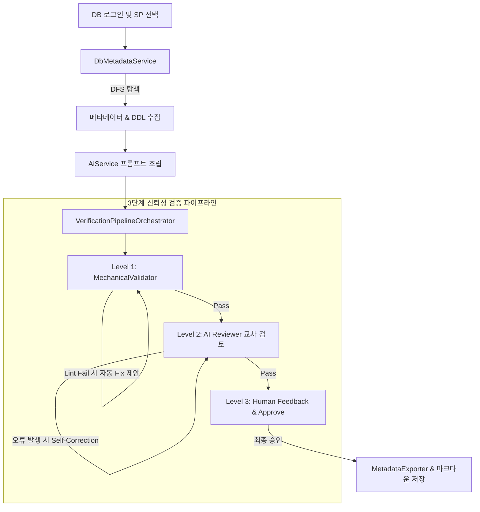

# 🤖 SP Analyzer Agent Guidelines (AGENTS.md)

이 문서는 **SQL Server Stored Procedure Reverse Engineering Tool (SP Analyzer)** 프로젝트를 분석하고, 수정하며, 확장하고자 하는 AI 에이전트를 위한 시스템 지침서입니다. 코드의 정합성과 아키텍처 설계를 유지하기 위해 다음 규칙들을 반드시 준수해 주십시오.

---

## 📌 프로젝트 개요 (Overview)

본 프로젝트는 SQL Server 2022에 구현된 Stored Procedure(SP)를 재귀적으로 분석하여 비즈니스 기능 명세서(`*_Spec.md`)와 여러 SP 기반의 통합 배치 전환 계획서(`*_BatchMigrationPlan.md`)를 작성하는 .NET Core 기반 CLI/TUI 도구입니다.

- **핵심 목표**: 레거시 DB 비즈니스 로직(SP)을 효율적으로 역공학하여 현대적인 애플리케이션 아키텍처(C#, Java Spring Batch 등)로 마이그레이션하기 위한 설계 산출물을 자동 생성 및 검증하는 것입니다.
- **신뢰성 보장**: AI가 단순 생성만 하고 끝나는 것이 아니라 **3단계 신뢰성 검증 파이프라인**을 통해 마크다운 문법, AI 자가 교정, 인간 피드백을 수렴하여 고품질의 설계를 유도합니다.

---

## 📂 프로젝트 구조 및 핵심 파일 (Structure & Key Links)

에이전트는 코드 수정 시 다음 구성 요소를 참조하고 알맞은 디렉토리에 변경사항을 작성해야 합니다.

### 1. Core 라이브러리: [SpAnalyzer.Core](file:///home/moondae/git-root/sp-reverse-engineering/src/SpAnalyzer.Core)
- **도메인 모델 ([Models](file:///home/moondae/git-root/sp-reverse-engineering/src/SpAnalyzer.Core/Models))**
  - [SpDefinition.cs](file:///home/moondae/git-root/sp-reverse-engineering/src/SpAnalyzer.Core/Models/SpDefinition.cs): 분석된 SP 메타데이터(소스코드 DDL, 컬럼, 의존성 등)를 관리하는 루트 데이터 클래스.
  - [DependencyInfo.cs](file:///home/moondae/git-root/sp-reverse-engineering/src/SpAnalyzer.Core/Models/DependencyInfo.cs): 재귀적으로 수집된 DB 개체(테이블, 뷰, 다른 SP 등) 의존성을 표현하는 모델.
  - [ColumnInfo.cs](file:///home/moondae/git-root/sp-reverse-engineering/src/SpAnalyzer.Core/Models/ColumnInfo.cs): 컬럼명, 데이터타입, PK/FK 정보 및 한글 설명을 수집하는 모델.
  - [HumanReviewResult.cs](file:///home/moondae/git-root/sp-reverse-engineering/src/SpAnalyzer.Core/Models/HumanReviewResult.cs): L3 피드백 및 개발자 승인 여부를 모델링.
- **비즈니스 서비스 ([Services](file:///home/moondae/git-root/sp-reverse-engineering/src/SpAnalyzer.Core/Services))**
  - [DbMetadataService.cs](file:///home/moondae/git-root/sp-reverse-engineering/src/SpAnalyzer.Core/Services/DbMetadataService.cs): SQL Server 메타데이터(Extended Properties, DDL, 의존성 관계)를 DFS 재귀 탐색을 활용해 수집하는 인터페이스([IDbMetadataService.cs](file:///home/moondae/git-root/sp-reverse-engineering/src/SpAnalyzer.Core/Services/IDbMetadataService.cs)) 구현체.
  - [AiService.cs](file:///home/moondae/git-root/sp-reverse-engineering/src/SpAnalyzer.Core/Services/AiService.cs): 수집한 정보를 프롬프트로 다듬어 AI 공급자에 분석 요청을 보내는 인터페이스([IAiService.cs](file:///home/moondae/git-root/sp-reverse-engineering/src/SpAnalyzer.Core/Services/IAiService.cs)) 구현체.
  - [Clients/](file:///home/moondae/git-root/sp-reverse-engineering/src/SpAnalyzer.Core/Services/Clients): 다중 AI 공급자(OpenAI, Gemini, Anthropic, Ollama)를 대응하는 [IAiClient.cs](file:///home/moondae/git-root/sp-reverse-engineering/src/SpAnalyzer.Core/Services/IAiClient.cs) 인터페이스 및 [AiClientFactory.cs](file:///home/moondae/git-root/sp-reverse-engineering/src/SpAnalyzer.Core/Services/Clients/AiClientFactory.cs)를 통한 팩토리 패턴 구현.
  - [MechanicalValidator.cs](file:///home/moondae/git-root/sp-reverse-engineering/src/SpAnalyzer.Core/Services/MechanicalValidator.cs): Markdig 파서 및 Mermaid 린터를 활용해 산출물 뼈대 및 다이어그램 문법을 정적 검증하는 클래스.
  - [VerificationPipelineOrchestrator.cs](file:///home/moondae/git-root/sp-reverse-engineering/src/SpAnalyzer.Core/Services/VerificationPipelineOrchestrator.cs): 3단계 검증 파이프라인의 오케스트레이션을 담당.
  - [MetadataExporter.cs](file:///home/moondae/git-root/sp-reverse-engineering/src/SpAnalyzer.Core/Services/MetadataExporter.cs): 원본 DB 메타데이터를 JSON, TXT 프롬프트, 개별 DDL/MD 파일 등으로 출력 디렉토리에 보존하는 기능 구현체.

### 2. CLI 실행 엔트리: [SpAnalyzer.Cli](file:///home/moondae/git-root/sp-reverse-engineering/src/SpAnalyzer.Cli)
- [Program.cs](file:///home/moondae/git-root/sp-reverse-engineering/src/SpAnalyzer.Cli/Program.cs): CLI 진입점이자 Spectre.Console 기반 TUI 메뉴 제어, 사용자 세션 검증, 배치(CLI) 모드 라우팅 및 흐름 오케스트레이션을 담당합니다.
- [ConsoleUserInteraction.cs](file:///home/moondae/git-root/sp-reverse-engineering/src/SpAnalyzer.Cli/ConsoleUserInteraction.cs): TUI와 사용자 간의 인터랙션 콘솔 처리를 정의한 구현체.
- [appsettings.json](file:///home/moondae/git-root/sp-reverse-engineering/src/SpAnalyzer.Cli/appsettings.json): 데이터베이스 정보 및 AI 설정 정보를 관리하는 구성 파일.
- [instructions.md](file:///home/moondae/git-root/sp-reverse-engineering/src/SpAnalyzer.Cli/instructions.md): AI 프롬프트에 동적으로 바인딩되는 세부 분석 가이드라인 템플릿.

### 3. 단위 테스트: [SpAnalyzer.Core.Tests](file:///home/moondae/git-root/sp-reverse-engineering/tests/SpAnalyzer.Core.Tests)
- 핵심 DB 메타데이터 파싱, 예외 상황 대응, AI 연동, 3단계 검증기 단위 테스트가 작성되어 있습니다.

---

## 🛠 아키텍처 및 작업 흐름 (Workflow)



---

## 🚨 개발 에이전트 핵심 준수 규칙 (Development Rules)

### 1. 보안 최우선 법칙
- **절대 비공개 API Key를 소스 코드나 [appsettings.json](file:///home/moondae/git-root/sp-reverse-engineering/src/SpAnalyzer.Cli/appsettings.json)에 포함하여 커밋하지 마십시오.**
- 로컬 개발용 API Key는 Git 추적 제외 대상인 `src/SpAnalyzer.Cli/appsettings.local.json`을 새로 생성하여 관리해야 합니다.

### 2. 안전한 Soft Fail (예외 격리 정책)
- SQL Server DB 메타데이터 수집([DbMetadataService.cs](file:///home/moondae/git-root/sp-reverse-engineering/src/SpAnalyzer.Core/Services/DbMetadataService.cs)) 시, 특정 테이블이나 뷰에 대한 스키마 조회 권한이 없는 경우 전체 프로세스를 크래시(`throw`)하지 마십시오.
- 권한 오류가 나면 경고 목록(`Warnings`)에 기록하고 안전하게 소프트 스킵하여, AI 프롬프트 및 TUI 화면에 수집 오류가 명시적으로 고지되도록 설계해야 합니다.
- 원천 데이터 파일 덤프([MetadataExporter.cs](file:///home/moondae/git-root/sp-reverse-engineering/src/SpAnalyzer.Core/Services/MetadataExporter.cs)) 과정에서 디스크 쓰기 오류(용량 부족 등)가 발생하더라도 핵심 산출물 저장은 끝까지 완료될 수 있도록 에러 핸들러로 감싸주어야 합니다.

### 3. Spectre.Console 렌더링 충돌 예방 (Escape 처리)
- 렌더링할 텍스트에 대괄호(`[...]`)가 포함되어 있으면 Spectre.Console은 이를 마크업 태그로 오인하여 `System.InvalidOperationException`을 던집니다.
- DB 메타데이터나 AI 분석 원문, 파일 경로 등 대괄호가 포함될 여지가 있는 모든 정보를 TUI에 출력할 때는 반드시 **`Markup.Escape()`** 메소드를 호출하여 출력해야 합니다.
- 예: `AnsiConsole.MarkupLine($"[green]Analyzed:[/] {Markup.Escape(spName)}")`

### 4. 3단계 검증 파이프라인의 명확한 역할 분리
- **L1 (정적 검증)**: [MechanicalValidator.cs](file:///home/moondae/git-root/sp-reverse-engineering/src/SpAnalyzer.Core/Services/MechanicalValidator.cs)에서 Markdig 파서 구조적 필수 섹션 헤더 검증과 Mermaid 다이어그램 린팅을 엄격히 수행하십시오. L1 검증 실패 시 즉시 보완 프롬프트 제안을 리턴합니다.
- **L2 (AI 교차 검토)**: [AiService.cs](file:///home/moondae/git-root/sp-reverse-engineering/src/SpAnalyzer.Core/Services/AiService.cs)를 통해 분석가 에이전트와 검토자(Reviewer) 에이전트를 분리하고 `Self-Correction` 한도(`MaxL2Attempts`)를 넘지 않도록 자가 보완 루프를 제어합니다.
- **L3 (인간 승인)**: 대화형 CLI 모드에서는 [IVerificationUserInteraction.cs](file:///home/moondae/git-root/sp-reverse-engineering/src/SpAnalyzer.Core/Services/IVerificationUserInteraction.cs)의 인터페이스 지침에 맞추어 미리보기를 제공하고 승인 혹은 추가 피드백 입력을 대기시킵니다. 무인 배치 모드에서는 자동으로 승인된 것으로 처리하도록 설계해야 합니다.

### 5. 신규 AI 공급자 추가 가이드
- 새로운 LLM 공급자 연동이 필요한 경우, [IAiClient.cs](file:///home/moondae/git-root/sp-reverse-engineering/src/SpAnalyzer.Core/Services/IAiClient.cs)를 상속하여 클라이언트를 생성하고, [AiClientFactory.cs](file:///home/moondae/git-root/sp-reverse-engineering/src/SpAnalyzer.Core/Services/Clients/AiClientFactory.cs) 및 `appsettings.json` 내 `AiSettings`에 매핑 설정을 신규 노드로 추가해 주십시오.

### 6. 단위 테스트 회귀 방지
- 변경 사항이 발생하면 반드시 `dotnet test` 명령을 활용하여 기존 18개 이상의 단위 테스트([tests/SpAnalyzer.Core.Tests/](file:///home/moondae/git-root/sp-reverse-engineering/tests/SpAnalyzer.Core.Tests))를 수행하고 통과하는지 확인해야 합니다. 신규 기능 추가 시 상응하는 단위 테스트를 추가 작성하십시오.

---

## 🏃 에이전트 로컬 작업 커맨드

### 프로젝트 빌드 및 실행
```bash
# 종속성 복원 및 빌드
dotnet build

# CLI TUI 대화형 모드 실행
dotnet run --project src/SpAnalyzer.Cli

# CLI 특정 SP 분석 배치 자동화 실행
dotnet run --project src/SpAnalyzer.Cli -- --conn "Server=localhost;Database=Northwind;User ID=sa;Password=your_password;TrustServerCertificate=true" --sp dbo.CustOrderHist
```

### 테스트 실행
```bash
dotnet test
```
