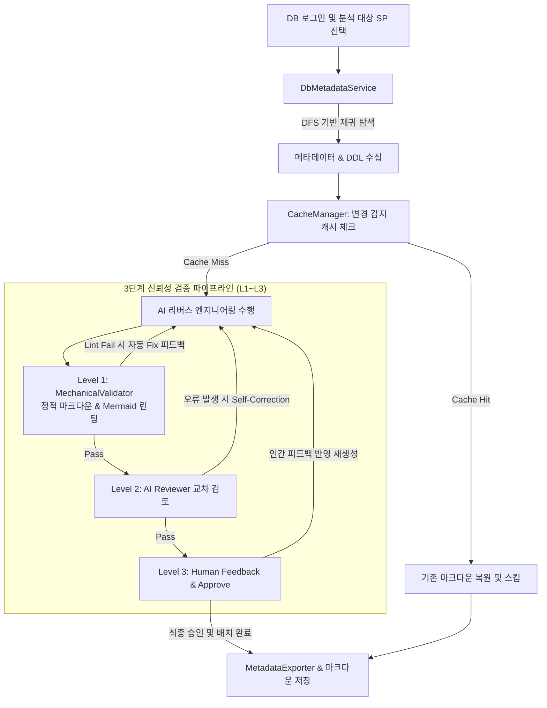
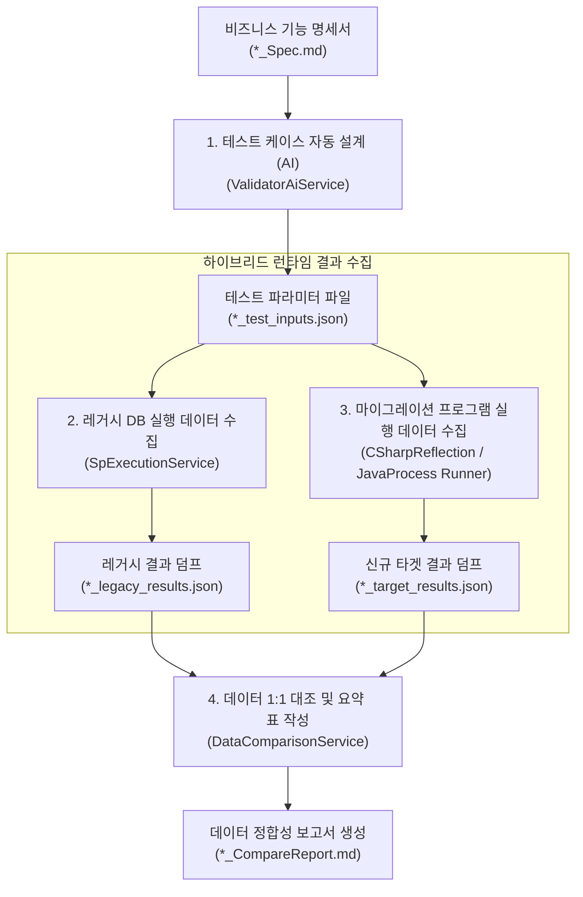

# SQL Server Stored Procedure Reverse Engineering Tool (ReSet (REverse engineering SETtlement))

[](https://dotnet.microsoft.com/download/dotnet/10.0)
[](https://www.microsoft.com/sql-server)
[](#)
[](#)

본 프로젝트는 **SQL Server**에 저장된 Stored Procedure(SP)를 심층 분석하여, AI(OpenAI, Ollama, Claude, Google Gemini 등)를 통해 사용자 정의 지침에 맞춘 마크다운 형식의 기능 명세서를 자동 생성하는 개발자용 터미널 기반 CLI(TUI) 도구입니다.

---

## 🚀 주요 특징 (Key Features)

본 도구는 크게 **Stored Procedure 역공학(Analyzer)**과 **구현 코드/데이터 검증(Validator)**의 유기적인 결합을 통해, 레거시 DB 비즈니스 로직을 현대적인 아키텍처로 안전하게 마이그레이션하도록 돕는 강력한 개발자용 TUI 도구입니다.

### 1. 지능형 역공학 및 의존성 분석 (Analyzer)
* **재귀적 하이브리드 의존성 추적**: 깊이 우선 탐색(DFS) 방식으로 SP가 참조하는 테이블, 뷰, UDF 및 타 SP를 재귀 추적하여 전체 의존성 구조를 파악합니다. (권한 오류 발생 시 경고 기록 후 안전한 Soft Fail 제공)
* **스키마 및 주석 자동 수집**: 데이터 타입, Null 여부, PK/FK 관계뿐만 아니라 시스템 설명(`MS_Description`)까지 긁어와 AI 분석용 도메인 맥락으로 자동 주입합니다.
* **다중 포맷 메타데이터 수출**: 분석에 사용된 원천 데이터를 구조화된 JSON, 프롬프트 텍스트, 그리고 개별 객체 단위 DDL/MD 파일 구조로 자동 분산 저장(Dump)합니다.

### 2. 3단계 신뢰성 검증 파이프라인 (Verification)
* **Level 1 (기계적 정적 검증)**: `Markdig` 파서로 구조적 필수 섹션을 검증하고, `mermaid-cli` 컴파일 테스트 또는 구문 린팅을 통해 Mermaid 다이어그램 오류를 방지합니다.
* **Level 2 (AI 교차 리뷰 및 자가 교정)**: 검토관 에이전트를 통해 비즈니스 로직의 결함을 검증하고, 오류 발견 시 한도 내에서 자동으로 자가 수정(`Self-Correction`) 루프를 수행합니다.
* **Level 3 (인간 승인 피드백 루프)**: TUI 모드에서 실시간 문서 미리보기를 제공하며, 개발자의 자연어 보완 피드백을 수렴하여 완벽한 설계서가 나올 때까지 재생성 및 검증을 반복합니다. (무인 배치 모드에서는 생략)

### 3. 배치 현대화 설계 및 비용 최적화 (Modernization & Cache)
* **순차적 배치 현대화 계획 수립**: 분석된 여러 SP들의 명세서를 사용자가 선택한 순서대로 조합하여, 워크플로우 제어, 대용량 페이징, 오류 처리 정책이 설계된 통합 배치 계획서(`*_BatchMigrationPlan.md`)를 작성합니다. (배치 작업 단위는 `--job-name` 옵션을 통해 식별 관리됩니다.)
* **코딩 에이전트 자동 기동 브릿지(CLI Orchestration)**: 통합 배치 전환 계획 수립 및 최종 승인이 완료되면 Claude Code, Antigravity CLI 등 지정된 전문 코딩 에이전트를 자식 프로세스로 자동 기동하여 전체 배치 코드를 통합적으로 연쇄 생성합니다. 현재 사용 중인 터미널 콘솔을 그대로 공유하여 대화형 프롬프트를 이어갈 수 있습니다.
* **하이브리드 동적 SQL 및 Linked Server 대응**: 정적 분석이 까다로운 동적 쿼리(EXEC, sp_executesql)에 대해 DDL 텍스트를 Regex로 2차 분석하여 동적 참조 테이블의 실시간 스키마까지 자동 병합 수집하며, Linked Server 식별자 패턴 감지를 결합해 안전하고 완벽한 현대화 전환 가이드를 제공합니다.
* **해시 기반 로컬 증분 캐싱**: SP 및 관련 의존성 DDL의 복합 SHA-256 해시를 체크하여, 변경이 없을 시 AI 분석을 건너뛰고 기존 마크다운을 복원하여 비용과 시간을 혁신적으로 절감합니다.

### 4. 코드 일치성 및 데이터 정합성 검증 (Validator)
* **설계서 vs 구현 소스코드 일치성**: C#/Java 코드를 정적으로 분석하고 AI Gap 분석을 실행하여, 명세서 대비 입출력 파라미터, 연산 분기, 트랜잭션 구현 불일치점(Gap Report)을 도출합니다.
* **관계지향 모의 데이터(Mock Data) 자동 생성 및 격리 적재**: 보안 규정으로 인해 운영 데이터를 활용할 수 없는 상황에 대처하여, AI가 테이블 DDL과 JOIN문을 파싱해 조인 컬럼 시드 값이 연결된 고품질 모의 데이터(`--gen-mock-data`)를 자동 생성하고, 테스트 실행 시 데이터베이스에 임시 Seeding 한 후 완료 시 자동 복구(Clean-up)합니다.
* **하이브리드 런타임 수집 & 1:1 대조**: 테스트 케이스 입력을 자동 설계하여 Legacy DB의 SP를 호출하고, 마이그레이션된 소스코드(C# DLL 리플렉션 로드 / Java 외부 프로세스 실행)를 안전하게 트랜잭션 격리(Rollback) 및 타임아웃 하에 구동한 뒤 결과셋 데이터를 1:1로 정밀 비교 대조(`*_CompareReport.md`)합니다.
* **풍부한 AI 공급자 및 TUI 인터랙션**: OpenAI, Claude, Google, 로컬 Ollama를 지원하며, 로컬 세션 보존, 실시간 자동완성 검색/경로 완성, 비동기 작업 취소(`CancellationToken`) 및 견고한 텍스트 이스케이프(`Markup.Escape`)가 적용되어 있습니다.

---

## 📊 핵심 아키텍처 및 워크플로우 (Core Workflow)

### 1. Stored Procedure 역공학 및 3단계 신뢰성 검증 파이프라인
Stored Procedure를 깊이 우선 탐색(DFS) 방식으로 재귀적 의존성을 분석하여 메타데이터와 DDL을 수집한 뒤, LLM 분석 및 L1~L3 3단계 신뢰성 검증 루프를 거쳐 명세서 및 계획서를 저장합니다. (동일 스펙 변경 감지 시 AI 호출을 건너뛰는 **로컬 캐싱** 적용)



### 2. 소스코드 일치성 및 데이터 정합성 검증 흐름 (Validator)
역공학된 명세서와 현대화 구현 소스코드의 일치성을 검사하고, 레거시 DB SP 실행 결과와 마이그레이션된 C#/Java 코드의 런타임 실행 결과를 1:1 대조하여 데이터 정합성 분석 보고서(`*_CompareReport.md`)를 도출합니다.



---

## 🛠 요구 사항 및 환경 구성 (Prerequisites)

도구를 빌드하고 실행하기 위해서는 아래의 최소 환경 구성이 필요합니다.

*   **.NET SDK 10.0** 이상 설치
*   **SQL Server** (메타데이터 쿼리 및 SP 실행용)
*   **Node.js & npm** (선택사항, Mermaid 다이어그램 이미지 컴파일 및 L1 정적 검사 수행 시 `mermaid-cli` 연동 필요)
    ```bash
    npm install -g @mermaid-js/mermaid-cli
    ```

---

## 📂 프로젝트 구조 (Project Structure)

```
SP-Reverse-Engineering/
│
├── SP-Reverse-Engineering.slnx      # .NET 솔루션 파일
│
├── src/
│   ├── ReSet.Core/            # [클래스 라이브러리] 핵심 비즈니스 로직 및 AI 커뮤니케이션
│   │   ├── Models/                 # SpDefinition, DependencyInfo 데이터 모델
│   │   └── Services/               # DB 조회, AI API 통신, 캐싱 및 코딩 엔진 연동
│   │
│   ├── ReSet.Cli/             # [콘솔 애플리케이션] Spectre.Console 기반 TUI (설계서 생성)
│   │   ├── Program.cs              # CLI 진입점 및 대화형 워크플로우 제어
│   │   ├── CodingEngineFactory.cs  # 설정 기반 외부 코딩 에이전트 생성 팩토리
│   │   ├── appsettings.json        # 기본 설정 파일
│   │   └── instructions.md         # AI 분석 세부 마크다운 지침 템플릿
│   │
│   ├── ReSet.Validator.Core/  # [클래스 라이브러리] 구현 정적/논리 검사 및 데이터 대조 서비스
│   │   ├── Models/                 # ValidationResult, MockDataDto 모델
│   │   └── Services/               # FileMapping, SandboxSeeding, DataComparison 서비스
│   │
│   └── ReSet.Validator.Cli/   # [콘솔 애플리케이션] TUI 및 배치 모드 (소스코드 및 데이터 정합성 대조 검증기)
│       ├── Program.cs              # 검증기 CLI 진입점 및 흐름 제어
│       └── appsettings.json        # 검증기용 설정 파일
│
├── tests/
│   └── ReSet.Core.Tests/      # [단위 테스트 프로젝트] xUnit 기반 단위 테스트
│
└── output/                          # [산출물 폴더] 생성된 스펙, 계획서, 모의 데이터 및 정합성 리포트 저장소
    ├── [SP이름]_Spec.md            # SP 개별 비즈니스 설계 명세서
    ├── [SP이름]_MigrationInstructions.md # 개별 SP 마이그레이션 지시서 번들
    ├── [JobName]_BatchMigrationPlan.md   # 통합 배치 전환 계획서
    ├── [JobName]_MigrationInstructions.md # 통합 마이그레이션 지시서 번들
    └── validation/                 # 소스코드 정적 검증 및 데이터 정합성 리포트 저장 폴더
        ├── [SP이름]_CompareReport.md  # 1:1 데이터 정합성 비교 분석 보고서
        └── mock/
            └── [SP이름]_mock_data.json # 검증에 활용된 관계형 모의 데이터 캐시
```

---

## ⚙ 설정 방법 (Configuration)

### 1. `appsettings.json` 설정
프로그램 실행 전 `src/ReSet.Cli/appsettings.json` 파일을 열어 기본적인 데이터베이스 환경 및 출력 설정을 지정합니다. 자격 증명 누출 방지를 위해 이 파일의 `ApiKey`는 비워두는 것을 권장합니다.

```json
{
  "DatabaseSettings": {
    "Server": "localhost",          // SQL Server 주소
    "Database": "Northwind",        // 대상 데이터베이스 이름
    "MaxDependencyDepth": 3         // 재귀적 의존성 탐색의 최대 깊이 (기본값: 3)
  },
  "AiSettings": {
    "Provider": "OpenAI",          // 활성화할 AI 제공자 ("OpenAI" | "Google" | "Claude" | "Ollama")
    "ModelName": "gpt-4o",         // 사용할 LLM 모델명
    "Temperature": 0.2,            // 분석의 일관성을 위해 낮게(0.0 ~ 0.3) 설정을 권장합니다.
    "MaxL2Attempts": 2,            // L2 AI 교차 리뷰 실패 시 추가로 재시도할 자가 보완 횟수 (1 이상의 정수 또는 "unlimited" 지정 시 검증 완료까지 무제한)
    "Providers": {
      "OpenAI": {
        "ApiKey": "",              // OpenAI API 키
        "Endpoint": "https://api.openai.com/v1"
      },
      "Google": {
        "ApiKey": "",              // Google API 키 (Google AI Studio)
        "Endpoint": "https://generativelanguage.googleapis.com"
      },
      "Claude": {
        "ApiKey": "",              // Claude API 키 (Claude Console)
        "Endpoint": "https://api.anthropic.com"
      },
      "Ollama": {
        "Endpoint": "http://localhost:11434" // 로컬 Ollama 엔드포인트
      }
    }
  },
  "OutputSettings": {
    "Directory": "./output",       // 명세서 파일이 저장될 출력 디렉터리
    "InstructionsFile": "./instructions.md", // 분석 규칙 지침 파일 명칭
    "SaveRawJson": true,           // [설정] SpDefinition JSON 파일 저장 여부
    "SaveRawContext": true,        // [설정] 조립된 프롬프트 텍스트 원문 저장 여부
    "SaveRawFiles": true,          // [설정] 의존성 개별 객체 파일/폴더 분산 덤프 여부
    "EnableCache": true            // [설정] DDL 해시 기반 로컬 증분 분석 캐싱 활성화 여부
  },
  "MigrationSettings": {
    "Enabled": true,               // [설정] 신규 시스템 현대화 설계서 추가 생성 활성화 여부
    "TargetLanguage": "C#"         // [설정] 제안할 신규 시스템의 배치 프레임워크 언어 (C# | Java 등)
  },
  "ValidationSettings": {
    "UseMermaidCli": false,         // [설정] mmdc(mermaid-cli)를 이용한 Mermaid 실시간 렌더링 검사 수행 여부 (기본값: false)
    "SpecDirectory": "./output",          // [설정] 검증에 쓰일 명세서 폴더
    "SourceCodeDirectory": "./src",       // [설정] 검증에 쓰일 구현 소스코드 폴더
    "TargetLanguage": "Auto",             // [설정] 검증 대상 언어 ("Auto" | "C#" | "Java")
    "OutputDirectory": "./output/validation" // [설정] 일치성 Gap 보고서 저장 경로
  },
  "CodegenSettings": {
    "Enabled": false,                     // [설정] 분석 완료 후 코딩 에이전트 브릿지 자동 실행 활성화 여부
    "Engine": "claude",                   // [설정] 기본 코딩 엔진 ("claude" | "agy" | "codex")
    "TargetProjectDirectory": "./src",    // [설정] 마이그레이션 코드가 저장될 대상 프로젝트 절대/상대 경로
    "Engines": {
      "claude": {
        "Command": "claude",              // 실행할 Claude CLI 명령어
        "Arguments": "\"write code using {instructions}\"" // 인자 양식 ({instructions}에 지시서 절대 경로가 자동 바인딩)
      },
      "agy": {
        "Command": "agy",                 // Antigravity CLI 명령어 (https://antigravity.google/docs/cli-overview)
        "Arguments": "run {instructions}"
      },
      "codex": {
        "Command": "codex",               // Codex CLI 명령어 (https://developers.openai.com/codex/cli/features)
        "Arguments": "\"{instructions}\""
      }
    }
  }
}
```

### 2. 보안 가이드: `appsettings.local.json` 설정 (권장)
보안상 안전하게 AI API Key 정보를 관리하기 위해, Git에 추적되지 않는 로컬 전용 설정 파일을 사용하는 것을 권장합니다.

1. `src/ReSet.Cli/` 디렉터리에 `appsettings.local.json` 파일을 만듭니다. (이 파일은 `.gitignore`에 무시 대상 파일로 이미 등록되어 안전합니다.)
2. 생성된 `appsettings.local.json` 파일 내에 다음과 같이 발급받은 API 키 설정을 넣으면 로컬 실행 시 보안 키가 우선적으로 적용됩니다.
   ```json
   {
     "AiSettings": {
       "Providers": {
         "OpenAI": {
           "ApiKey": "여기에_새로_발급받은_API키_입력"
         },
         "Google": {
           "ApiKey": "여기에_새로_발급받은_API키_입력"
         },
         "Claude": {
           "ApiKey": "여기에_새로_발급받은_API키_입력"
         }
       }
     }
   }
   ```

---

## 🏃 실행 및 사용 방법 (Running the Tool)
 
### 1. 대화형 TUI 모드 실행
기본적으로 아무 아규먼트 없이 실행하면 로그인 정보 입력 및 메인 메뉴 선택이 가능한 TUI 모드로 시작합니다.
```bash
dotnet run --project src/ReSet.Cli
```
1. DB 계정(ID)과 패스워드를 입력하여 SQL Server에 로그인합니다.
2. 로그인 성공 시 아래 **메인 메뉴**가 화면에 표시됩니다:
   * **`1. Stored Procedure 개별 분석 명세서 작성`**:
     SP를 1개 선택하여, 해당 프로시저의 비즈니스 로직과 데이터 입출력 명세서(`*_Spec.md`)를 작성합니다. (이때 개별 SP 마이그레이션용 지시서 번들 `*_MigrationInstructions.md`도 자동 생성됩니다.)
   * **`2. 기분석 명세서 통합 배치 전환 계획 수립 (Multi-SP)`**:
     출력 디렉터리에 축적된 `*_Spec.md` 목록 중에서 통합할 대상들을 **원하는 순서대로 하나씩 선택**하여 배치 단계를 구성하고, Job 이름(예: `Daily_Order_Job`)을 입력하여 통합 배치 전환 계획서(`*_BatchMigrationPlan.md`)를 작성합니다.
     * **이전 메뉴로 돌아가기**: 파일 선택 화면의 최상단에 제공되는 `[-- 메인 메뉴로 돌아가기 --]` 옵션을 선택하여 이전 메인 메뉴로 안전하게 되돌아올 수 있습니다.
     * **대칭형 검증 적용**: 전환 계획서가 생성된 후에는 1단계와 대칭되는 **3단계 검증 파이프라인(L1 린터 -> L2 AI 리뷰 -> L3 사용자 피드백 반영 및 컨펌)**을 수행하며, 최종 승인 시에만 파일로 저장됩니다.
     * **통합 소스 코드 자동 생성 및 에이전트 기동**: 최종 컨펌 및 저장이 완료되면, 복원된 SP 메타데이터들을 바탕으로 통합 마이그레이션 지시서 (`{JobName}_MigrationInstructions.md`)를 저장하고 외부 코딩 에이전트(Claude Code 등)를 자동/선택 기동하여 전체 코드를 생성합니다.
   * **`3. 종료 (Exit)`**: 도구를 완전히 종료합니다.

### 2. 배치 모드 및 CLI 자동화 실행 (Batch Mode)
명령줄 아규먼트(`--conn`, `--all`, `--sp`) 또는 환경 변수(`SP_ANALYZER_CONN_STR`)를 통해 로그인 및 TUI 메뉴 단계를 완전히 건너뛰고 무인 대량 일괄 처리가 가능합니다.

- **명령줄 옵션**:
  - `--conn <연결문자열>`: 분석용 데이터베이스 연결 문자열을 직접 지정합니다. (생략 시 `SP_ANALYZER_CONN_STR` 환경 변수 값을 조회합니다.)
  - `--all`: 데이터베이스 내의 모든 Stored Procedure를 일괄 분석합니다.
  - `--sp <SP이름1,SP이름2,...>`: 특정 Stored Procedure들만 지정하여 분석합니다. 쉼표(`,`)로 구분하며 스키마명을 포함(`dbo.USP_1`)하거나 생략(`USP_1`)할 수 있습니다.
  - `--job-name <작업이름>`: 배치 모드 실행 시 지정된 이름으로 개별 명세서들을 엮어 **통합 배치 전환 계획 및 통합 마이그레이션 지시서 번들을 자동으로 일괄 생성**하도록 지시합니다. (무인 CI/CD 파이프라인 전용)
  - `--codegen`: (TUI 전용) 통합 배치 전환 계획 수립 최종 승인 완료 후, 자동으로 코딩 에이전트 브릿지 프로세스를 기동하여 소스 코드를 생성하도록 설정합니다. (배치 모드에서 `--job-name` 지정 시에도 함께 적용 가능합니다.)
  - `--engine <엔진명>`: 코딩 에이전트 종류를 명시적으로 지정합니다. (`claude` | `agy` | `codex`)
  
- **배치 실행 예시**:
  - **특정 SP 지정 분석**:
    ```bash
    dotnet run --project src/ReSet.Cli -- --conn "Server=localhost;Database=my_db;User ID=sa;Password=my_password;TrustServerCertificate=true" --sp dbo.USP_GetUsers,dbo.USP_UpdateOrder
    ```
  - **전체 SP 일괄 분석**:
    ```bash
    dotnet run --project src/ReSet.Cli -- --conn "Server=localhost;Database=my_db;User ID=sa;Password=my_password;TrustServerCertificate=true" --all
    ```

> [!NOTE]
> 배치 모드로 대량 실행 중 특정 SP에 대한 메타데이터 조회 실패 또는 AI 통신 에러가 발생하더라도, 해당 SP만 에러 로그가 출력되고 스킵(try-catch 격리)되며 전체 배치 작업은 중단 없이 다음 SP 분석을 계속 수행합니다.

### 3. 코드 일치성 검증 및 데이터 정합성 검증 (ReSet.Validator)
역공학 마이그레이션이 끝난 뒤, 생성된 명세서와 실제 마이그레이션 소스코드가 동일하게 구현되었는지 검증하고, 레거시 DB와 실제 실행 결과 정합성을 대조할 때 실행합니다.

*   **대화형 TUI 모드 실행**:
    ```bash
    dotnet run --project src/ReSet.Validator.Cli
    ```
    *   **1. 설계서 vs 마이그레이션 소스코드 일치성 검증 (L1/L2/L3)**: C#/Java 소스코드 정적 분석 및 AI 의미론적 Gap 분석, 인간 피드백 루프를 가동하여 검증합니다.
    *   **2. 데이터 정합성 검증용 테스트 파라미터 설계 (AI)**: 설계서(`*_Spec.md`)를 분석해 AI가 정상/경계값/오류 시나리오 테스트 파라미터 JSON(`*_test_inputs.json`)을 생성합니다.
    *   **3. 검증용 모의 테이블 데이터(Mock Data) 자동 생성 및 캐싱 (AI)**: 원본 메타데이터 및 설계서를 분석해 테이블 간의 조인 키 난수 시드가 일치하는 모의 데이터(`*_mock_data.json`)를 생성하여 캐싱합니다.
    *   **4. 원본 Stored Procedure 실행 데이터 수집 (Legacy DB)**: 생성된 테스트 입력값 JSON을 기반으로 실제 Legacy DB에 접근해 SP를 호출하고, 다중 ResultSet 데이터를 JSON(`*_legacy_results.json`)으로 덤프 수집합니다. (모의 데이터가 있을 경우 자동 Seeding 및 Clean-up 실행)
    *   **5. 신규 마이그레이션 타겟 소스코드 실행 데이터 수집 (Target System)**: 마이그레이션된 C#(DLL 리플렉션 로드) 또는 Java(외부 JAR/클래스 프로세스 실행) 코드를 실제로 구동하여 실행 결과 JSON(`*_target_results.json`) 데이터를 수집합니다. (모의 데이터 자동 Seeding/Clean-up 및 트랜잭션 자동 롤백 적용)
    *   **6. 실행 결과 데이터 정합성 1:1 대조 및 보고서 생성 (Compare)**: 수집된 레거시 결과와 신규 타겟 결과(`*_target_results.json`)를 상세 1:1 비교 대조하여 데이터 정합성 분석 보고서(`*_CompareReport.md`)를 작성합니다.

*   **배치 검증 자동화 모드 실행 (CI/CD 무인 모드)**:
    ```bash
    # 소스코드 일치성 자동 검증 (L3 인간 개입 생략)
    dotnet run --project src/ReSet.Validator.Cli -- --spec "./output" --code "./src/Migration" --batch

    # 데이터 정합성 테스트 파라미터 설계 배치 모드
    dotnet run --project src/ReSet.Validator.Cli -- --spec "./output" --gen-inputs --batch

    # 검증용 모의 테이블 데이터(Mock Data) 자동 생성 배치 모드
    dotnet run --project src/ReSet.Validator.Cli -- --spec "./output" --gen-mock-data --batch

    # 레거시 DB 실행 결과 덤프 배치 모드
    dotnet run --project src/ReSet.Validator.Cli -- --exec-legacy --conn "Server=localhost;Database=Northwind;User ID=sa;Password=your_password;TrustServerCertificate=true" --batch

    # 신규 마이그레이션 타겟 실행 결과 덤프 배치 모드
    dotnet run --project src/ReSet.Validator.Cli -- --exec-target --conn "Server=localhost;Database=Northwind;User ID=sa;Password=your_password;TrustServerCertificate=true" --batch

    # 레거시 vs 타겟 1:1 데이터 정합성 대조 배치 모드
    dotnet run --project src/ReSet.Validator.Cli -- --compare-data --batch
    ```

---

## 🛠 트러블슈팅 및 자주 묻는 질문 (Troubleshooting)

> [!TIP]
> **Q. Mermaid 다이어그램 이미지 컴파일(Level 1 검증) 중에 오류가 납니다.**
> * **원인**: 시스템에 Node.js 전역 패키지인 `mermaid-cli (mmdc)`가 설치되어 있지 않거나 경로에 등록되지 않았기 때문입니다.
> * **해결**: `npm install -g @mermaid-js/mermaid-cli` 명령을 통해 설치를 완료하거나, `appsettings.json` 내 `"UseMermaidCli": false`로 설정을 변경하여 텍스트 정적 린팅만 수행하도록 설정을 완화할 수 있습니다.

> [!WARNING]
> **Q. Stored Procedure 실행 결과 수집 단계에서 데이터베이스 연결 예외가 발생하며 수집이 실패합니다.**
> * **원인**: 일시적인 DB 네트워크 차단, 잘못된 연결 문자열 또는 계정 권한 부족 등이 원인입니다.
> * **해결**: 프로그램은 **Soft Fail**을 채택하여 DB 실행 오류가 나더라도 크래시되지 않고 결과 JSON에 `FAIL` 상태를 기록하여 리턴합니다. 연결 대상 데이터베이스가 샌드박스 또는 적절한 테스트 DB에 접근할 수 있도록 `--conn` 파라미터나 `appsettings.local.json` 내 정보를 점검해 주십시오.

---

## 🧪 단위 테스트 실행 (Running Tests)

단위 테스트를 실행하여 모든 코드가 무결하게 작동하는지 검증합니다.
```bash
dotnet test
```
