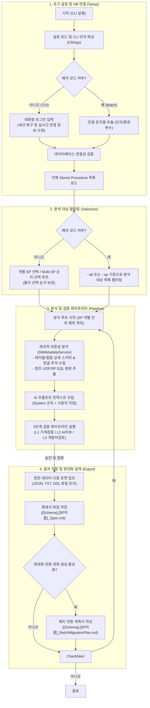
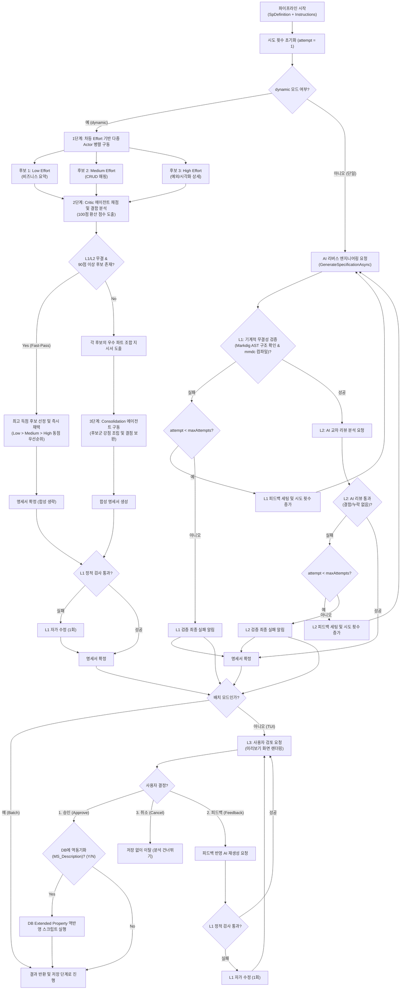
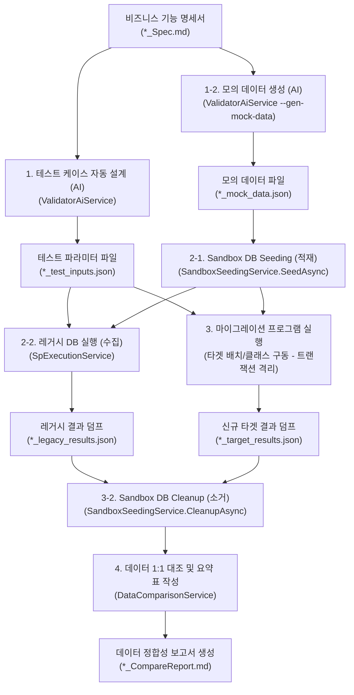

# ReSet (REverse engineering SETtlement) 시스템 아키텍처 정의서 (System Architecture Definition)

본 문서는 SQL Server Stored Procedure(SP)를 자율적으로 분석하고 신규 시스템으로의 전환 계획서를 도출하는 **ReSet (REverse engineering SETtlement) 에이전트** 프로그램의 모듈 설계, 구성 요소 간의 데이터 흐름, 핵심 알고리즘 및 검증 파이프라인의 구조적 아키텍처를 정의합니다.

---

## 1. 개요 (Overview)

### 1.1. 시스템의 목적
본 프로그램은 레거시 DB 비즈니스 로직(Stored Procedure)을 현대적인 애플리케이션 아키텍처(C#, Java Spring Batch 등)로 마이그레이션하기 위해, SP의 비즈니스 로직과 의존성을 자율적으로 분석하고 기능 명세서(`*_Spec.md`) 및 배치 전환 계획서(`*_BatchMigrationPlan.md`)를 자동 생성·검증하는 CLI/TUI 도구입니다.

### 1.2. 핵심 설계 사상
* **관심사 분리 (SoC)**: 사용자 인터페이스 레이어(Cli)와 핵심 도메인 비즈니스 레이어(Core), 코드 검증 레이어(Validator)를 명확히 분리하여 설계의 격리성을 극대화합니다.
* **3단계 점진적 신뢰성 보장**: 생성된 명세서의 무결성을 기계적 검증(L1), AI 교차 검토(L2), 인간 승인(L3)의 3단계 파이프라인을 거치며 검증합니다.
* **무인 자동화와 인간 피드백의 유기적 결합**: 대화형 모드(TUI)를 통해 개발자의 피드백을 실시간 수집하고, CI/CD 환경을 위한 무인 배치 실행 모드를 동시에 완벽하게 지원합니다.

---

## 2. 시스템 구성 및 컴포넌트 아키텍처 (System Components)

### 2.1. 컴포넌트 레이어링 및 관계
본 프로그램은 프레젠테이션 레이어(Cli)와 비즈니스 서비스 레이어(Core/Validator)로 구성되어 있습니다.

```
┌───────────────────────────────────┐    ┌───────────────────────────────────┐
│          ReSet.Cli (TUI)          │    │      ReSet.Validator.Cli (TUI)    │
│  (분석기 실행 엔트리 및 TUI 제어)  │    │  (검증기 실행 엔트리 및 TUI 제어)  │
└───────────┬───────────────────────┘    └───────────────┬───────────────────┘
            │ DI                                         │ DI
            ▼                                            ▼
┌───────────────────────────┐                ┌───────────────────────────────┐
│        ReSet.Core         │                │     ReSet.Validator.Core      │
│  (Metadata, AI Prompts,   │◄───────────────┤ (Target runner, Seeding,      │
│   Orchestrator, Caching)  │                │  Data Comparison)             │
└───────────────────────────┘                └───────────────────────────────┘
```

### 2.2. 핵심 모듈 및 클래스 목록

| 프로젝트 (레이어) | 주요 모듈 (클래스/인터페이스) | 아키텍처적 역할 및 기능 |
| :--- | :--- | :--- |
| **ReSet.Cli**<br/>(TUI/CLI 레이어) | [Program](file:///home/moondae/git-root/ReSet/src/ReSet.Cli/Program.cs) | CLI 진입점, DI 구성, 대화형(TUI) 및 배치 실행 모드 제어, Multi-SP 순차 선택 큐 흐름 오케스트레이션. |
| | [ConsoleUserInteraction](file:///home/moondae/git-root/ReSet/src/ReSet.Cli/ConsoleUserInteraction.cs) | Spectre.Console 기반 TUI 렌더링, L3 인간 개입형 검토 UI 제공, Warnings 경고 패널 렌더링, DB 동기화 동의(`ConfirmMetadataSyncAsync`) 제어. |
| | [SessionManager](file:///home/moondae/git-root/ReSet/src/ReSet.Cli/SessionManager.cs) | 로컬 세션 파일(`.session.json`)을 활용한 직전 로그인 정보 관리 및 서버·DB명 즉시 수정 기능 제공. |
| | [CliArgs](file:///home/moondae/git-root/ReSet/src/ReSet.Cli/CliArgs.cs) | CLI 아규먼트 파싱 결과(`--conn`, `--sp`, `--all`, `--job-name` 등)를 담는 데이터 모델. |
| **ReSet.Core**<br/>(핵심 비즈니스 레이어) | [DbMetadataService](file:///home/moondae/git-root/ReSet/src/ReSet.Core/Services/DbMetadataService.cs) | SQL Server 메타데이터 수집, DFS 기반 재귀적 의존성 탐색, 확장 속성(`MS_Description`) 주석 및 DDL 추출. |
| | [AiService](file:///home/moondae/git-root/ReSet/src/ReSet.Core/Services/AiService.cs) | LLM 프롬프트 조립(설명 누락 컬럼 역추론 및 코드-주석 불일치 감지 규칙 포함), 주입받은 `IAiClient`를 통한 AI API 호출 및 JSON 파싱. |
| | [IAiClient](file:///home/moondae/git-root/ReSet/src/ReSet.Core/Services/IAiClient.cs) | AI 모델 간의 공통 텍스트 통신 및 스트리밍을 정의하는 추상 인터페이스. |
| | [Clients (OpenAi, Claude, Google)](file:///home/moondae/git-root/ReSet/src/ReSet.Core/Services/Clients/) | OpenAI, Anthropic, Google Gemini 등 공급자별 네이티브 규격 채팅 HttpClient 통신 모듈. |
| | [MechanicalValidator](file:///home/moondae/git-root/ReSet/src/ReSet.Core/Services/MechanicalValidator.cs) | Markdig AST 기반 마크다운 필수 구조 분석 및 mermaid-cli 연동을 통한 다이어그램 문법 실시간 컴파일 검증. |
| | [VerificationPipelineOrchestrator](file:///home/moondae/git-root/ReSet/src/ReSet.Core/Services/VerificationPipelineOrchestrator.cs) | CancellationToken을 전파하는 L1/L2 자동화 자가 수정 루프 및 L3 인간 개입 워크플로우 오케스트레이션. |
| | [MetadataExporter](file:///home/moondae/git-root/ReSet/src/ReSet.Core/Services/MetadataExporter.cs) | JSON 덤프, 프롬프트 로그, 개별 DDL 파일 내보내기 및 외부 코딩 에이전트용 가이드라인 번들(`*_MigrationInstructions.md`) 생성. |
| | [CacheManager](file:///home/moondae/git-root/ReSet/src/ReSet.Core/Services/CacheManager.cs) | SHA-256 해시 기반 로컬 증분 분석 캐싱 및 색인(`.sp_cache_index.json`) 보존/조회 관리. |
| | [ExternalCliCodingEngine](file:///home/moondae/git-root/ReSet/src/ReSet.Core/Services/ExternalCliCodingEngine.cs) | CLI 기반 외부 코딩 에이전트(Claude Code, agy 등) 기동, 콘솔 입출력 스트림 공유 및 CancellationToken 기반 강제 프로세스 정리. |
| | [SettlementPolicyService](file:///home/moondae/git-root/ReSet/src/ReSet.Core/Services/SettlementPolicyService.cs) | DDL 상수 분석 및 DB 마스터 데이터 프로파일링을 결합한 통합 정산 정책 정의서 도출. |
| **ReSet.Validator.Cli**<br/>(TUI/CLI 레이어) | [Program](file:///home/moondae/git-root/ReSet/src/ReSet.Validator.Cli/Program.cs) | 검증기 CLI 진입점. 디렉토리 사전 유효성 확인, 솔루션 루트 스캔, Ctrl+C 취소 연동 및 무인 배치 검증 흐름 제어. |
| | [ConsoleUserInteraction](file:///home/moondae/git-root/ReSet/src/ReSet.Validator.Cli/ConsoleUserInteraction.cs) | Spectre.Console 기반 TUI 렌더링. 탭(Tab) 자동완성 디렉토리 입력창(`ShowChoices(false)` 제어) 및 Gap 분석 결과 패널 렌더링. |
| **ReSet.Validator.Core**<br/>(정합성 검증 레이어) | [CodeVerificationOrchestrator](file:///home/moondae/git-root/ReSet/src/ReSet.Validator.Core/Services/CodeVerificationOrchestrator.cs) | L1 정적 검사 -> L2 AI 논리 Gap 검증 및 자가 수정 -> L3 개발자 승인을 조율하는 검증 오케스트레이터. |
| | [FileMappingService](file:///home/moondae/git-root/ReSet/src/ReSet.Validator.Core/Services/FileMappingService.cs) | 명세서 파일명 및 YAML Front Matter 기반 구현 소스 1:1 매핑 및 경로 자동 보정. |
| | [CSharpReflectionRunner](file:///home/moondae/git-root/ReSet/src/ReSet.Validator.Core/Services/CSharpReflectionRunner.cs) | C# 프로젝트 DLL 동적 로딩 및 리플렉션 호출, DbTransaction 강제 롤백을 활용한 DB 격리 실행기. |
| | [JavaProcessRunner](file:///home/moondae/git-root/ReSet/src/ReSet.Validator.Core/Services/JavaProcessRunner.cs) | Java JAR/클래스를 외부 프로세스로 기동하여 stdin/stdout JSON 통신을 수행하는 격리 실행기. |
| | [SpExecutionService](file:///home/moondae/git-root/ReSet/src/ReSet.Validator.Core/Services/SpExecutionService.cs) | 테스트 케이스 파라미터를 활용해 Legacy DB에서 Stored Procedure를 실행하고 결과를 다중 ResultSet 구조 JSON으로 수집. |
| | [SandboxSeedingService](file:///home/moondae/git-root/ReSet/src/ReSet.Validator.Core/Services/SandboxSeedingService.cs) | 모의 데이터를 샌드박스 DB에 자동 적재(Seed)하고 검증 완료 후 강제 제거(Cleanup)하는 라이프사이클 관리. |
| | [DataComparisonService](file:///home/moondae/git-root/ReSet/src/ReSet.Validator.Core/Services/DataComparisonService.cs) | 레거시 vs 타겟 결과 JSON 데이터를 행 수, 컬럼 타입, 값 단위로 1:1 대조하여 비교 보고서 마크다운 생성. |

---

## 3. 전체 실행 라이프사이클 및 데이터 흐름 (Visual Execution Flow)

### 3.1. 프로그램 거시 실행 흐름
ReSet 프로그램이 기동되어 설정을 파싱하고, 대상 DB 메타데이터를 수집하여 AI 분석 파이프라인을 구동하고 산출물을 저장하기까지의 거시적인(Macro) 흐름은 다음과 같습니다.



### 3.2. 실행 모드 분기
* **대화형 TUI 모드**: 개발자가 직접 화면을 보며 분석할 SP를 원하는 순서대로 골라 담은 후 배치 전환 계획을 수립하고, AI 검증 결과와 피드백을 실시간 조율하며 승인 및 DB 동기화를 제어합니다.
* **무인 배치 모드 (CI/CD)**: `--job-name` 인자가 공급되면 사용자의 대화형 개입 단계를 생략하고 L1/L2 검증을 통과한 산출물을 자동 생성 및 병합하며, 외부 코딩 에이전트 기동까지 파이프라인을 무정지로 실행합니다.

---

## 4. 핵심 아키텍처 메커니즘 (Key Architectural Mechanisms)

### 4.1. DFS 기반 재귀적 의존성 수집 및 Soft Fail
* **하이브리드 재귀 탐색**: 타겟 SP가 참조하는 테이블, 뷰, 사용자 정의 함수(UDF), 하위 SP를 `sys.sql_expression_dependencies`를 활용해 깊이 우선 탐색(DFS) 방식으로 재귀 수집합니다. 정적 의존성 카탈로그 뷰에서 식별되지 않는 동적 SQL 구문(`EXEC`, `sp_executesql`)은 DDL 소스 Regex 2차 스캔을 적용해 참조 대상 테이블을 강제 병합 수집합니다.
* **순환 참조 방지**: 탐색 중인 객체의 전체 이름을 담는 `HashSet<string> (visited)`을 관리하여 중복 DB 쿼리 및 무한 루프를 방지합니다.
* **소프트 페일(Soft Fail)**: 특정 UDF의 스키마나 DDL 조회 시 권한 누락 등으로 발생한 비치명적 예외는 프로세스를 정지시키지 않고 `SpDefinition.Warnings` 리스트에 누적하여 스킵 처리합니다. 경고 내역은 TUI 경고 패널과 AI 프롬프트에 동시 전달되어 불완전한 메타데이터 기반 하에서도 차선의 명세서를 도출하도록 돕습니다.

### 4.2. MS_Description 확장 속성 맵핑 및 AI 보완
* **한글 도메인 지식 맵핑**: 데이터베이스의 확장 속성인 `MS_Description`에 등록된 컬럼 주석과 테이블 설명을 상세 스키마 정보 테이블에 자동 맵핑하여 AI에 전달합니다. 이를 통해 코드 분석 시 단순 영문 약어(예: `STAT_CD`)의 업무상 의미(예: `상태코드`)를 직관적으로 해석하게 돕습니다.
* **설명 누락 컬럼 역추론**: 스키마 조회 시 한글 주석이 누락된 항목은 `IsDescriptionMissing`으로 마킹됩니다. AI는 SP/뷰/UDF 연산 문맥을 분석하여 컬럼의 용도를 유추하며, 명세서 본문에 `[AI 추론 보완: Schema.Table.Column - 유추된설명]` 포맷으로 강제 노출하도록 프롬프트 규칙에 바인딩됩니다.
* **코드-주석 불일치 감지**: 소스코드에 삽입된 자연어 주석과 실제 실행되는 쿼리 연산 로직 사이에 모순이 감지되는 경우, 실제 쿼리 코드를 진실의 원천으로 삼아 명세서를 작성하되, 개요 섹션 최상단에 `[🚨 주석 불일치 경고] {모순내용}` 경고 문구를 포함시키도록 설계되었습니다.
* **보완 스크립트 추출**: 분석 완료 시, AI가 역추론한 컬럼 설명 정보를 활용해 `sp_addextendedproperty` 및 `sp_updateextendedproperty` 쿼리가 조립된 SQL 정화 스크립트 파일(`*_MetadataCleansing.sql`)을 디렉토리에 항상 파일로 덤프해 보존합니다.

### 4.3. 3단계 신뢰성 검증 파이프라인 (Verification Pipeline)
생성된 명세서의 무결성과 비즈니스 완성도를 보장하기 위해 L1, L2, L3 단계가 유기적으로 연결된 검증 아키텍처를 가동합니다.



#### 4.3.1. Level 1: 기계적 무결성 검증 (L1 Linter)
* **정적 헤더 검사**: Markdig AST 파서를 가동해 명세서 내 5대 필수 대분류 헤더(`## 개요`, `## 파라미터 목록`, `## CRUD 분석`, `## 로직 흐름 요약`, `## 비즈니스 흐름 시각화`)가 누락 없이 정확한 대소문자와 명칭으로 구성되었는지 점검합니다.
* **다이어그램 문법 컴파일**: 명세서에 포함된 Mermaid 다이어그램 블록을 추출해 `mermaid-cli`로 백그라운드 컴파일을 수행하며, 문법 오류 감지 시 에러 메시지를 수집합니다.
* **정적 자가 보완**: 정적 검증 실패 시, 구체적인 구문 오류 내용과 수정 방향이 가이드된 `SuggestedPromptFix`를 조립해 AI 모델에게 즉각 자가 수정을 재요청합니다.

#### 4.3.2. Level 2: AI 교차 리뷰 (L2 Actor-Critic)
* **동적 모드 분기**: `ActorEffort` 설정값에 따라 검증 및 생성 경로가 이원화됩니다.
  * **단일 모드**: 지정된 LLM 모델을 사용해 1차 명세서를 빌드한 후, 이종 Critic 에이전트에게 4대 평가 기준(비즈니스 정합성, CRUD 데이터 매핑, 다이어그램 가독성, 예외 및 트랜잭션)을 바탕으로 교차 리뷰를 수행하도록 요청합니다. 결함 발견 시 `maxAttempts` 한도 내에서 피드백 로그를 누적하며 자가 수정 루프를 가동합니다.
  * **dynamic 모드 (병렬 협업)**: 다형성 및 앙상블 효과를 극대화하는 dynamic 아키텍처 경로입니다. (상세 협업 시퀀스는 상위 통합 검증 파이프라인 흐름도 참고)

* **차등 Effort 병렬 생성 (1단계)**: 동일한 SP 정의에 대해 `low`, `medium`, `high` 추론 강도를 병렬 구동하여 서로 다른 장점을 가진 3종의 후보 명세서를 확보합니다.
* **Critic 채점 및 Fast-Pass 판정 (2단계)**: Critic 에이전트가 각 후보에 대해 정량 채점(4대 기준 각 10점, 총 40점 만점)을 실시하고 100점 만점으로 정규화합니다. L1 검증을 통과하고 Critic 결함이 없으며 90점 이상인 후보가 있다면 **Fast-Pass로 최고 점수 후보를 즉시 채택**하고 합성을 생략합니다. (동점 시 저-Effort 우선순위)
* **Consolidation 합성 (3단계)**: 완벽한 후보가 없을 시에만 구동됩니다. 영역별 최고 득점을 기록한 후보의 파트를 진실의 원천으로 조립하여 결점을 보완한 단일 통합 명세서를 합성합니다.

#### 4.3.3. Level 3: 개발자 최종 검토 및 동기화 (L3 Human-in-the-loop)
* **피드백 수동 반영**: TUI 화면에 명세서 미리보기가 렌더링되며 개발자가 '승인', '취소', '피드백 입력' 중 하나를 선택합니다. 피드백 입력 시 사용자의 상세 요구사항을 컨텍스트에 추가하여 명세서를 재생성하고, 재생성된 결과물에 대해 L1 정적 검사 및 AI 자가 수정 루프를 1회 더 구동해 안정성을 유지합니다.
* **DB 동기화 제어**: 최종 승인 단계에서 개발자에게 DB 역반영 동의 여부를 확인하여, 동의할 경우에만 보완 SQL 스크립트(`*_MetadataCleansing.sql`)를 호출하여 대상 데이터베이스의 Extended Properties 속성 주석을 정화합니다.

### 4.4. 다중 AI 공급자(Multi-LLM Provider) 추상화
* **Decoupling 계약**: LLM 통신과 페이로드 직렬화 사양을 `IAiClient` 계약 뒤로 격리하였습니다. 비즈니스 파이프라인인 `AiService`는 하위 전송 메커니즘을 인지하지 않습니다.
* **공급자별 독립 클라이언트**:
  * **OpenAiClient**: OpenAI 공식 SDK 및 o1/o3 추론 모델 규격(`reasoning_effort` 등) 대응.
  * **ClaudeClient**: Anthropic Messages API 페이로드 규격 및 Claude 4세대(`output_config.effort`) 대응.
  * **GoogleClient**: Google AI Studio API Key 주입 및 SystemInstruction 구조 대응.
* **설정 기반 동적 DI**: `appsettings.json` 내 `Providers` 맵핑 값을 읽어 `AiClientFactory`가 적합한 전용 클라이언트를 빌드해 `AiService`에 주입하는 런타임 다형성을 확보했습니다.

### 4.5. 소스코드 정합성 검증 엔진 (Validator)
마이그레이션된 소스코드가 원래의 비즈니스 기능 명세서(Spec) 및 기존 Legacy DB SP의 구동 결과 데이터와 일치하는지 판정하는 정합성 검증 시스템 흐름은 다음과 같습니다.



* **절대 경로 자동 보정**: CLI 인자나 설정으로 유입된 상대 경로는 프로세스 구동 시 `Directory.GetCurrentDirectory()`와 결합해 즉시 절대 경로로 고정하여 실행 디렉토리 변동으로 인한 파일 미조회 오류를 원천 차단합니다.
* **명세서-소스 스마트 매핑**: 파일명 매칭 규칙을 기반으로 마이그레이션된 소스코드를 스캔하되, 명세서 상단의 YAML Front Matter(`TargetCode: ...`) 지시를 최우선 순위로 해석합니다. 빌드 디렉토리와 소스 디렉토리 간 중복된 접두사 경로(예: `src/`)는 정규식 슬라이싱을 통해 자동 보정합니다.
* **타겟 런타임 격리 실행 (Runner)**:
  * **C# Reflection Runner**: 빌드된 C# DLL을 리플렉션 로드하고 생성자에 `SqlConnection` 및 `SqlTransaction`을 동적 주입하여 비즈니스 메소드를 직접 실행합니다. 로직 수행 후 DB 수정 내역을 Sandbox에 반영하지 않고 항상 `Rollback()`을 호출해 격리합니다.
  * **Java Process Runner**: 타겟 클래스나 JAR를 외부 Java 프로세스로 기동하고 입력 인자를 stdin JSON 스트림으로 전달하며 결과를 stdout으로 수집합니다. 30초 타임아웃을 연결해 CLI 무한 대기 교착을 차단합니다.
* **유연한 1:1 데이터 동등성 비교**: 레거시 DB SP를 돌려 수집한 `_legacy_results.json`과 타겟 실행 결과를 덤프한 `_target_results.json`을 대조합니다. 단순 텍스트 비교 시 발생하는 실수 소수점 끝자리 차이 및 DateTime 날짜 포맷팅 문자 표현 차이는 타입 감지 후 `NormalizeValueString`을 통해 정형화한 후 동등성을 평가하여 False Positive(거짓 불일치) 경고를 방지합니다.

### 4.6. 관계지향 모의 데이터 적재 및 수명주기 격리 (Sandbox Seeding)
* **관계지향 모의 데이터 생성**: 개발/검증용 실제 운영 데이터 반출이 불가능한 환경을 타개하기 위해, AI가 참조 테이블 스키마 및 JOIN 조건 등을 파악하여 상호 참조 무결성을 충족하는 모의 데이터를 `MockDataDto` 형태로 생성하고 로컬 캐싱합니다.
* **Seeding 수명주기**: 데이터 정합성 수집 실행 직전 `SandboxSeedingService`가 가동되어 캐싱된 관계형 모의 데이터를 대상 샌드박스 데이터베이스에 적재(Seed)하며, 수집 작업이 종료되는 즉시 데이터를 자동으로 소거(Truncate/Delete)함으로써 샌드박스 DB의 무결 상태를 완벽하게 복원합니다.

### 4.7. SHA-256 해시 기반 로컬 증분 캐싱
* **복합 시그니처 해시 계산**: 대상 SP의 DDL 본문 텍스트와 재귀적으로 수집된 모든 참조 UDF/SP/테이블의 DDL 메타데이터를 개체명 순서로 정렬 및 결합하여 단일 SHA-256 해시값으로 산출합니다.
* **증분 분석 스킵**: 로컬 `./output/.sp_cache_index.json`에 기록된 기존 해시 시그니처와 대조하여 일치하고, 기존 저장된 명세서 마크다운 파일이 물리적으로 보존되어 있는 것이 확인되면 AI 모델 API 호출과 3단계 검증 프로세스 전체를 스킵하여 리소스 비용을 획기적으로 절약합니다.

---

## 5. TUI/CLI 부가 기능 및 복구 파이프라인 (Secondary Features)

### 5.1. TUI 로그인 세션 및 연결 정보 실시간 변경
* **연결 정보 즉석 수정**: 로컬 세션 파일(`.session.json`)에서 직전 로그인 성공 정보를 복구한 뒤, 사용자가 설정 파일을 열어 직접 고칠 필요 없이 TUI 화면에서 즉시 서버 주소 및 데이터베이스 이름을 수정해 다른 DB 인스턴스로 연결 대상을 손쉽게 교체 접속할 수 있는 접속 기회를 제공합니다.

### 5.2. Multi-SP 전환 계획 수립을 위한 순서 보장형 TUI 수집
* **순차 단일 선택 루프**: 다중 선택 UI 컴포넌트가 사용자의 선택 물리적 입력 순서를 리턴 목록에 보장하지 않는 한계를 극복하기 위해, 배치 전환 시나리오의 단계별 실행 흐름에 맞게 사용자가 목록에서 순서대로 하나씩 SP를 선택해 큐(Queue)에 적재하고 최종 `[-- 완료 --]` 메뉴 선택 시 루프를 종료해 물리적 배치 전환 순서 정합성을 완벽히 확보합니다.

### 5.3. 외부 코딩 에이전트 연동용 마이그레이션 지시서 번들링 및 자동 기동 브릿지
* **마이그레이션 지시서 패키징**: 최종 승인된 통합 배치 계획과 개별 SP의 명세서, 참조하는 DDL 및 테이블 스키마 정보를 하나의 마크다운 파일(`{JobName}_MigrationInstructions.md`)로 빌드하여 외부 에이전트 복사/붙여넣기용 컨텍스트 프롬프트를 명시해 추출합니다.
* **대화형 콘솔 상속**: Claude Code 등 대화형 CLI 에이전트 연동 실행 시 자식 프로세스의 입출력을 숨기지 않고 부모 콘솔 스트림을 상속 공유(`RedirectStandardInput/Output = false`)하여, 에이전트 기동 중 발생할 수 있는 자연어 상호작용 및 수동 승인 프롬프트를 동일 콘솔 상에서 자연스럽게 수행합니다.
* **취소 및 프로세스 강제 정리**: 취소 토큰(`CancellationToken`) 수신 시 윈도우/리눅스 환경의 좀비 프로세스 방지를 위해 `process.Kill(true)`을 구동해 외부 에이전트 프로세스 트리 전체를 강제 정리합니다. 프롬프트 내 공백이 파이프라인 인자로 분해 해석되는 문제를 방지하도록 이스케이프 쌍따옴표(`\"...\"`)로 파라미터를 감싸 공급합니다.

### 5.4. 정합성 검증 실패 시의 3단계 복구 피드백 루프 (Failure Recovery Loops)
* **루프 A (설계 재수립 - Spec Feedback)**: 레거시 비즈니스 규칙 해석 오류 등 명세서 자체에 결함이 있는 경우, L3 개발자 콘솔 피드백을 통해 기능 명세서(`*_Spec.md`)를 보완·재생성하고 이에 맞춰 코드를 재생성하도록 복구 흐름을 분기합니다.
* **루프 B (소스코드 보완 - Code Refactoring)**: 설계서는 올바르나 소스코드 구현부에 단순 로직 누락이 있는 경우, 명세서 재생성 과정을 건너뛰고 불일치 명세(`GapReport`)만 외부 코딩 에이전트에 공급해 소스코드만 부분 수정/리팩토링하도록 유도합니다.
* **루프 C (테스트 튜닝 - Param Tuning)**: 환경 차이로 인한 미세한 날짜/실수 표현 불일치 등 테스트 환경적 문제일 경우, 입력 파라미터(`*_test_inputs.json`)의 경계값을 보완하거나 데이터 비교 서비스의 정형화 포맷을 조정하여 데이터 덤프 대조를 재작동시킵니다.

### 5.5. TUI 비파괴식 Serilog 파일 로깅 시스템
* **콘솔 UI 파괴 방지**: Spectre.Console 진행 바 및 TUI 화면이 로그 텍스트 출력으로 인해 지저분하게 깨지는 현상을 원천 방어하기 위해 Serilog의 콘솔 출력을 비활성화하고 **오직 파일 전용(File Sink)으로만 로그를 기록**하도록 제한합니다.
* **마크업 자동 정화**: 로그 파일 저장 직전, Serilog 로그 파이프라인 내에서 Spectre.Console의 스타일 마크업 태그들을 정규식(`StripMarkup`)으로 자동 정화 처리해 순수한 문자열 로그 형태로만 보존함으로써 실행 파일의 가독성을 높입니다.
