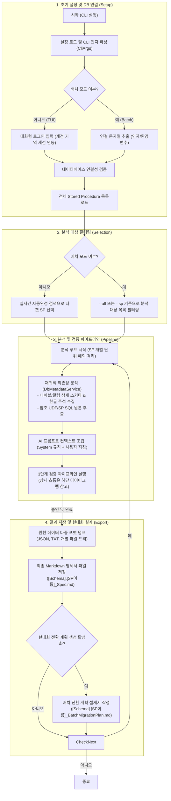
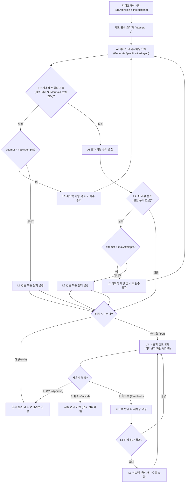

# SP Analyzer 시스템 아키텍처 정의서 (System Architecture Definition)

본 문서는 SQL Server Stored Procedure(SP)를 자율적으로 분석하고 신규 시스템으로의 전환 설계서를 도출하는 **SP Analyzer 에이전트** 프로그램의 모듈 설계, 구성 요소 간의 데이터 흐름, 핵심 알고리즘 및 검증 파이프라인의 구조적 아키텍처를 정의합니다.

---

## 🏗️ 컴포넌트 및 모듈 아키텍처 (Component Architecture)

본 프로그램은 관심사 분리(SoC) 원칙에 따라 사용자 인터페이스 레이어(Cli)와 핵심 도메인 비즈니스 레이어(Core)로 명확히 분리되어 설계되었습니다.

| 컴포넌트 (프로젝트) | 모듈 (클래스/인터페이스) | 주요 아키텍처적 역할 및 기능 |
| :--- | :--- | :--- |
| **SpAnalyzer.Cli** (TUI/CLI 레이어) | [Program](file:///home/moondae/git-root/sp-reverse-engineering/src/SpAnalyzer.Cli/Program.cs) | CLI 아규먼트 파싱, DI(의존성 주입) 구성, 대화형 및 배치 실행 모드 제어 |
| | [ConsoleUserInteraction](file:///home/moondae/git-root/sp-reverse-engineering/src/SpAnalyzer.Cli/ConsoleUserInteraction.cs) | Spectre.Console 기반 TUI 렌더링, L3 인간 개입형 검토 UI 제공 |
| | [SessionManager](file:///home/moondae/git-root/sp-reverse-engineering/src/SpAnalyzer.Cli/SessionManager.cs) | 직전 로그인 정보 로컬 세션 파일 기억 관리 |
| **SpAnalyzer.Core** (핵심 비즈니스 레이어) | [DbMetadataService](file:///home/moondae/git-root/sp-reverse-engineering/src/SpAnalyzer.Core/Services/DbMetadataService.cs) | 시스템 메타데이터 쿼리, DFS 기반 재귀적 의존성 탐색, 확장 속성 주석 수집 |
| | [AiService](file:///home/moondae/git-root/sp-reverse-engineering/src/SpAnalyzer.Core/Services/AiService.cs) | LLM 프롬프트 조립, 명세서 생성, AI 리뷰(L2) 및 배치 현대화 설계서 기안 |
| | [MechanicalValidator](file:///home/moondae/git-root/sp-reverse-engineering/src/SpAnalyzer.Core/Services/MechanicalValidator.cs) | L1 정적 마크다운 포맷팅 린팅 및 Mermaid 문법 적합성 정밀 패턴 검사 |
| | [MetadataExporter](file:///home/moondae/git-root/sp-reverse-engineering/src/SpAnalyzer.Core/Services/MetadataExporter.cs) | JSON 덤프, 프롬프트 로그, 개별 개체 파일 트리 내보내기(Export) 제어 |
| | [VerificationPipelineOrchestrator](file:///home/moondae/git-root/sp-reverse-engineering/src/SpAnalyzer.Core/Services/VerificationPipelineOrchestrator.cs) | L1/L2 자동화 자가 수정 루프 및 L3 인간 개입 워크플로우 오케스트레이션 |

---

## ⚙️ 핵심 아키텍처 메커니즘 (Core Mechanisms)

### 1. 재귀적 의존성 수집 및 예외 격리 (DFS & Soft Fail)
* **재귀적 탐색 알고리즘**: 타겟 SP가 참조하는 테이블, UDF, 하위 SP의 의존성을 `sys.sql_expression_dependencies`를 활용하여 **깊이 우선 탐색(DFS)** 방식으로 추적합니다.
* **순환 참조 방지**: 탐색 중인 객체의 전체 이름을 담는 `HashSet<string> (visited)`을 관리하여 무한 루프 및 중복 DB 조회를 원천 차단합니다.
* **소프트 페일(Soft Fail)**: 특정 UDF DDL이나 테이블 스키마 조회 시 권한 누락 예외가 발생할 경우, 예외를 에이전트 내에서 격리하고 경고 로그만 남긴 채 상위 객체 분석은 지속하는 높은 장애 내성(Fault Tolerance)을 갖추고 있습니다.

### 2. 비즈니스 뉘앙스 확보를 위한 확장 속성(Extended Properties) 맵핑
* 기술적 메타데이터(컬럼명, 데이터 타입) 수집 단계를 넘어, 데이터베이스의 확장 속성인 **`MS_Description`**에 등록된 테이블 요약과 컬럼별 한글 주석을 실시간 연동합니다.
* 이를 통해 AI 엔진이 `STAT_CD = 'A01'`과 같은 데이터 조작을 분석할 때, 실제 도메인 의미인 `상태코드 (A01: 대기)`를 정확히 인지하여 환각(Hallucination) 현상을 원천 방어합니다.

### 3. 3단계 신뢰성 검증 파이프라인 (Verification Pipeline)
* **대칭형 검증 아키텍처**: 개별 SP 분석서(`_Spec.md`)와 통합 배치 전환 계획서(`_BatchMigrationPlan.md`) 모두에 100% 대칭형 검증 파이프라인이 구동됩니다.
* **L1 (기계 검사 - 정적 Linter)**: 각 문서 포맷별 필수 섹션 존재 유무(개별 5대 헤더 / 통합 4대 헤더) 및 Mermaid 다이어그램 구문을 정적으로 고속 린팅합니다.
* **L2 (AI 교차 리뷰어)**: 수석 아키텍트 프롬프트로 리뷰어 에이전트를 가동하여 원천 정보와 생성 설계서 간의 불일치를 스크리닝하고 누락 발견 시 설정된 시도 횟수(기본 1회, 또는 검증 완료시까지 무제한)만큼 자가 보완(`Self-Correction`)을 수행합니다.
* **L3 (인간 개입 조율 - HITL)**: TUI 모드에서 렌더링된 결과를 개발자가 직접 프리뷰하고 승인(`Approve`)하거나, 보완 피드백(`Feedback`)을 자연어로 주어 재생성하는 인터랙티브 조율을 지원합니다.

### 4. 현대화 배치 스케줄러 전환 설계 및 아키텍처 분리
* 1차 마이그레이션 타겟인 **SQL Server Agent 배치 작업**의 특성을 극대화하기 위해 **개별 분석과 통합 마이그레이션 계획 프로세스를 이원화**하여 설계했습니다.
  - **1단계: 개별 SP 정적 분석 (`_Spec.md`)**: SP 개별 단위의 로직 설명, 메타데이터 컬럼 맵, 의존 객체 분석에만 집중하여 AI 프롬프트 비용을 낮추고 명세서 문서를 개별 축적합니다.
  - **2단계: 다중 명세서 통합 배치 설계 (`_BatchMigrationPlan.md`)**: 사용자가 TUI/CLI 상에서 수동으로 선택한 복수의 기존 분석 명세서(`_Spec.md`) 파일들을 로드/조합하여, 이를 하나의 유기적인 배치 Job 아키텍처(예: .NET Worker Service 또는 Spring Batch의 Job & Step 구조)로 전환하는 통합 현대화 설계서를 자동 도출합니다.
  - 이를 통해 멀티 스텝 배치 워크플로우 제어(Restartability), 청크(Chunk) 페이징 의사코드, 단계별 예외 처리 및 알림 통합, 그리고 통합 정합성 검증 SQL 세트를 도출합니다.

---

## 📊 프로그램 실행 흐름 (Visual Execution Flow)

아래 다이어그램은 SP Analyzer 프로그램이 기동되어 설정 파싱, 데이터베이스 메타데이터 재귀 수집, AI 분석 및 결과 저장/이탈까지의 거시적인(Macro) 전체 실행 흐름을 시각적으로 나타냅니다.

---

## 🔍 3단계 검증 파이프라인 상세 (Verification Pipeline Details)

AI가 생성한 1차 명세서의 신뢰성과 무결성을 검증하고, 오류 발견 시 자가 수정(`Self-Correction`) 및 사용자 피드백을 적용하는 상세 검증(Micro) 흐름도입니다.

---

## 📈 활용 분야 및 기대 효과

* **레거시 시스템 마이그레이션**: 오랜 기간 정비되지 않은 대규모 레거시 Stored Procedure의 비즈니스 로직을 빠르게 문서화하고 도식화함과 동시에 현대화 마이그레이션 계획을 상세히 수립합니다.
* **신입 개발자 온보딩**: 복잡한 데이터베이스 의존 관계를 AI 에이전트가 탐색하여 다이어그램과 함께 구조적으로 해설하고 포팅 가이드라인을 제공하므로 개발 지식 전파 비용을 대폭 낮춥니다.
* **CI/CD 파이프라인 자동화**: 주기적으로 배치 모드를 실행하여 데이터베이스 스키마와 프로시저 변경 이력을 명세서로 자동 추적하고 변경 감지 리포트를 산출할 수 있습니다.
