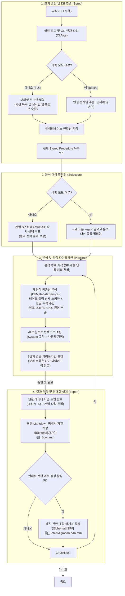
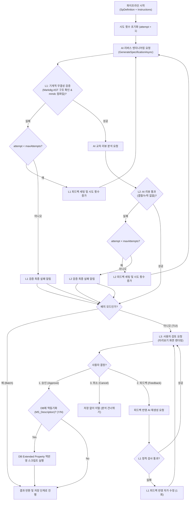
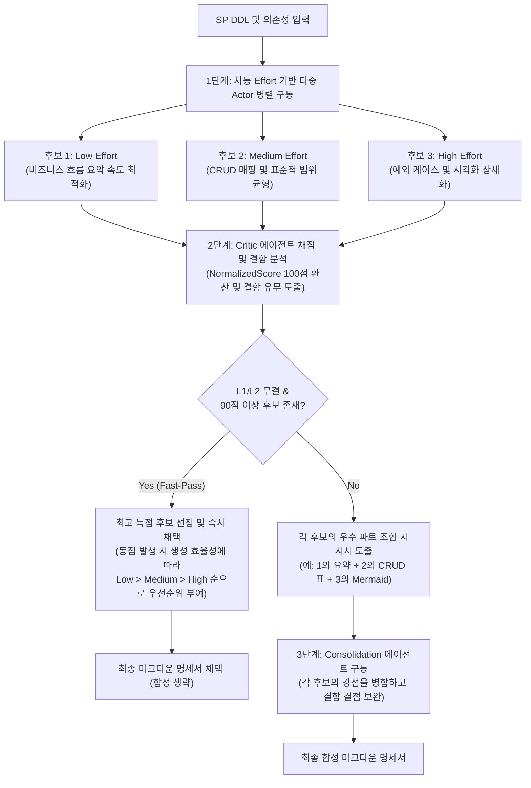
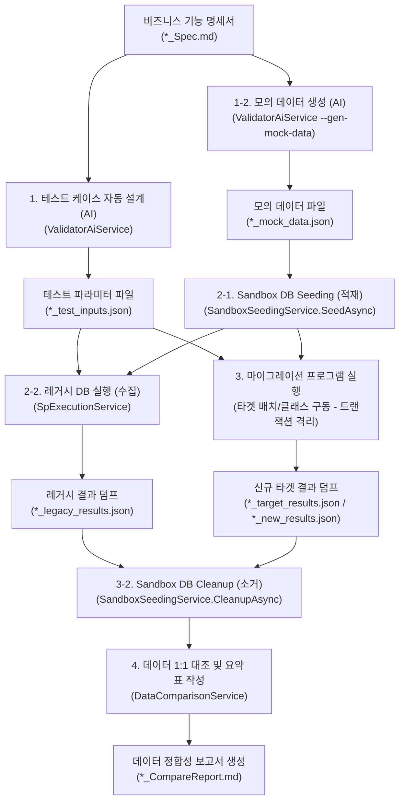

# ReSet (**RE**verse engineering **SET**tlement) 시스템 아키텍처 정의서 (System Architecture Definition)

본 문서는 SQL Server Stored Procedure(SP)를 자율적으로 분석하고 신규 시스템으로의 전환 설계서를 도출하는 **ReSet (REverse engineering SETtlement) 에이전트** 프로그램의 모듈 설계, 구성 요소 간의 데이터 흐름, 핵심 알고리즘 및 검증 파이프라인의 구조적 아키텍처를 정의합니다.

---

## 🏗️ 컴포넌트 및 모듈 아키텍처 (Component Architecture)

본 프로그램은 관심사 분리(SoC) 원칙에 따라 사용자 인터페이스 레이어(Cli)와 핵심 도메인 비즈니스 레이어(Core)로 명확히 분리되어 설계되었습니다.

| 컴포넌트 (프로젝트) | 모듈 (클래스/인터페이스) | 주요 아키텍처적 역할 및 기능 |
| :--- | :--- | :--- |
| **ReSet.Cli** (TUI/CLI 레이어) | [Program](file:///home/moondae/git-root/ReSet/src/ReSet.Cli/Program.cs) | CLI 아규먼트 파싱, DI 구성, 대화형 및 배치 실행 모드 제어, Multi-SP 물리 선택 순서 보장 순차 선택 루프 흐름 및 CancellationTokenSource 연동 |
| | [ConsoleUserInteraction](file:///home/moondae/git-root/ReSet/src/ReSet.Cli/ConsoleUserInteraction.cs) | Spectre.Console 기반 TUI 렌더링, L3 인간 개입형 검토 UI 제공, Warnings 경고 패널 렌더링, DB 동기화 동의(ConfirmMetadataSyncAsync) 및 Markup.Escape 예외 방지. 내부 `ConsoleProgressScope` 구현 포함 |
| | [SessionManager](file:///home/moondae/git-root/ReSet/src/ReSet.Cli/SessionManager.cs) | 직전 로그인 정보 로컬 세션 파일 기억 관리 및 즉각적인 연결 정보(서버, DB명) 수정 기능 제공 |
| | [CodingEngineFactory](file:///home/moondae/git-root/ReSet/src/ReSet.Cli/CodingEngineFactory.cs) | 설정 파일에 기반해 다형적 외부 코딩 에이전트(`ICodingEngine`)를 구성하고 생성하는 팩토리 클래스 |
| **ReSet.Core** (핵심 비즈니스 레이어) | [DbMetadataService](file:///home/moondae/git-root/ReSet/src/ReSet.Core/Services/DbMetadataService.cs) | 시스템 메타데이터 쿼리, DFS 기반 재귀적 의존성 탐색, 확장 속성 주석 수집, 설명 누락 여부(IsDescriptionMissing) 판단, CancellationToken 기반 비동기 취소 지원 및 Warnings 수집 |
| | [AiService](file:///home/moondae/git-root/ReSet/src/ReSet.Core/Services/AiService.cs) | LLM 프롬프트 조립(동적 SQL/Linked Server 가이드라인 포함) 및 결과 분석 오케스트레이션. 설명 누락 컬럼 역추론 및 주석-코드 모순 감지 프롬프트 룰(12, 13) 내장, 주입받은 `IAiClient`를 사용해 AI API 호출 수행, robust한 JSON 추출(`ExtractJson`) |
| | [IAiClient](file:///home/moondae/git-root/ReSet/src/ReSet.Core/Services/IAiClient.cs) | AI 모델 간의 공통 텍스트 통신 계약 정의 |
| | [Clients (OpenAi, Claude, Google, Ollama)](file:///home/moondae/git-root/ReSet/src/ReSet.Core/Services/Clients/) | 각 프로바이더(OpenAI, Claude, Google, Ollama)의 네이티브 REST 규격에 맞춰 제작된 HttpClient 통신 모듈 |
| | [AiClientFactory](file:///home/moondae/git-root/ReSet/src/ReSet.Core/Services/Clients/AiClientFactory.cs) | 제공자 문자열에 맞춰 적절한 `IAiClient` 구현체를 생성하여 반환하는 팩토리 클래스 |
| | [MechanicalValidator](file:///home/moondae/git-root/ReSet/src/ReSet.Core/Services/MechanicalValidator.cs) | Markdig AST 기반 마크다운 필수 구조 분석(IsConsolidated 분기 검증) 및 mermaid-cli 연동을 통한 다이어그램 문법 실시간 컴파일 검증 |
| | [MetadataExporter](file:///home/moondae/git-root/ReSet/src/ReSet.Core/Services/MetadataExporter.cs) | JSON 덤프, 프롬프트 로그, 개별 개체 파일 트리 내보내기(Export) 및 외부 코딩 에이전트용 가이드라인 번들(`*_MigrationInstructions.md`) 생성 제어 |
| | [VerificationPipelineOrchestrator](file:///home/moondae/git-root/ReSet/src/ReSet.Core/Services/VerificationPipelineOrchestrator.cs) | CancellationToken을 전파하는 L1/L2 자동화 자가 수정 루프 및 L3 인간 개입 워크플로우 오케스트레이션. SQL 메타데이터 보완 스크립트 무인 내보내기 및 DB 동기화 조율 수행 |
| | [CacheManager](file:///home/moondae/git-root/ReSet/src/ReSet.Core/Services/CacheManager.cs) | SHA-256 해시 기반 로컬 증분 분석 캐싱 및 색인(`.sp_cache_index.json`) 보존/조회 관리 |
| | [ICodingEngine](file:///home/moondae/git-root/ReSet/src/ReSet.Core/Services/ICodingEngine.cs) | 외부 코딩 에이전트 연동용 마이그레이션 생성기 추상 인터페이스 |
| | [ExternalCliCodingEngine](file:///home/moondae/git-root/ReSet/src/ReSet.Core/Services/ExternalCliCodingEngine.cs) | CLI 기반 외부 에이전트 프로세스(Claude, agy, codex 등) 기동 및 콘솔 상속 연동 구현체 |
| | [IMultiProgressScope](file:///home/moondae/git-root/ReSet/src/ReSet.Core/Services/IMultiProgressScope.cs) | 멀티태스크 진행률 상황 보고를 위한 추상 인터페이스 |
| | [NullProgressScope](file:///home/moondae/git-root/ReSet/src/ReSet.Core/Services/NullProgressScope.cs) | 유닛 테스트 및 무인 모드 등에서 UI 미출력을 보장하고 NullReferenceException을 막는 방어적 널 객체 구현체 |
| | [ISettlementPolicyService](file:///home/moondae/git-root/ReSet/src/ReSet.Core/Services/ISettlementPolicyService.cs) | 정산 정책 문서 생성기 추상 인터페이스 |
| | [SettlementPolicyService](file:///home/moondae/git-root/ReSet/src/ReSet.Core/Services/SettlementPolicyService.cs) | DDL 상수 분석 및 DB 마스터 데이터 프로파일링을 활용한 통합 정산 정책서 생성 서비스 |
| **ReSet.Validator.Cli** (TUI/CLI 레이어) | [Program](file:///home/moondae/git-root/ReSet/src/ReSet.Validator.Cli/Program.cs) | 검증기 CLI 진입점. 디렉토리 사전 유효성 확인, 솔루션 루트 스캔, Ctrl+C 취소 연동 및 무인 배치 검증 흐름 제어 |
| | [ConsoleUserInteraction](file:///home/moondae/git-root/ReSet/src/ReSet.Validator.Cli/ConsoleUserInteraction.cs) | Spectre.Console 기반 TUI 렌더링. 탭(Tab) 자동완성 디렉토리 입력창(`ShowChoices(false)` 제어) 및 Gap 분석 결과 패널 렌더링 |
| **ReSet.Validator.Core** (검증 비즈니스 레이어) | [FileMappingService](file:///home/moondae/git-root/ReSet/src/ReSet.Validator.Core/Services/FileMappingService.cs) | 명세서 파일명/YAML Front Matter 기반 구현 소스 매핑 및 경로 중복 자동 보정 |
| | [IValidatorPlugin](file:///home/moondae/git-root/ReSet/src/ReSet.Validator.Core/Abstractions/IValidatorPlugin.cs) | C#([CsValidatorPlugin](file:///home/moondae/git-root/ReSet/src/ReSet.Validator.Core/Plugins/CsValidatorPlugin.cs)), Java([JavaValidatorPlugin](file:///home/moondae/git-root/ReSet/src/ReSet.Validator.Core/Plugins/JavaValidatorPlugin.cs)) 등 언어별 정적 구조 린터 플러그인 인터페이스 |
| | [IRuntimeRunner](file:///home/moondae/git-root/ReSet/src/ReSet.Validator.Core/Abstractions/IRuntimeRunner.cs) | C# 및 Java 등 언어별 타겟 런타임 결과 수집 러너 표준 추상 인터페이스 |
| | [MockDataDto](file:///home/moondae/git-root/ReSet/src/ReSet.Validator.Core/Models/MockDataDto.cs) | 기획된 관계형 모의 데이터를 로컬 및 메모리에 들고 있기 위한 데이터 모델 |
| | [CSharpReflectionRunner](file:///home/moondae/git-root/ReSet/src/ReSet.Validator.Core/Services/CSharpReflectionRunner.cs) | C# 프로젝트 DLL 동적 로딩 및 리플렉션 호출, DbTransaction 강제 롤백을 활용한 DB 격리 실행기 |
| | [JavaProcessRunner](file:///home/moondae/git-root/ReSet/src/ReSet.Validator.Core/Services/JavaProcessRunner.cs) | Java JAR/클래스를 외부 프로세스로 기동하여 stdin/stdout JSON 통신을 수행하는 격리 실행기 |
| | [ValidatorAiService](file:///home/moondae/git-root/ReSet/src/ReSet.Validator.Core/Services/ValidatorAiService.cs) | AI 공급자(`IAiClient`)를 통해 입출력 및 비즈니스 로직에 대한 의미론적 Gap 분석 요청 및 역직렬화 수행. 추가로 데이터 정합성 검증용 테스트 파라미터 JSON 및 모의 테이블 데이터 생성 기능 탑재 |
| | [SpExecutionService](file:///home/moondae/git-root/ReSet/src/ReSet.Validator.Core/Services/SpExecutionService.cs) | 입력받은 테스트 케이스 파라미터를 활용해 Legacy DB에서 Stored Procedure를 실행하고 결과를 다중 ResultSet 구조의 JSON 문자열로 직렬화하여 반환. Soft Fail 기반 예외 격리 적용 |
| | [SandboxSeedingService](file:///home/moondae/git-root/ReSet/src/ReSet.Validator.Core/Services/SandboxSeedingService.cs) | 캐시된 모의 데이터를 샌드박스 DB에 자동 적재(Seed)하고 검증 완료 후 강제 제거(Cleanup)하는 라이프사이클 관리 서비스 |
| | [DataComparisonService](file:///home/moondae/git-root/ReSet/src/ReSet.Validator.Core/Services/DataComparisonService.cs) | 수집된 레거시 결과 JSON과 신규 타겟 결과 JSON 데이터를 로드해, 행 수, 데이터 타입, 개별 컬럼의 동등성(실수 정밀도 및 날짜 정형화 적용)을 1:1 비교 검증해 상세 보고서 마크다운 생성 |
| | [CodeVerificationOrchestrator](file:///home/moondae/git-root/ReSet/src/ReSet.Validator.Core/Services/CodeVerificationOrchestrator.cs) | L1 정적 검사 -> L2 AI 논리 검증 및 자체 교정 -> L3 개발자 승인 총괄 오케스트레이터 및 결과 보고서 내보내기 |

---

## ⚙️ 핵심 아키텍처 메커니즘 (Core Mechanisms)

### 1. 재귀적 의존성 수집 및 예외 격리 (DFS & Soft Fail & Warnings)
* **하이브리드 재귀 탐색 알고리즘**: 타겟 SP가 참조하는 테이블, UDF, 하위 SP의 의존성을 `sys.sql_expression_dependencies`를 활용해 깊이 우선 탐색(DFS) 방식으로 수집합니다. 여기에 더하여, **DDL 소스 텍스트 내에서 동적 SQL 구문(EXEC, sp_executesql)을 2차 Regex 스캔하여 정적 의존성 뷰에서 누락되는 동적 참조 테이블들의 실시간 컬럼 스키마 및 주석 정보까지 강제 병합 수집**하는 하이브리드 탐색 매커니즘이 탑재되어 있습니다.
* **순환 참조 방지**:  탐색 중인 객체의 전체 이름을 담는 `HashSet<string> (visited)`을 관리하여 무한 루프 및 중복 DB 조회를 원천 차단합니다.
* **소프트 페일 및 경고 누적(Soft Fail & Warnings)**: 특정 의존 테이블의 스키마나 UDF DDL 조회 중 권한 누락이나 존재하지 않는 객체 참조 등의 비치명적 오류가 발생하면, 파이프라인 전체를 중단시키는 대신 해당 내역을 `SpDefinition.Warnings` 리스트에 누적합니다. 이 경고 데이터는 TUI 화면에 명확한 경고 패널(Panel)로 렌더링될 뿐만 아니라 AI 분석 프롬프트에도 포함되어 AI가 누락된 리소스를 감안하여 현실적인 분석 명세서를 쓰도록 돕습니다.

### 2. 비즈니스 뉘앙스 확보를 위한 확장 속성(Extended Properties) 맵핑
* 기술적 메타데이터(컬럼명, 데이터 타입) 수집 단계를 넘어, 데이터베이스의 확장 속성인 **`MS_Description`**에 등록된 테이블 요약과 컬럼별 한글 주석을 실시간 연동합니다.
* 이를 통해 AI 엔진이 `STAT_CD = 'A01'`과 같은 데이터 조작을 분석할 때, 실제 도메인 의미인 `상태코드 (A01: 대기)`를 정확히 인지하여 환각(Hallucination) 현상을 원천 방어합니다.

### 3. 3단계 신뢰성 검증 파이프라인 (Verification Pipeline)
* **Actor-Critic 및 점진적 합성 (Level 2 고도화)**:
  * `ActorEffort: "dynamic"` 설정이 활성화되면, 분석가(Actor)가 `Low`, `Medium`, `High` 추론 강도를 적용하여 3종의 상이한 후보 분석서를 병렬로 생성합니다.
  * 생성된 후보들은 L1 정적 검사 후 **Critic 에이전트**에게 주입되어 4대 평가 기준(비즈니스 정합성, CRUD 데이터 매핑, 다이어그램 가독성, 예외/트랜잭션)에 기반해 정량 채점(각 10점, 총 40점 만점) 및 결점 피드백을 부여받습니다.
  * 결함이 없고 100점 환산 기준 90점 이상인 후보가 있을 경우 **Fast-Pass 즉시 채택**하며, 그렇지 않은 경우 **Consolidator 에이전트**가 각 후보군의 세부 항목별 득점 가중치를 가이드로 받아 최상의 섹션들을 한 문장 단위로 조립(Consolidation)하는 구조를 취합니다. 각 에이전트의 구체적 모델 및 공급자는 설정에서 자유롭게 지정 및 연동 가능하며, 이종 모델(예: Claude 계열 Actor와 GPT 계열 Critic 앙상블 등)을 매핑하여 온도 조절 제약을 극복하고 자가 편향을 소거하도록 권장됩니다.
* **다단계 검증 구조**: AI 분석 및 합성을 거친 명세서의 기계적 무결성을 재검사하기 위해 Level 1(기계적 정적 검사), Level 2(AI 리뷰어 상호 교사), Level 3(개발자 검토 및 승인)의 3단계 파이프라인이 연쇄적으로 작동합니다.
* **CancellationToken 전파 및 취소 안전성**: 대량의 SP 데이터 수집이나 원격 AI 응답 대기가 장시간 블로킹되거나 무한 대기가 발생하는 것을 방지합니다. `Program`의 메인 컨트롤러부터 `VerificationPipelineOrchestrator`, `AiService`, `DbMetadataService` 등 모든 비동기 호출 경로로 `CancellationToken`을 전파하였고, CLI 환경에서 `Ctrl+C` 입력 감지 시 `CancellationTokenSource`를 즉시 취소하여 안전하게 예외를 격리하고 메인 루프를 복구합니다.

### 4. 다중 AI 공급자 지원을 위한 추상화 아키텍처 (IAiClient)
* **결합도 분리(Decoupling)**: 기존에 `AiService` 내부에서 직접 HTTP Client를 구성하여 OpenAI 규격만을 강제해 사용하던 아키텍처를 전면 리팩토링하여, 구체적인 모델 통신 세부 사항을 `IAiClient` 인터페이스 뒤로 감췄습니다.
* **프로바이더별 전용 클라이언트 독립화**:
  * **OpenAiClient**: OpenAI 공식 채팅 엔드포인트에 대응.
  * **ClaudeClient**: Claude API(Anthropic Messages API) 형식에 맞춘 System Instruction 및 페이로드 구성.
  * **GoogleClient**: Google AI Studio 규격에 적합한 URI Query API Key 주입 및 SystemInstruction 구조 대응.
  * **OllamaClient**: 로컬 Ollama 환경이 제공하는 OpenAI 호환 API 엔드포인트에 맞춰 `OpenAiClient`를 대리자로 활용.
* **설정 파일 기반의 동적 다형성**: `appsettings.json` 내에 신설된 `Providers` 하위 설정들(ApiKey 및 Endpoint)을 기반으로, `AiClientFactory`가 지정된 활성 제공자(`Provider`)에 최적화된 `IAiClient` 인스턴스를 동적으로 생성하여 `AiService`에 주입(Dependency Injection)합니다.

### 5. 마이그레이션 소스코드 일치성 검증 메커니즘 (Validator)
* **설정 파일 기반 경로 절대화 보정**:
  - 설정 파일이나 CLI 인자로부터 수신한 상대 경로(`SpecDirectory`, `SourceCodeDirectory`, `OutputDirectory`)는 프로세스 구동 시 `Directory.GetCurrentDirectory()`를 결합하여 즉시 **절대 경로로 전환 보정** 처리됩니다. 이는 실행 시점의 워킹 디렉토리 차이로 발생 가능한 디렉토리 미조회 장애(IO Error)를 사전에 통제합니다.
* **공통 AI 공급자 클라이언트 다형성 공유**:
  - `ValidatorAiService` 또한 별도의 검증용 AI 라이브러리를 종속시키지 않고, `ReSet.Core`가 정의한 `IAiClient` 추상화 계약을 그대로 수신합니다. 이에 따라 `AiClientFactory`를 통해 빌드된 다중 AI 공급자(OpenAI, Claude, Google, Ollama) 객체를 다형적으로 재사용하며, 동일한 API 키 관리 전략을 일관되게 공유합니다.
* **스마트 설계서-코드 매핑 (Resolving Mappings)**:
  - 파일명 매칭 규칙(예: `dbo.CustOrderHist_Spec.md` -> `CustOrderHist.cs` / `CustOrderHist.java`)을 기반으로 연관 관계를 자동 탐색합니다.
  - 마크다운 설계서 상단에 YAML Front Matter(`TargetCode: ...`)로 명확한 목적 경로가 명시된 경우 우선순위를 부여하며, 실행 경로에 따라 중복된 접두사 경로(예: `src/` 중복)를 자동 슬라이싱해 보정해 주는 장애 방지 로직이 탑재되어 있습니다.
* **언어별 정적 구문 분석 플러그인 (L1 Linter)**:
  - `IValidatorPlugin` 인터페이스를 통해 C# 및 Java 구문 검증기를 다형적으로 운영합니다.
  - 정교한 컴파일러 대신 경량화된 중괄호 쌍 일치 분석 및 Regex 클래스/메소드 식별자 스캔 방식을 채택하여 라이브러리 의존성 충돌 없는 고속 L1 정적 검사를 지원합니다.
* **AI 의미론적 Gap 분석 (L2 Semantic Check)**:
  - `ValidatorAiService`가 검토 에이전트를 가동해 입력 파라미터, 출력셋, 핵심 비즈니스 로직, 예외/트랜잭션 세부 처리를 설계서와 비교 검증합니다.
  - 비교 분석 결과는 사전 약속된 JSON 규격(`GapReport`)으로만 수집하여 파싱 안전성을 확보하였으며, 불일치 식별 시 **이전 시도의 구체적인 불일치 Gap 항목 및 Suggestions 수정 지침을 프롬프트 피드백(Feedback Log)으로 전달하는 지능형 자체 교정(`MaxL2Attempts`)**을 구동해 정합성을 극대화합니다.
* **사용자 친화적 대화형 경로 확보 (TUI UX)**:
  - 실행 설정된 폴더가 유효하지 않을 경우 `DirectoryNotFoundException`으로 튕기지 않고, TUI 화면에서 사용자에게 유효 경로를 다시 입력하도록 루프형 재요청을 지원합니다.
  - 탭(Tab) 키 및 화살표 키를 이용해 로컬 디렉토리 후보군을 자동 완성(AutoComplete)하도록 설계했으며, 슬래시(`/`) 구분자 충돌로 인해 지저분하게 렌더링되던 선택지 출력을 `ShowChoices(false)` 옵션을 통해 시각적으로 제어하여 사용성을 향상했습니다.

### 6. 데이터 정합성 검증 엔진 (Data Verification Runner)
비즈니스 로직에 대한 AI 검토를 마친 뒤, 실제 기존 Stored Procedure와 마이그레이션된 타겟 소스코드를 런타임 상에서 구동해 결과 데이터를 대조하는 검증 메커니즘입니다.
* **AI 기반 동적 테스트 케이스 설계 (`ValidatorAiService.GenerateTestParametersAsync`)**:
  - 작성된 기능 명세서(`*_Spec.md`)의 입출력 정보를 AI 분석가에게 제공하여, 정상 호출 조건뿐만 아니라 경계값(Boundary), 예외/오류 유발 조건까지 망라하는 다양한 테스트 케이스와 파라미터 세트를 기획하여 `*_test_inputs.json` 형태로 출력합니다.
* **레거시 DB 실시간 실행 데이터 수집 (`SpExecutionService`)**:
  - 수집된 테스트 케이스 JSON을 파싱하여, 실제 SQL Server 데이터베이스에 연결한 뒤 Stored Procedure를 직접 실행합니다.
  - SP가 반환하는 다중 결과 세트(Multiple Result Sets)를 `SqlDataReader`를 통해 누락 없이 추적하며, DB 상의 Null 값은 JSON 직렬화가 가능하게 안전하게 변환 처리하여 `*_legacy_results.json`으로 물리 덤프합니다.
  - 데이터베이스의 일시적 장애나 자격 증명 오류가 빌드 전체를 실패시키지 않도록 **연결 및 실행 예외를 격리(Soft Fail)**하여 결과 파일 내부의 각 테스트 케이스에 `FAIL` 상태를 기록하고 정상 리턴합니다.
* **유연한 1:1 데이터 동등성 비교 알고리즘 (`DataComparisonService`)**:
  - 레거시 덤프 JSON과 신규 타겟 결과 덤프 JSON(`*_target_results.json`)을 동적으로 역직렬화하여 구조 대조를 실시합니다.
  - **3차원 대조 매트릭스**: 테스트 케이스 단위 ➔ 결과 세트(Result Set) 인덱스 단위 ➔ 행(Row) 및 컬럼 값 단위까지 계층적으로 1:1 대조합니다.
  - **데이터 값 포맷 정규화**: 실수의 부동 소수점 자릿수 표현 차이나 날짜/시간(DateTime) 문자 포맷 차이로 인한 미세한 문자열 불일치(False Positives)를 방지하기 위해, 타입 감지 시 `NormalizeValueString`을 통해 정규화 처리를 거친 후 비교를 실행합니다.
  - 불일치 항목들이 한눈에 파악되도록 불일치율, 행 수 미스매치, 컬럼 값 차이를 비교 요약 표와 상세 목록으로 작성한 검증 보고서 마크다운 `*_CompareReport.md`를 자동으로 출력 디렉토리에 내보냅니다.

### 7. SHA-256 해시 기반 로컬 증분 캐싱 (Caching Infrastructure)
* **Composite Signature Hash**: 대상 SP의 SQL 본문 텍스트와 모든 하위 의존성 객체의 DDL 원문을 각각 SHA-256으로 해싱한 뒤, 키로 정렬 및 병합하여 복합 해시값을 산출합니다.
* **증분 스킵 (Cache Hit)**: `./output/.sp_cache_index.json` 파일에 저장된 기존 캐시값과 비교하여 대조 결과가 동일하고, 물리적인 마크다운 명세서 파일이 손실되지 않았다면 LLM 분석 및 3단계 검증 전체 루프를 건너뜁니다.
* **안전한 격리**: 로컬 인덱스에 쓰기 실패하거나 손상된 경우에도 Soft Fail 형태로 예외가 무시되어, 원본 비즈니스 분석 전체 흐름에 영향을 끼치지 않습니다.

### 8. 하이브리드 타겟 런타임 결과 수집 및 DB 격리
* **C# DLL 리플렉션 기동**: 마이그레이션된 C# 타겟 코드의 경우, 빌드 디렉토리의 DLL을 검색하여 로드한 뒤 생성자 분석을 통해 `SqlConnection` 및 `SqlTransaction`을 리플렉션 주입하여 실행합니다.
* **Java 외부 프로세스 구동**: JAR 또는 클래스 파일을 외부 Java 런타임 프로세스로 실행하고, 입력 페이로드를 표준 입력(stdin)으로 공급하여 실행 완료된 결과를 표준 출력(stdout)으로 파싱해 수집합니다. 30초 타임아웃을 두어 CLI 교착을 방지합니다.
* **DbTransaction 강제 롤백**: 로직 수행 완료 성공 여부에 관계없이 항상 `Rollback()`을 호출하여 DB 데이터 수정을 예방하는 격리 전략을 지원합니다.

### 9. TUI 로그인 세션 및 연결 정보 실시간 변경
* **연결 정보 즉석 수정**: 로컬 세션 파일(`.session.json`)에서 직전 로그인 성공 계정 정보를 성공적으로 불러온 경우에도, 사용자가 설정 파일(`appsettings.json`)을 열어 수정할 필요 없이 TUI 화면에서 즉시 서버 주소 및 데이터베이스 이름을 확인하고 직접 수정하여 다른 DB 인스턴스에 안전하게 교체 연결할 수 있습니다.
* **사용성 개선**: 연결 정보 재입력 번거로움을 줄이면서도 동적으로 타겟 데이터베이스를 손쉽게 오갈 수 있는 편리한 접속 환경을 유지합니다.

### 10. Multi-SP 전환 계획을 위한 순서 보장형 TUI 수집 메커니즘
* **물리 선택 순서 보장**: 다중 선택(Multi-select) UI 컴포넌트는 사용자가 스페이스바로 항목을 선택하더라도 최종 선택 반환 결과에서 사용자가 누른 순서(Sequence)를 보장하지 않고 알파벳 순서 등으로 정렬되는 한계가 있습니다.
* **순차 단일 선택 루프**: 배치 작업 설계 시 각 SP 마이그레이션 스텝의 논리적 실행 순서를 엄격히 반영할 수 있도록, TUI 화면에서 사용자가 목록을 보며 원하는 순서대로 하나씩 SP 명세서를 선택하여 큐(Queue)에 적재하고, 최종 `[-- 완료 및 배치 계획 수립 --]` 메뉴를 선택하여 처리를 마치는 단일 순차 선택 루프 흐름을 제공합니다.

### 11. 외부 코딩 에이전트 연동용 마이그레이션 지시서 번들링 및 자동 기동 브릿지 (Migration Instructions & Codegen Bridge)
* **단절 없는 개발 경험 제공**: SP 분석 ➔ 통합 배치 전환 계획 수립 및 통합 지시서 작성 ➔ 코드 마이그레이션 ➔ 코드 검증의 전체 흐름에서, 마이그레이션 소스 코드를 생성하는 주체를 외부의 전문 코딩 에이전트(Claude Code, agy, codex 등)로 위임하되 결합도 및 사용자 단절을 최소화하기 위한 브릿지 구조를 탑재했습니다.
* **무인 배치 통합 계획 수립 자동화**: TUI 메뉴뿐만 아니라 무인 배치 자동화 실행 시에도 `--job-name` 인자가 공급되면 `RunConsolidatedPipelineAsync`가 L3 대화형 단계를 건너뛰고 자동으로 통합 계획 및 지시서 번들을 생성해 외부 에이전트 프로세스 기동까지 연속 수행하는 CI/CD 무인 파이프라인을 온전히 지원합니다.
* **구조화된 컨텍스트 패키징**: 사용자가 직접 DDL/계획서 등을 코딩 에이전트에 공급하는 번거로움을 해결하기 위해, 최종 승인된 **통합 배치 전환 계획서(Plan)**와 이에 매핑되는 각 SP들의 **설계 명세서(Spec)**, **레거시 DDL 원본**, 그리고 **참조하는 모든 외부 스키마 및 DDL** 정보들을 하나의 마이그레이션 지시서 문서(`{JobName}_MigrationInstructions.md`)로 빌드하여 자동 추출합니다.
* **즉시 사용 가능한 프롬프트 내장**: 문서 말단에는 사용자가 복사하여 곧바로 사용할 수 있는 표준화된 마이그레이션 명령 프롬프트 템플릿을 명시해 둠으로써 프롬프팅 누락 및 실수 가능성을 원천 제거합니다.
* **대화형 콘솔 상속 및 양방향 제어 (Terminal Stream Sharing)**:
  - CLI 연동 구동 시 자식 프로세스의 입출력 스트림을 리다이렉션하여 가두지 않고, 현재 작동 중인 부모 콘솔 스트림을 직접 상속 공유(`RedirectStandardInput/Output = false`)하도록 구현했습니다.
  - 이를 통해 Claude Code 등 대화형 에이전트가 실행되는 도중 발생할 수 있는 사용자의 수동 승인 요청(Y/N)이나 자연어 질의응답 등의 양방향 인터랙션을 동일한 콘솔에서 매끄럽게 처리할 수 있습니다.
* **취소 안전성 및 프로세스 격리 (Cancellation Safety & Process Isolation)**:
  - 마이그레이션 전체 파이프라인에서 전파되는 `CancellationToken`과 외부 기동 프로세스의 수명 주기를 연결했습니다.
  - CLI 상에서 사용자가 `Ctrl+C` 등을 통해 마이그레이션 분석 프로세스를 중단시키면, 토큰 해제 이벤트 핸들러가 가동 중인 하위 코딩 에이전트 프로세스 트리 전체를 강제 종료(`process.Kill(true)`)하여 유령 백그라운드 프로세스가 리소스를 독점하는 좀비 현상을 예방합니다.
* **프롬프트 단일 인자 패키징 (Query Parameter Wrapping)**:
  - 띄어쓰기가 포함된 여러 단어로 조립된 프롬프트가 외부 에이전트 CLI 구동 시 여러 개의 인자(Subcommands)로 쪼개져 인식되는 파싱 에러를 차단하기 위해, 전체 프롬프트 구문을 이스케이프된 쌍따옴표(`\"...\"`)로 감싸 단일 문자열 매개변수로 대상 CLI에 안전하게 공급하는 템플릿 바인딩 전략을 적용했습니다.

### 12. 모의 데이터(Mock Data) 자동 생성 및 격리 적재 라이프사이클 (Sandbox Seeding & Lifecycle)
* **관계지향 모의 데이터 자동 생성 (`--gen-mock-data`)**:
  - 보안 규정 및 사내 정책상 실제 운영/개발 데이터를 활용할 수 없는 환경에 대응하여, AI 분석을 통해 물리적 FK가 없더라도 JOIN문과 컬럼 메타데이터를 분석하여 상호 연결성을 가진 고품질 모의 데이터를 `MockDataDto` 형태로 생성 및 로컬 캐싱합니다.
* **Sandbox Seeding 메커니즘**:
  - 데이터 정합성 검증 실행(Legacy DB SP 호출 및 Target 소스코드 구동) 직전에, `SandboxSeedingService`가 기동되어 캐싱된 관계형 모의 데이터를 대상 샌드박스 데이터베이스에 적재(Seed)합니다.
* **수명주기 소거(Clean-up) 및 상태 격리**:
  - 레거시 및 타겟 런타임 결과 데이터 수집 작업이 종료되는 즉시, 데이터 정합성 대조를 진행하기 이전에 적재했던 모의 테이블들의 데이터를 강제로 소거(Delete/Truncate)하여 샌드박스 데이터베이스의 원래 무결 상태를 완벽하게 원복시킵니다.
  - 이를 통해 로컬/샌드박스 DB의 타 테스트 케이스나 프로세스에 부작용(Side Effect)이 전파되지 않도록 완벽한 생명주기 격리를 수행합니다.

### 13. 정합성 검증 실패 시의 3단계 복구 피드백 루프 (Failure Recovery Feedback Loops)
데이터 정합성 대조 및 검증 작업이 실패(`FAIL`)하였을 때, 전체 작업을 원점(1단계 분석)에서부터 비효율적으로 재실행하는 대신 결함의 유형에 맞추어 점진적이고 효율적으로 피드백 루프를 분기하는 예외 대응 아키텍처입니다.
* **루프 A (설계 재수립 - Loop A: Spec Feedback)**:
  - **원인**: 레거시 SQL의 비즈니스 규칙 해석 오류 등 **비즈니스 설계 명세서(`*_Spec.md`) 자체에 결함**이 식별된 경우입니다.
  * **흐름**: Level 3 인간 피드백 콘솔에 실패한 비교 분석 리포트(`*_CompareReport.md`) 및 `GapReport`를 입력 피드백으로 주입하여, 기능 설계서를 보완/재생성하고 이에 맞추어 코드를 재생성하도록 오케스트레이션합니다.
* **루프 B (소스코드 보완 - Loop B: Code Refactoring)**:
  - **원인**: 설계 명세서는 완벽하지만, **마이그레이션된 소스코드 구현부에 로직 누락이나 코딩 버그**가 존재하는 경우입니다.
  * **흐름**: 설계서 재생성 과정을 전면 스킵하고, 불일치 명세(`GapReport`)만 외부 코딩 에이전트 CLI 프로세스에 주입하여 소스코드만 수정 및 부분 리팩토링하도록 유도합니다. (2단계 생성 브릿지로 바로 점프)
* **루프 C (테스트 튜닝 - Loop C: Param Tuning)**:
  - **원인**: 날짜 포맷 표현 차이나 부동 소수점 자릿수 정밀도 오차 등 **환경적 차이로 인해 미세한 덤프 데이터 불일치(False Positive)**가 발생한 경우입니다.
  * **흐름**: 설계서와 소스코드는 건드리지 않고, 테스트 케이스 매개변수(`*_test_inputs.json`)의 경계 조건을 보완하거나 `DataComparisonService` 내 정규화 함수(`NormalizeValueString`)의 정밀도 비교 조건을 조정하여 덤프 비교 수집을 재구동합니다.

### 14. 메타데이터 정화 및 주석 보완 라이프사이클 (Metadata Cleansing & DB Sync)
설명 주석(`MS_Description`)이 소실되거나 개발 주석과 실제 코드가 모순되는 레거시 환경을 탐지 및 자동 치유하기 위한 메커니즘입니다.
* **설명 누락 식별 및 AI 역추론**:
  - `DbMetadataService`가 스키마 조회 시 한글 속성이 소실된 항목을 찾아 `IsDescriptionMissing` 속성을 마크하고 AI 분석 모델에 제공합니다.
  - AI는 테이블 스키마에서 `[설명 누락]`으로 마킹된 컬럼의 쿼리 활용 문맥을 SP/UDF/뷰 소스코드 내에서 분석하여 의미를 역으로 유추하고, `[AI 추론 보완: {Schema}.{Table}.{Column} - {설명}]` 포맷으로 사양서에 포함시킵니다.
* **코드-주석 불일치 경고 전파**:
  - 소스코드 주석과 실제 연산 수식 간 불일치를 AI가 정밀 탐지하여 개요에 `[🚨 주석 불일치 경고]` 블록을 렌더링하고 오케스트레이터 경고 흐름에 주입합니다.
* **SQL 보완 스크립트 무인 내보내기**:
  - 분석 완료 시, 사용자의 DB 갱신 선택 유무와 관계없이 `sp_addextendedproperty` / `sp_updateextendedproperty` 쿼리가 조립된 SQL 스크립트 파일(`*_MetadataCleansing.sql`)을 `{outputDirectory}/cleansing` 디렉토리에 항상 파일로 저장합니다.
* **인간 승인 기반 DB 동기화**:
  - TUI에서 최종 승인 시 역동기화 의사 (`ConfirmMetadataSyncAsync`)를 확인하여, 사용자가 동의할 경우에만 DB 세션을 획득해 SQL 스크립트를 동적으로 수행함으로써 DB의 MS_Description 속성을 정화합니다.

### 15. 정산 정책 문서 도출 메커니즘 (Settlement Policy Extraction)
* **정적 및 동적 분석 결합**: 정적 코드에 하드코딩된 상수 분기 조건들을 수집하고, 이에 매핑되는 DB 공통코드와 마스터 테이블의 실제 레코드들을 동적으로 프로파일링(SELECT TOP 100)하여 데이터셋을 덤프합니다.
* **통합 정책서 합성**: DDL 의존성 스키마와 프로파일링 데이터셋을 AI 엔진에 주입하여, 상수값들이 비즈니스적으로 의미하는 바(예: `S02 = 정산보류`)를 1:1 결합하여 자연어 형태의 구체적인 '통합 정산 정책 정의서'를 도출합니다.

---

## 📊 프로그램 실행 흐름 (Visual Execution Flow)

아래 다이어그램은 ReSet 프로그램이 기동되어 설정 파싱, 데이터베이스 메타데이터 재귀 수집, AI 분석 및 결과 저장/이탈까지의 거시적인(Macro) 전체 실행 흐름을 시각적으로 나타냅니다.

---

## 🔍 3단계 검증 파이프라인 상세 (Verification Pipeline Details)

AI가 생성한 1차 명세서의 신뢰성과 무결성을 검증하고, 오류 발견 시 자가 수정(`Self-Correction`) 및 사용자 피드백을 적용하는 상세 검증(Micro) 흐름도입니다.

### 3.1. Level 2 Actor-Critic 상세 협업 워크플로우
3단계 검증 파이프라인의 **Level 2 (AI 교차 리뷰)** 단계에서 `ActorEffort: "dynamic"`이 적용되었을 때, 다중 모델의 병렬 생성 및 채점, 최고 득점자 Fast-Pass 판정, 최종 조립(Consolidation)이 이루어지는 내부 에이전트 협업 시퀀스입니다.

#### 🔄 상세 실행 원칙
1. **차등 Effort 병렬 생성 (1단계 - Sampler & Actors)**
   - 동일한 SP 정의에 대하여 `low`, `medium`, `high` 3가지의 차등 Effort 옵션을 가진 생성 태스크들을 병렬로 구동하여 각기 강점이 다른 세 개의 명세서 후보군을 획득합니다.
2. **독립적 Critic 평가 및 채점 (2단계 - Critic)**
   - 생성된 3종 후보군에 대해 Critic 에이전트가 4대 평가 기준(비즈니스 정합성, CRUD 데이터 매핑, 다이어그램 가독성, 예외 및 트랜잭션 - 각 10점 만점, 총 40점 만점)을 토대로 독립 채점을 실시하고 100점 만점(`NormalizedScore`)으로 환산합니다. 동시에 Critic Feedback(결함 내용) 유무를 분석합니다.
3. **최고 득점자 Fast-Pass 판정**
   - 3종 후보군 중 **"L1 정적 검사 통과 및 L2 Critic 결함이 없고, 90점 이상"**인 후보들을 필터링합니다.
   - 만족하는 후보가 존재할 경우, 그중 **가장 높은 NormalizedScore를 획득한 최고 득점 후보**를 선별하여 즉시 채택(Fast-Pass)하고 합성 프로세스를 생략합니다.
   - 동점자 발생 시에는 생성 비용 및 속도적 측면을 고려하여 `Low` > `Medium` > `High` 순서로 우선권을 가집니다.
4. **이종 모델 합성 (3단계 - Consolidator)**
   - Fast-Pass 조건을 만족하는 완벽한 후보가 단 하나도 없는 경우에만 3단계 Consolidation으로 진입합니다.
   - 각 영역별(ScoreAccuracy, ScoreCrud, ScoreReadability, ScoreException) 최고 득점을 기록한 후보의 파트를 진실의 원천(Source of Truth)으로 삼아, Consolidator 에이전트가 단일한 고품질 병합 명세서로 재구성합니다.

### 15. 비결합 진행도 시각화 및 동시성 제어
* **Clean Architecture 기반 UI 비결합**: Core 비즈니스 로직은 특정 뷰 기술(Spectre.Console 등)에 종속되지 않도록 진행률 추적 수단을 `IMultiProgressScope` 추상화 뒤로 은닉했습니다. 이로 인해 유닛 테스트 실행 시에는 Mocking에 유연하게 대응하며 아무 동작도 하지 않는 `NullProgressScope`를 주입하여 널 참조 크래시를 온전히 방어합니다.
* **TUI 동시성 렌더링**: CLI 모드에서 실제로 구동되는 `ConsoleProgressScope`는 메인 태스크 동작 스레드와 Spectre.Console 렌더링 스레드의 교착 및 충돌을 방지하기 위해 `ConcurrentDictionary`와 `TaskCompletionSource`를 사용합니다. 비동기로 누적된 펜딩 태스크 갱신 건들을 백그라운드 렌더링 태스크가 100ms 간격으로 소거(TryRemove)하며 부드럽고 안전하게 상태를 실시간 업데이트합니다.

### 16. TUI 비파괴식 파일 로깅 시스템 (Serilog File Sink)
* **콘솔 UI 파괴 방지**: TUI 인터랙티브 메뉴 및 진행도 바가 로그 텍스트 출력으로 인해 번잡하게 깨지는 것을 막도록 Serilog의 콘솔 싱크를 끄고, **오직 파일 전용(File Sink)으로만 로그가 적재**되도록 아키텍처를 제한했습니다.
* **로깅 라이프사이클 및 설정 동적화**: `appsettings.json` 내 `LoggingSettings`를 배치하여 로그 디렉토리 및 일별 롤링 보존 기준(기본 31일)을 제어하며, `Program.ConfigureLogging`을 통해 폴더 자동 생성을 예외 격리하고 메인 종료 단계에서 `Log.CloseAndFlush()`로 자원을 안전하게 회수합니다.
* **마크업 자동 정화(StripMarkup)**: 로그에 들어가기 직전에 Spectre.Console 용 스타일 마크업 태그들을 정규식으로 안전하게 치환·제거하여 정밀한 순수 텍스트 상태로 파일을 보존함으로써, 실행 정보의 가독성과 영속성을 보장합니다.

---

## ⚙️ 데이터 정합성 검증 실행 흐름 (Data Verification Workflow)

아래 다이어그램은 마이그레이션된 소스코드와 레거시 DB SP 간의 데이터 정합성을 확인하기 위해 설계된 테스트 케이스 기획, 모의 데이터(Mock Data) 자동 생성 및 Sandbox DB 적재/소거, 그리고 실행 결과 데이터를 1:1 대조하는 전체 검증 실행 흐름입니다.

