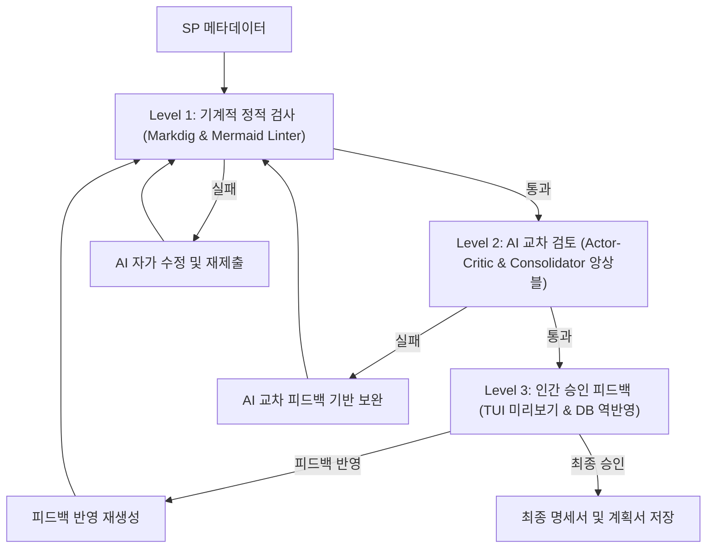

# 📄 ReSet (REverse engineering SETtlement) 제품 요구사항 정의서 (PRD)

본 문서는 SQL Server Stored Procedure(SP)를 분석하여 현대적인 애플리케이션(C#, Java 등)으로 마이그레이션하는 **ReSet (REverse engineering SETtlement)** 시스템의 제품 요구사항 정의서(Product Requirement Document)입니다. 시스템이 제공해야 할 기능적/비기능적 요구사항과 비즈니스 비전, 그리고 성공 지표를 명확히 정의합니다.

---

## 1. 제품 개요 및 비전 (Product Overview & Vision)

### 1.1. 배경 및 문제 정의
많은 엔터프라이즈 환경에서 핵심 비즈니스 로직(특히 정산, 회계, 배치 작업 등)이 데이터베이스 내부의 **Stored Procedure(SP)** 형태로 구현되어 운영되고 있습니다. 이로 인해 다음과 같은 문제점이 발생합니다.
*   **유지보수성 저하**: 수천 라인에 달하는 SQL 코드와 복잡하게 얽힌 DB 객체 간 의존성으로 인해 영향도 분석과 로직 수정이 어렵습니다.
*   **시스템 노후화**: 클라우드 네이티브 아키텍처 및 현대적인 애플리케이션 프레임워크(C# .NET Core, Java Spring Batch 등)로의 전환이 시급하나, 분석과 재현 과정에서 엄청난 시간과 리스크가 따릅니다.
*   **검증의 어려움**: 수동으로 재작성된 소스코드가 레거시 DB의 원본 로직과 완벽히 일치하는지, 데이터 정합성에 오류가 없는지 100% 검증하기란 사실상 불가능합니다.
*   **도메인 지식 파편화**: 컬럼이나 테이블 설명(`MS_Description`)이 누락되어 있고, 실제 쿼리 연산과 오래된 소스 주석이 모순되어 비즈니스 분석이 제한됩니다.

### 1.2. 제품 비전 (Vision)
> **"복잡한 레거시 DB 비즈니스 로직을 자율적으로 분석·이관하고, 1:1 런타임 결과 대조를 통해 100%의 신뢰성을 보장하는 자동화 엔지니어링 브릿지"**
> 
> ReSet은 리버스 엔지니어링(Analyzer)과 런타임 정합성 대조(Validator)의 유기적인 결합을 통해, 레거시 DB 이관 프로젝트의 휴먼 에러를 방지하고 분석 및 개발 공수를 90% 이상 단축합니다.

---

## 2. 대상 사용자 및 페르소나 (Target Audience)

| 페르소나 | 주요 유스케이스 및 Pain Point | ReSet이 주는 가치 |
| :--- | :--- | :--- |
| **마이그레이션 개발자** | SP 코드를 읽고 C#/Java Spring Batch 등으로 재구현해야 함. 의존성 파악이 어렵고 재구현 중 로직 누락 리스크가 큼. | DFS 기반의 자동 의존성 추적 및 마이그레이션 지시서 번들 제공을 통해 개발 생산성 극대화. |
| **품질 보증(QA) / 테스터** | 새로 작성한 코드가 레거시 SP와 완전히 동일하게 작동하는지 데이터셋 단위로 검증해야 함. 테스트 데이터 구축이 어려움. | 샌드박스 DB 기반의 모의 데이터(Mock Data) 자동 적재(Seeding) 및 1:1 런타임 결과 데이터 대조 검증 제공. |
| **비즈니스 분석가 / PM** | 레거시 시스템에 숨겨진 정산/회계 비즈니스 규칙과 도메인 정책을 한눈에 파악하고 문서화해야 함. | 스키마 설명 누락 추론, 코드-주석 불일치 감지 및 통합 정산 정책 정의서(Settlement Rulebook) 도출. |

---

## 3. 핵심 기능 요구사항 (System Functional Requirements)

제품은 크게 **Stored Procedure 분석 및 설계 엔진(ReSet.Cli / ReSet.Core)**과 **마이그레이션 소스코드 및 데이터 정합성 검증 엔진(ReSet.Validator.Cli / ReSet.Validator.Core)**의 두 가지 영역으로 구성됩니다.

### 3.1. 지능형 역공학 및 메타데이터 수집 (Analyzer)
*   **DFS 기반 재귀적 의존성 탐색**: 
    *   분석 대상 SP가 참조하는 테이블, 뷰, 사용자 정의 함수(UDF), 다른 SP를 `sys.sql_expression_dependencies`를 활용해 깊이 우선 탐색(DFS) 방식으로 재귀 수집해야 합니다.
    *   정적 의존성 뷰로 식별할 수 없는 동적 SQL(`EXEC`, `sp_executesql`)은 소스코드 정규식(Regex) 분석을 결합하여 2차 수집 및 강제 병합해야 합니다.
*   **메타데이터 및 확장 속성 수집**:
    *   컬럼 데이터 타입, Null 여부, PK/FK 관계, DefaultValue, Identity 여부 및 테이블 인덱스 메타데이터를 정밀 수집해야 합니다.
    *   SQL Server 확장 속성(`MS_Description`)에 저장된 한글 설명을 맵핑하여 AI에 비즈니스 맥락으로 주입해야 합니다.
*   **소프트 페일(Soft Fail) 처리**: 스키마 조회 시 권한 누락이나 쿼리 오류 발생 시, 프로세스를 강제 중단하지 않고 경고 목록(`Warnings`)에 누적하여 분석 프로세스를 계속 진행해야 합니다.

### 3.2. 3단계 신뢰성 검증 파이프라인 (Verification Pipeline)
AI가 생성하는 산출물의 신뢰성을 극대화하기 위해 L1, L2, L3 단계가 결합된 파이프라인을 운영해야 합니다.

*   **Level 1 (기계적 정적 검증)**:
    *   `Markdig` AST 분석을 통해 5대 필수 헤더(`## 개요`, `## 파라미터 목록`, `## CRUD 분석`, `## 로직 흐름 요약`, `## 비즈니스 흐름 시각화`)의 누락 여부를 검사해야 합니다.
    *   Mermaid 다이어그램 블록을 추출하여 `mermaid-cli`를 통해 백그라운드 컴파일 린팅을 수행하고, 오류 발견 시 AI에 자가 수정을 요구해야 합니다.
*   **Level 2 (AI 교차 리뷰 및 Actor-Critic)**:
    *   `ActorEffort: "dynamic"` 시, `low`, `medium`, `high` 추론 강도를 적용해 3종의 명세서 후보를 병렬 생성해야 합니다.
    *   이종(Heterogeneous) 모델로 구성된 **Critic 에이전트**가 4대 평가 기준(비즈니스 정합성, CRUD 매핑, 가독성, 예외/트랜잭션)으로 정량 평가를 실시해야 합니다.
    *   결함이 없고 90점 이상인 우수 후보가 존재할 경우 즉시 채택(**Fast-Pass**)하며, 그렇지 않은 경우 **Consolidator 에이전트**가 각 후보의 고득점 파트를 앙상블 합성하여 단일 명세서를 작성해야 합니다.
    *   단일 추론 모드일 경우에는 설정된 `MaxL2Attempts` 한도 내에서 자가 수정(Self-Correction) 피드백 루프를 수행해야 합니다.
*   **Level 3 (인간 승인 피드백 루프)**:
    *   TUI 화면에 실시간 마크다운 미리보기를 제공하고 승인, 반려(피드백 입력), 취소를 지원해야 합니다.
    *   무인 배치 모드(`isBatchMode: true`) 환경에서는 L3 인간 승인 단계를 생략하고 자동으로 우회 승인해야 합니다.

### 3.3. 메타데이터 정화 및 주석 보완 (Cleansing & Annotation)
*   **설명 누락 역추론**: 컬럼 설명이 `[설명 누락]`으로 탐지된 경우, AI가 SP 내 연산(JOIN, WHERE, 대입 등) 문맥을 파악하여 `[AI 추론 보완: Schema.Table.Column - 유추된설명]` 형태로 명세서에 자동 주입해야 합니다.
*   **코드-주석 불일치 감지**: 레거시 주석과 실제 SQL 실행 연산 코드 간의 모순이 감지되는 경우, 실제 코드를 진실의 원천으로 두고 분석서 최상단에 `[🚨 주석 불일치 경고] {모순내용}`을 명시해야 합니다.
*   **SQL 클렌징 스크립트 덤프 및 DB 동기화**:
    *   분석 완료 시 AI가 추론 보완한 컬럼 설명을 DB 확장 속성에 채워넣기 위한 이중 분기형 SQL 스크립트(`*_MetadataCleansing.sql`)를 무조건 `output/cleansing/` 디렉토리에 자동 덤프해야 합니다.
    *   TUI 환경에서 개발자가 최종 승인 시, 샌드박스 또는 대상 DB에 직접 연결하여 메타데이터를 영구 역동기화(Sync)할 수 있는 선택권을 제공해야 합니다.

### 3.4. 통합 배치 현대화 계획 및 정산 정책서 (Modernization & Rulebook)
*   **Multi-SP 배치 전환 계획서**:
    *   분석이 완료된 개별 명세서(`*_Spec.md`) 목록 중, 사용자가 순서대로 지정 선택하여 단계를 구성하고 통합 배치 계획서(`[JobName]_BatchMigrationPlan.md`)를 작성해야 합니다. (순서 보장형 TUI 수집 루프 가동)
*   **통합 정산 정책서 (Settlement Policy Rulebook)**:
    *   SP DDL 코드 내부의 조건식 상수값(예: `WHERE Status = 'S02'`)과 실제 데이터베이스 마스터/공통 코드 테이블에 저장된 적재 값(예: `S02 = 정산보류`)을 1:1 대조 및 데이터 프로파일링(Data Profiling)하여 비즈니스 정책 정의 문서를 자동 도출해야 합니다.

### 3.5. 외부 코딩 에이전트 브릿지 (Codegen Integration)
*   **지시서 번들 패키징**: 분석 설계가 완료되면 원본 DDL, DB 스키마, 개별/통합 명세서를 하나로 묶어 복사/붙여넣기 및 참조용 통합 마이그레이션 지시서 번들(`{JobName}_MigrationInstructions.md`)을 생성해야 합니다.
*   **프로세스 양방향 제어**:
    *   통합 배치 계획 수립 및 최종 승인 완료 시점에 Claude Code, agy, codex 등 외부 코딩 에이전트를 자식 프로세스로 자동 기동할 수 있어야 합니다.
    *   에이전트 구동 터미널의 입출력 스트림을 공유하여 대화형 프롬프트를 이어갈 수 있도록 해야 합니다.
    *   취소 요청 시 좀비 프로세스를 방지하기 위해 `process.Kill(true)`로 하위 프로세스 트리를 강제 종료해야 합니다.

### 3.6. 소스코드 및 데이터 정합성 검증 (Validator)
*   **설계서 vs 구현 소스코드 일치성 검증 (L1/L2)**:
    *   마이그레이션된 C#/Java 소스코드를 정적 스캔하고 명세서와의 입출력 파라미터, 핵심 조건문 매핑 일치성을 AI Gap 분석하여 불일치 보고서(`GapReport`)를 도출해야 합니다.
    *   명세서 상단의 YAML Front Matter(`TargetCode: ...`) 지시를 최우선 순위로 해석하고 상대 경로는 자동으로 절대 경로 보정 처리해야 합니다.
*   **테스트 케이스 및 관계지향 모의 데이터(Mock Data) 자동 생성**:
    *   명세서 분석을 통해 AI가 테스트 파라미터 JSON(`*_test_inputs.json`)을 자동으로 설계해야 합니다.
    *   테이블 간 JOIN 관계와 참조 무결성(FK 관계)을 유지하는 모의 데이터를 자동으로 설계해 `*_mock_data.json`으로 보존해야 합니다.
*   **Sandbox DB Seeding 라이프사이클 격리**:
    *   테스트 실행 시 수집된 `*_mock_data.json`을 샌드박스 데이터베이스에 적재(Seed)하고, 테스트 완료 후 즉시 원상 복구(Truncate/Delete/Clean-up)하는 라이프사이클을 수행해야 합니다.
*   **양방향 런타임 결과 수집 및 1:1 대조**:
    *   **레거시 덤프**: 레거시 DB에서 SP를 동적으로 구동하여 ResultSet 결과셋을 JSON(`*_legacy_results.json`)으로 덤프해야 합니다.
    *   **타겟 덤프**: C# DLL(리플렉션 로드 후 DbTransaction Rollback 격리 적용) 또는 Java 외부 프로세스(30초 타임아웃 격리 적용)를 구동하여 결과셋을 JSON(`*_target_results.json`)으로 덤프해야 합니다.
    *   **정밀 대조**: 수집된 양방향 JSON의 행 수, 컬럼 타입, 개별 데이터 값을 1:1 비교 대조하여 비교 리포트(`*_CompareReport.md`)를 도출해야 합니다. 실수 소수점이나 날짜 표기 문자 차이 등으로 인한 거짓 경보(False Positive) 방지를 위해 타입 감지 및 정형화(`NormalizeValueString`)를 선행해야 합니다.

---

## 4. 비기능적 요구사항 (Non-Functional Requirements)

### 4.1. 보안 및 크레덴셜 격리 (Security)
*   **API Key 탈취 방지**:
    *   비공개 API Key가 `appsettings.json` 소스나 빌드 산출물에 포함되어 커밋되지 않도록 해야 합니다.
    *   Git 추적에서 제외된 `appsettings.local.json`을 생성 및 병합 처리하여 로컬 개발/운영 환경의 자격 증명을 보안 격리해야 합니다.
*   **운영 데이터 보호**: 실 데이터 유출을 방지하기 위해 정합성 검증 시 가상의 모의 데이터(Mock Data)를 활용한 샌드박스 검증 체계를 표준으로 삼아야 합니다.

### 4.2. 안정성 및 예외 격리 (Stability & Soft Fail)
*   **개별 예외 격리**: 배치 모드로 대량 분석/검증 실행 시 특정 SP나 파일 처리에서 오류가 발생하더라도, 전체 파이프라인 프로세스가 중단(Crash)되지 않도록 개별 try-catch로 격리하고 경고를 로그에 기록한 후 다음 SP를 순차 분석해야 합니다.
*   **API 널 가드(Null Guard)**: AI API 호출 시 모델이 안전 필터로 답변을 거부하거나 빈 본문을 보낼 경우, `KeyNotFoundException` 등의 연쇄 크래시가 나지 않도록 `TryGetProperty`를 활용해 JSON 응답을 안전하게 검증하고 예외 사유를 반환해야 합니다.

### 4.3. 비용 및 리소스 최적화 (Caching)
*   **SHA-256 해시 증분 캐싱**:
    *   대상 SP DDL과 모든 종속 개체(테이블, UDF, 뷰)의 DDL을 묶어 시그니처 해시를 산출해야 합니다.
    *   DDL과 저장 문서의 변경이 없을 시 AI 호출 및 검증 파이프라인 전체를 스킵하고 기존 마크다운 보고서를 복원해 리소스 요금을 절감해야 합니다.

### 4.4. 사용자 인터페이스 (TUI UX & Logging)
*   **TUI 화면 비파괴 로깅**: Spectre.Console 진행 바와 TUI 화면이 오염되지 않도록 Serilog 파일 로깅(File Sink)만을 단독 운용해야 합니다.
*   **로그 마크업 정화**: 로그를 파일에 기록하기 직전에 Spectre.Console의 스타일 태그(예: `[red]`, `[/]`)를 자동 정화(`StripMarkup`) 처리해야 합니다.
*   **마크업 이스케이프**: TUI 상에 렌더링될 메타데이터나 파일 경로에 대괄호(`[...]`)가 있을 시, Spectre.Console 마크업 엔진의 오작동을 막기 위해 **`Markup.Escape()`**를 필수 처리해야 합니다.
*   **진행률 추적 추상화**: 코어 도메인 로직과 UI 라이브러리를 분리(Decoupling)하기 위해 `IMultiProgressScope` 인터페이스 구조를 적용하고, TUI 구현부에서는 비동기 백그라운드 태스크 방식으로 진행 바 스레드를 제어해야 합니다.

---

## 5. 제약사항 및 시스템 환경 (Constraints)

*   **대상 데이터베이스**: SQL Server 2016 이상 (메타데이터 쿼리 및 확장 속성 맵핑 지원 대상)
*   **개발 및 구동 플랫폼**: .NET 10.0 SDK 이상
*   **L1 다이어그램 검증 도구 의존성**: 로컬 머신에 Node.js 및 `@mermaid-js/mermaid-cli` 전역 패키지가 설치되어 있어야 함 (미설치 시 `UseMermaidCli: false`로 문법 린팅만 수행하도록 완화 가동)
*   **타겟 런타임 언어**: C# (DLL 리플렉션 로드 구동), Java (JAR/클래스 외부 프로세스 실행 및 JSON IPC 통신)

---

## 6. 성공 지표 및 정량적 목표 (Key Success Metrics)

1.  **분석 시간 단축**: SP당 수동 분석 및 문서화에 걸리던 시간을 평균 4시간에서 **3분 이내(90% 이상 절감)**로 단축합니다.
2.  **AI 명세서 신뢰성**: Actor-Critic 및 L1/L2 자가 교정 피드백을 통해 최종 저장되는 명세서의 Mermaid 문법 오류 및 구조적 누락률을 **0%**에 수렴하도록 보장합니다.
3.  **마이그레이션 정확성**: 레거시 DB SP 실행 데이터 대비 마이그레이션된 소스코드 실행 결과의 1:1 값 정합성을 **100% 일치**시킴으로써 소스 수준 버그를 사전에 완전 차단합니다.
4.  **보안 및 비용 절감**: 캐싱 활성화 시 미변경 SP에 대한 재분석 리소스 낭비율을 **0%**로 만들어 AI 토큰 비용을 최소화합니다.
