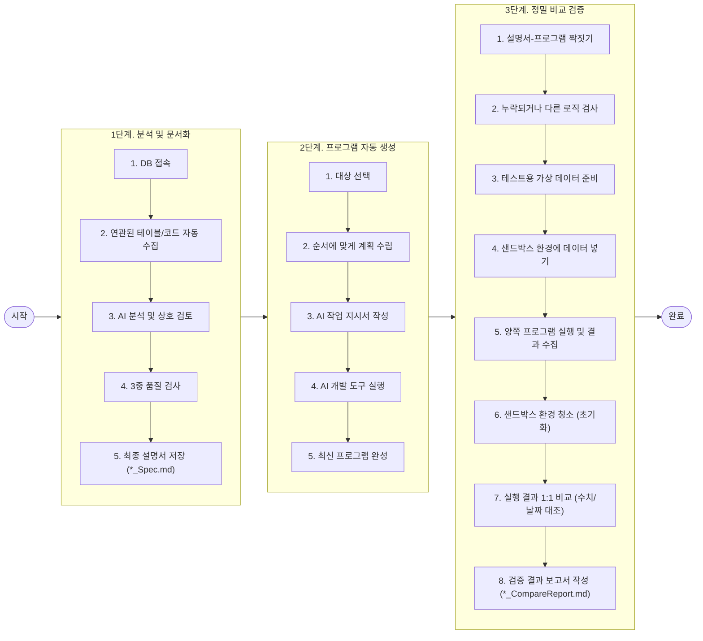

# 🗺️ ReSet (**RE**verse engineering **SET**tlement) 프로젝트 로드맵

본 문서는 기존 데이터베이스(SQL Server)에 있는 복잡한 비즈니스 로직을 분석하여, 안전하게 새로운 현대식 프로그램(C#, Java 등)으로 변환하고 그 결과가 정확한지 검증하는 **전체 마이그레이션 과정과 일정**을 안내하는 로드맵입니다.

---

## 🎯 프로젝트 최종 목표

본 프로젝트의 최종 목표는 **오래된 데이터베이스 내부 프로그램(Stored Procedure, 이하 SP)을 최신 프로그래밍 언어(C# / Java)로 안전하게 바꾸고, 바뀐 프로그램이 이전과 똑같이 정확하게 작동하는지 100% 검증하는 신뢰성 있는 파이프라인을 구축하는 것**입니다.

*   **지능적인 기존 프로그램 분석**: 복잡한 데이터베이스 코드를 AI와 검증 도구가 자동으로 분석하여 읽기 쉬운 설명서(*_Spec.md)로 만듭니다.
*   **AI 기반의 자동 프로그래밍**: 분석된 설명서를 토대로 AI 개발 도구가 새로운 최신 프로그램 코드를 자동으로 구현합니다.
*   **샌드박스 환경을 통한 완벽한 검증**: 기존 데이터베이스 프로그램과 새로 만든 최신 프로그램에 똑같은 테스트 값을 입력해 보고, 두 결과가 완벽하게 일치하는지 정밀 대조(*_CompareReport.md)하여 오류를 사전에 차단합니다.

---

## 📌 마이그레이션 전체 프로세스

도구를 통해 레거시 데이터베이스 로직을 안전하게 현대화 시스템으로 이관하기 위해 설계된 거시적 데이터 및 제어 프로세스입니다.

---

## 🗓️ 프로젝트 전체 일정

새로운 최신 시스템으로 안전하게 이전하기 위한 전체 프로젝트 수행 일정 계획입니다. 본 도구의 각 마일스톤(Milestone 1 ~ 6) 개발 및 적용 단계와 매핑되어 진행됩니다.

| 기간 | 주차 | 우리가 하는 일 | 관련 마일스톤 및 산출물 |
| :--- | :---: | :--- | :--- |
| 2026-06-09 ~ 2026-06-18 | 1~2주차 | 프로젝트 개요 정의 및 흐름 기반 로드맵/산출물 규격 설계 | 로드맵 수립 & 산출물 템플릿 정의 |
| 2026-06-19 ~ 2026-07-16 | 3~6주차 | 기존 데이터베이스 프로그램을 정밀 분석하고 AI를 통해 설명서를 작성 및 검토합니다. | **Milestone 1, 2, 3** · 분석 설명서 (`*_Spec.md`) · 중복 분석 방지용 캐시 파일 (`.sp_cache_index.json`) |
| 2026-07-17 ~ 2026-08-06 | 7~9주차 | 여러 설명서를 하나로 묶어 AI 개발도구를 통해 새로운 최신 프로그램으로 자동 구현합니다. | **Milestone 4** · 통합 전환 계획서 (`*_BatchMigrationPlan.md`) · 통합 작업 지시서 (`{JobName}_MigrationInstructions.md`) · 현대화 완료 소스코드 |
| 2026-08-07 ~ 2026-08-27 | 10~12주차 | 작성된 설명서와 실제 구현된 프로그램의 비즈니스 규칙이 서로 일치하는지 비교합니다. | **Milestone 5** · 논리 흐름 비교 보고서 (`GapReport`) |
| 2026-08-28 ~ 2026-09-24 | 13~16주차 | 샌드박스 환경에 모의 데이터를 넣어 실제 두 프로그램의 결과가 똑같은지 1:1로 비교합니다. | **Milestone 6** · 테스트용 가상 데이터 (`*_mock_data.json`) · 결과 비교 보고서 (`*_CompareReport.md`) |
| 2026-09-25 ~ 2026-11-05 | 17~22주차 | 폐쇄망으로 이전하여 테스트 DB의 실제 데이터로 검증하고 안정화 작업을 거쳐 최종 완료합니다. | 최종 검증 완료 및 이관 |

---

## 📅 단계별 마일스톤 및 핵심 과제

프로젝트가 나아가는 주요 단계별 입력 정보, 출력 결과, 그리고 품질 기준입니다.

| 마일스톤 단계 | 핵심 비즈니스 프로세스 | 사용자가 넣는 것 (Input) | 시스템이 주는 것 (Output) | 품질 보증 약속 (Quality) |
| :--- | :--- | :--- | :--- | :--- |
| **Milestone 1** | **레거시 의존성 수집 및 역공학** | 대상 데이터베이스 접속 및 분석할 프로그램 선택 | 기존 코드 구조와 프로그램 상세 내용 화면 표시 | 조회 권한이 없더라도 중단되지 않고 안전하게 다음 단계를 이어감 (**안전 조치**) |
| **Milestone 2** | **설계 명세서 신뢰성 검증** | AI가 분석한 최초 설명서 | 문법 검사 및 도표가 포함된 설명서 파일 저장 | 사람이 직접 피드백을 주어 설명서의 신뢰성을 끝까지 확보함 (**3중 검증**) |
| **Milestone 3** | **비용 통제 및 캐시 적용** | 재분석 요청 | 변경되지 않은 프로그램은 분석을 건너뛰고 빠른 화면 표시 | 이미 분석한 내용은 호출하지 않아 AI 사용 요금을 절감함 (**비용 통제**) |
| **Milestone 4** | **터미널 상속형 코드 자동 생성** | 최종 승인된 이전 계획 | AI가 자동으로 작성한 최신 언어의 프로그램 코드 | AI와 대화하며 프로그램을 즉석에서 수정 및 완성 (**단절 없는 구현**) |
| **Milestone 5** | **구현 소스코드 일치성 검토** | 자동 완성된 프로그램 코드 폴더 | 설명서와 프로그램 소스코드 간의 불일치 보고서 | 설계와 다르게 코딩된 부분이 없는지 확인 (**설계-구현 일치**) |
| **Milestone 6** | **격리 샌드박스 기반 결과 정합성 대조** | 테스트할 조건 및 데이터 | 이전 및 이후 프로그램의 실행 결과 1:1 비교 보고서 | 날짜 형식이나 소수점 차이 등 미세한 표현 오류를 걸러내고 정밀한 수치 일치 확인 (**결과 정합성**) |

---

## 🎯 마일스톤별 상세 워크플로우 설계

### 🗺️ Milestone 1: 기존 시스템 분석 및 수집 (Legacy 분석)
*   **비즈니스 목적**: 기존 데이터베이스(SQL Server)에 짜여 있는 복잡한 연관 관계와 주석, 테이블 구조를 수집하여 AI 분석을 위한 탄탄한 기초 자료를 마련합니다.
*   **상세 진행 단계**:
    1.  사용자가 안전하게 데이터베이스에 로그인합니다. (언제든지 접속 주소 수정 가능)
    2.  분석하려는 프로그램을 선택하면, 프로그램이 내부적으로 꼬리에 꼬리를 물고 엮여 있는 다른 테이블이나 코드의 구조를 알아서 추적합니다.
    3.  복잡한 형태의 동적 실행문이 숨어 있어도 알아서 스캔하여 빠짐없이 정보를 모옵니다.
    4.  코드에 적혀 있는 한글 메모(주석)까지 꼼꼼히 긁어와 업무의 맥락을 확보합니다.
    5.  혹시 보안 때문에 조회가 안 되는 특수 테이블이 있더라도, 전체 작업이 멈추지 않고 경고만 띄운 후 다음 작업을 계속 진행합니다. (소프트 페일 적용)

### 🗺️ Milestone 2: 분석 설명서의 3중 신뢰성 검증
*   **비즈니스 목적**: AI가 제멋대로 엉뚱한 문서나 오류가 있는 문서를 만들지 못하도록 시스템적으로 차단하고, 완성도 높은 마크다운 형식의 설계 설명서를 저장합니다.
*   **상세 진행 단계**:
    1.  **다중 후보군 생성**: 사용자가 `dynamic` 추론 강도를 적용하면 시스템이 병렬로 Low, Medium, High Effort를 할당한 3종의 상이한 후보 분석서를 자동 생성합니다.
    2.  **1차 기계 린팅 검사**: 각 후보의 문서 헤더 서식 및 Mermaid 다이어그램 구문에 기계적 문법 오류가 없는지 컴퓨터가 검증합니다.
    3.  **2차 AI 상호 채점 및 영역별 점진적 합성**: 설정에 의해 지정된 **Critic** 에이전트가 다차원 기준으로 세 후보의 각 파트를 정량 평가 및 채점한 후, **Consolidator** 에이전트가 각 후보의 가장 우수한 파트 조각들을 가져와 하나의 명세서로 조립하고 자연어 톤을 보완하여 단일 통합 명세서를 합성합니다. (자가 편향 극복을 위해 서로 다른 이종 모델의 앙상블 구성을 권장합니다.)
    4.  **3차 사람 최종 승인**: 최종 합성된 문서를 사용자가 화면에서 실시간으로 미리보고 피드백을 전달해 수정한 뒤, 최종 승인 시 저장 및 데이터베이스 Extended Properties 역반영을 실행합니다.

### 🗺️ Milestone 3: 변경 감지기를 통한 비용 최적화 (캐싱)
*   **비즈니스 목적**: 데이터베이스에 아무런 변화가 없는 프로그램에 대해 똑같은 AI 호출을 반복하지 않음으로써 아까운 시간과 AI 서비스 요금을 낭비하지 않도록 합니다.
*   **상세 진행 단계**:
    1.  사용자가 분석을 요청하면 대상 코드 전체를 조합해 고유한 디지털 지문(해시값)을 생성합니다.
    2.  시스템은 저장해둔 기록 파일(`.sp_cache_index.json`)을 찾아 같은 지문이 존재하고 이미 만들어둔 설명서가 있다면, AI를 호출하지 않고 1초 만에 기존 문서를 바로 보여줍니다.
    3.  **망 분리(폐쇄망) 대응**: 인터넷이 되는 개발 환경에서 비용을 아끼며 설명서 작성과 프로그램 생성을 100% 진행하고, 인터넷이 차단된 안전한 내부망 환경에서는 LLM 호출 없이 오직 실행 정합성만을 검증하도록 시스템 프로세스를 통제합니다.

### 🗺️ Milestone 4: AI와 대화하며 최신 프로그램 자동 생성 (코드 작성)
*   **비즈니스 목적**: 작성된 설계 설명서를 토대로, AI 개발도구가 끊김 없이 알아서 최신 프로그램(C#, Java 등)을 완성할 수 있도록 사용자와 AI의 연결 다리를 만듭니다.
*   **상세 진행 단계**:
    1.  사용자가 화면에서 원하는 순서대로 분석된 프로그램들을 골라 마이그레이션 계획을 세웁니다.
    2.  승인 즉시, 수립된 계획과 스키마 정보들을 담아 하나의 깔끔한 **AI 작업 지시서**(`{JobName}_MigrationInstructions.md`)로 묶어 패키징합니다.
    3.  AI 코딩 엔진(Claude Code, Codex 등)이 자동으로 켜지면서 작성해야 하는 코드를 인식합니다.
    4.  이때 AI 코딩 엔진이 작동하는 화면을 사용자의 콘솔 창에 그대로 보여주어, 사용자가 중간에 로그인 인증을 하거나 추가 요구 사항을 자연어로 답할 수 있게 대화형 환경을 제공합니다.
    5.  만약 사용자가 실행 중에 취소(`Ctrl+C`)하면 백그라운드에서 동작 중이던 AI 코딩 도구의 좀비 프로세스까지 말끔히 종료시켜 컴퓨터 메모리 낭비를 방지합니다.

### 🗺️ Milestone 5: 설명서와 완성된 프로그램의 불일치 분석 (Gap 분석)
*   **비즈니스 목적**: 마이그레이션이 완료된 새 코드가 처음에 의도했던 설명서의 규칙이나 흐름과 다르게 만들어지지 않았는지 꼼꼼하게 대조합니다.
*   **상세 진행 단계**:
    1.  시스템이 분석 설명서와 구현된 프로그램 파일들을 검색해 자동으로 서로 짝을 맞춰 비교 대상으로 올립니다.
    2.  정적 검사 도구가 소스코드의 구조가 규격에 맞게 뼈대가 잘 짜였는지 컴퓨터 언어별로 자동 검사합니다.
    3.  AI 검토관이 설명서의 업무 규칙과 실제 소스코드의 로직 분기, 데이터 가공 방식을 직접 읽어보고 다른 부분이나 보완이 필요한 위치를 보고서(`GapReport`)로 작성해 알려줍니다.

### 🗺️ Milestone 6: 샌드박스 환경 기반 실행 결과 대조 (정합성 검증)
*   **비즈니스 목적**: 실제 운영 데이터를 유출하거나 손상시키지 않는 안전한 환경에서, 옛날 프로그램과 최신 프로그램에 동일한 값을 넣어보고 결과물이 정말 100% 똑같은지 확인합니다.
*   **상세 진행 단계**:
    1.  AI가 똑똑하게 정상 작동 시나리오뿐만 아니라 오류가 날 법한 억지 조건(경계값)까지 포함한 테스트 시나리오를 설계합니다.
    2.  실제 데이터베이스 테이블 구조를 읽어 조인 관계를 분석하고, 실감 나는 테스트용 가상 데이터(Mock Data)를 생성합니다.
    3.  **샌드박스 환경 적재**: 실제 테스트 실행 직전에 가상 데이터를 안전한 테스트용 샌드박스 데이터베이스에 임시로 넣어(Seeding) 줍니다.
    4.  **동시 실행 및 결과 수집**: 옛날 데이터베이스 프로그램을 실행해 본 결과와 새로 작성한 프로그램(C# / Java)을 실행한 결과를 각각 텍스트 데이터(JSON)로 조용히 파일에 담습니다. (테스트 후 데이터베이스 상태는 원래대로 깨끗하게 원복 처리됩니다.)
    5.  **정밀 비교 대조**: 수집된 결과를 열고 건수, 데이터 항목, 세부 결과값을 1:1로 비교합니다. 이때 날짜 포맷 차이나 소수점 뒤의 미세한 오차로 인한 무의미한 에러 경고를 방지하기 위한 보정 로직을 가동하여 똑똑하게 대조 보고서(`*_CompareReport.md`)를 도출합니다.
    6.  **복구 피드백**: 검증이 실패하면 시스템이 어디서 문제가 발생했는지 파악하여 **3가지 피드백 루트(1. 설명서 고쳐서 다시 하기, 2. 프로그램 코드 버그 고치기, 3. 테스트 조건 조율)** 중 적절한 조치를 추천하는 순환 피드백 루프를 지원합니다.
