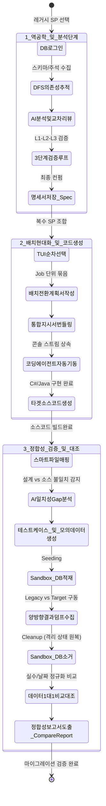

# SP Analyzer & Validator 마이그레이션 흐름 기반 로드맵 (Workflow-Oriented Roadmap)

본 문서는 SQL Server Stored Procedure 역공학(SP Analyzer)에서부터 신규 마이그레이션 타겟 소스코드 및 데이터 무결성 검증(Validator)에 이르는 **전체 비즈니스 라이프사이클 및 사용자 실행 흐름(Process Workflow)**을 기준으로 설계된 마일스톤 로드맵입니다.

---

## 📌 마이그레이션 전체 실행 흐름 (Core Modernization Journey)

도구를 통해 레거시 데이터베이스 로직을 안전하게 현대화 시스템으로 이관하기 위해 설계된 거시적 데이터 및 제어 흐름입니다.

---

## 🗓️ 프로젝트 전체 일정 (Project Schedule)

마이그레이션 라이프사이클의 흐름에 따른 전체 프로젝트 수행 일정입니다. 본 도구의 각 마일스톤(Milestone 1 ~ 6) 개발 및 적용 단계와 매핑되어 진행됩니다.

| 기간 | 주차 | 핵심 활동 및 태스크 | 관련 마일스톤 및 산출물 |
| :--- | :---: | :--- | :--- |
| 2026-06-09 ~ 2026-06-18 | 1~2주차 | 프로젝트 개요 정의 및 흐름 기반 로드맵/산출물 규격 설계 | 로드맵 수립 & 산출물 템플릿 정의 |
| 2026-06-19 ~ 2026-07-16 | 3~6주차 | 역공학 엔진(SP Analyzer) 개발 및 3단계 신뢰성 검증 파이프라인 적용 / 설계서 검토 | **Milestone 1, 2, 3** · `*_Spec.md` · `.sp_cache_index.json` |
| 2026-07-17 ~ 2026-08-06 | 7~9주차 | 통합 배치 전환 계획 수립 및 에이전트 연동 기반 타겟 배치 프로그램(C#/Java) 자동 구현 | **Milestone 4** · `*_BatchMigrationPlan.md` · `{JobName}_MigrationInstructions.md` · 현대화 소스코드 |
| 2026-08-07 ~ 2026-08-27 | 10~12주차 | 설계 명세서와 현대화 완료 소스코드 간 일치성 추적 및 AI 갭 분석(L1/L2) 검증 | **Milestone 5** · `GapReport` (정적/의미론적 일치성) |
| 2026-08-28 ~ 2026-09-24 | 13~16주차 | 격리 샌드박스 기반 모의 데이터(Mock Data) 적재 및 레거시 vs 타겟 런타임 결과 1:1 대조 검증 | **Milestone 6** · `*_mock_data.json` · `*_CompareReport.md` (1:1 데이터 대조) |
| 2026-09-25 ~ 2026-11-05 | 17~22주차 | 폐쇄망 이관 및 실데이터 기반 Legacy vs Target 런타임 결과 1:1 대조 검증 및 시스템 안정화 | 최종 검증 완료 및 이관 |

---

## 📅 실행 흐름 기준 마일스톤 (Milestones Overview)

| 마일스톤 단계 | 비즈니스 실행 흐름 | 사용자가 보게 되는 입력 및 출력 | 목표 품질 및 보장 요소 |
| :--- | :--- | :--- | :--- |
| **Milestone 1** | **레거시 의존성 수집 및 역공학 흐름** | **In**: 대상 데이터베이스 접속 및 SP 선택 **Out**: DDL 원문 및 테이블 상세 스펙 가시화 | 레거시 스펙 분석 시 권한 누락 등에 대응한 안전한 **소프트 페일(Soft Fail)** 보장 |
| **Milestone 2** | **설계 명세서 신뢰성 검증 흐름** | **In**: 1차 AI 분석 결과물 **Out**: AST 구조 통과 및 Mermaid 다이어그램 렌더링 명세 | AI 자가 수정(`Self-Correction`) 및 자연어 피드백 수렴을 통한 **설계서 무결성** 확보 |
| **Milestone 3** | **비용 통제 및 캐시 건너뛰기 흐름** | **In**: 재분석 요청 또는 다중 LLM 라우팅 **Out**: 캐시 인덱스 대조를 통한 초고속 분석 스킵 | 불필요한 AI 호출 비용 및 분석 시간을 줄이는 **비용 최적화 및 인프라 통제** |
| **Milestone 4** | **터미널 상속형 코드 자동 생성 흐름** | **In**: 최종 컨펌된 통합 배치 계획서 **Out**: 외부 코딩 에이전트 연동을 통한 자동 코딩 완료 | 다수의 명세서 묶음으로부터 단절 없는 코드 생성을 지원하는 **원클릭 현대화 파이프라인** |
| **Milestone 5** | **구현 소스코드 일치성 추적 흐름** | **In**: 마이그레이션된 C#/Java 소스코드 폴더 **Out**: 입출력/논리 구조 상의 차이점 보고서(`GapReport`) | 기획 설계서와 개발 완료된 소스코드 간의 **논리적 구현 싱크** 보장 |
| **Milestone 6** | **격리 샌드박스 기반 정합성 대조 흐름** | **In**: 테스트 케이스 및 모의 데이터 생성 **Out**: 양측 구동 데이터 1:1 대조 보고서(`CompareReport`) | 운영 데이터 보안 규정을 준수하며 실제 실행값의 **수치 정밀도 및 타입 정합성** 보증 |

---

## 🎯 흐름 단계별 상세 워크플로우 설계

### 🗺️ Milestone 1: 레거시 의존성 수집 및 역공학 흐름 (Legacy Reverse-Engineering)
*   **비즈니스 목적**: 레거시 DB에 구현된 프로시저가 참조하는 복잡한 연관 관계를 가시화하고, 주석과 테이블 데이터 구조를 정확히 맵핑하여 AI 분석을 위한 원천 정보를 확보합니다.
*   **사용자 여정 및 흐름**:
    1.  사용자가 TUI 로그인 세션을 열어 DB에 안전하게 접속합니다. (직전 연결 정보 실시간 수정 지원)
    2.  분석 대상 SP를 선택하면 프로그램 내부적으로 `sys.sql_expression_dependencies` 뷰를 DFS(깊이 우선 탐색)로 파헤쳐 연관된 뷰, 함수, 서브 프로시저의 DDL을 수집합니다.
    3.  동시에 DDL 내 동적 SQL 구문(EXEC, sp_executesql)을 텍스트 기반으로 2차 스캔 및 분석하여 감춰진 동적 참조 테이블의 스키마까지 누락 없이 강제 병합 수집합니다.
    4.  DB 확장 속성(`MS_Description`)에 숨겨진 한글 주석 메타데이터를 매핑하여 데이터 타입 이면의 비즈니스 도메인 맥락(뉘앙스)을 획득합니다.
    5.  특정 테이블 조회 권한이 없는 장애 상황이 감지되면 전체 프로세스를 중단시키지 않고 경고 목록에 쌓은 후 다음 의존성 추적으로 안전하게 우회(소프트 페일)합니다.

### 🗺️ Milestone 2: 설계 명세서 신뢰성 검증 흐름 (Specification Trust & Self-Correction)
*   **비즈니스 목적**: 생성형 AI의 일방적 답변(환각 현상 등)으로 인한 산출물 깨짐을 방지하고, 구조적 형식이 완벽하게 갖추어진 마크다운 전환 설계서를 영구 저장합니다.
*   **사용자 여정 및 흐름**:
    1.  1차 AI 리버스 엔지니어링 결과가 도출되면, `Markdig AST` 린터가 기계적으로 설계서의 규격 헤더가 올바른지 감지(Level 1)합니다.
    2.  Mermaid 다이어그램 코드가 포함된 경우 렌더러를 기동해 문법 컴파일 테스트를 거쳐 깨짐이 없는지 검사합니다. L1 실패 시 피드백 프롬프트를 조립해 AI에 자동 재질의합니다.
    3.  L1을 통과하면, AI 분석가 에이전트와 별개의 'AI 검토자 에이전트'가 가동되어 비즈니스 로직과 원 DDL 간의 결함이나 오역을 검토(Level 2)하고 한도 내에서 자가 교정 루프를 수행합니다.
    4.  자동 검증을 마치면 TUI 콘솔에 설계서 요약 미리보기가 표시되며, 사용자가 직접 자연어로 보완 요청 피드백을 전달(Level 3)하여 최종 설계서를 컨펌하고 저장합니다.

### 🗺️ Milestone 3: 비용 통제 및 캐시 건너뛰기 흐름 (Caching & LLM Routing)
*   **비즈니스 목적**: 데이터베이스 변경 사항이 없는 프로시저에 대해 불필요한 AI API 요금이 과금되는 현상을 방지하고, 즉각적으로 로컬 마크다운 설계를 복원합니다.
*   **사용자 여정 및 흐름**:
    1.  사용자가 재귀 분석을 실행하면, 대상 SP DDL 및 모든 하위 의존 객체의 DDL 원문을 직렬화하고 SHA-256 알고리즘을 거쳐 복합 해시 서명값(Signature Hash)을 생성합니다.
    2.  로컬 캐시 인덱스(`.sp_cache_index.json`)를 참조해 서명값이 동일하고 최종 산출물 파일이 디스크에 남아있다면, AI 호출 및 3단계 검증 루프 전체를 스킵(Cache Hit)하여 1초 이내에 완료 처리합니다.
    3.  **2단계 검증 전략 적용**: 외부망 환경에서 고성능 상용 AI(GPT, Claude 등)를 활용하여 SP 분석 및 소스코드 자동 생성을 100% 수행한 후, 폐쇄망 환경에서는 LLM 호출을 완전히 배제한 상태로 오직 데이터 정합성 검증만을 수행하도록 이중화(망분리) 인프라 흐름을 통제합니다.

### 🗺️ Milestone 4: 터미널 상속형 코드 자동 생성 흐름 (Automated Codegen & Interactive Bridge)
*   **비즈니스 목적**: 수립된 설계 계획서를 기반으로, 마이그레이션 소스 코드를 작성하는 외부 도구와 결합하여 단절 없는 원스톱 코드 현대화 환경을 사용자에게 제공합니다.
*   **사용자 여정 및 흐름**:
    1.  사용자가 TUI에서 개별 분석 완료된 SP들을 원하는 배치 실행 순서대로 하나씩 골라 큐에 넣고 '통합 배치 전환 계획서'를 최종 승인합니다. (물리적 선택 순서 보장 루프 작동)
    2.  계획서 승인 즉시 배치 전환 계획서, 관련 SP 명세서, 레거시 DDL 및 참고용 스키마 정보들을 하나의 구조화된 마이그레이션 지시서 파일(`{JobName}_MigrationInstructions.md`)로 빌드하여 패키징합니다.
    3.  설정된 코딩 엔진(Claude CLI 등)에 지시서의 절대 경로와 프롬프트 템플릿 인자를 바인딩하고, 자식 프로세스를 자동 구동합니다.
    4.  이때 자식 프로세스의 터미널 입출력 스트림을 부모 콘솔에 직접 바인딩(상속)하여, 외부 에이전트가 실행되면서 사용자에게 묻는 인증 승인이나 질의응답을 현재 작동 중인 터미널 세션 내에서 매끄럽게 이어가도록 지원합니다.
    5.  실행 도중 사용자가 `Ctrl+C`로 작업을 취소하면 전파되는 토큰 이벤트를 감지해 백그라운드에 구동 중인 코딩 에이전트의 좀비 프로세스 트리까지 강제 소멸(process.Kill(true))시켜 리소스 유출을 방지합니다.

### 🗺️ Milestone 5: 구현 코드와 설계 명세서 불일치 추적 흐름 (Source Code Gap Analysis)
*   **비즈니스 목적**: 현대화 마이그레이션이 끝난 소스코드 파일과 분석 단계에서 작성된 명세서의 입출력 및 세부 연산 로직이 동일하게 코딩되었는지 일치성을 추적합니다.
*   **사용자 여정 및 흐름**:
    1.  사용자가 검증기를 구동하면 설계서 파일(`*_Spec.md`)명과 마이그레이션된 소스코드 파일을 검색하고, 경로 중복이 발생할 경우 자동으로 슬라이싱 보정하여 1:1로 매핑합니다.
    2.  구문 린팅 플러그인이 C#/Java 소스코드를 정적 스캔(Level 1)하여 최소한의 클래스 및 메소드 시그니처 뼈대가 갖추어졌는지 확인합니다.
    3.  이어 AI 검토관이 소스코드의 내부 연산 분기, 데이터 변환 로직, 예외 처리 및 트랜잭션 흐름을 명세서의 상세 비즈니스와 대조(Level 2)하여 차이점과 수정 가이드를 담은 `GapReport`를 사용자 화면에 보고합니다.

### 🗺️ Milestone 6: 격리 샌드박스 기반 정합성 대조 흐름 (Isolated Sandboxing & Data Regression)
*   **비즈니스 목적**: 보안 규정상 운영 원천 데이터를 활용할 수 없는 상황에서, 가상의 데이터 적재와 실행을 안전하게 격리하고 출력 데이터셋을 1:1로 정밀 정량 대조합니다.
*   **사용자 여정 및 흐름**:
    1.  명세서의 입출력 정보를 기반으로 AI가 정상 호출 조건뿐만 아니라 경계값(Boundary), 예외/오류 유발 조건 파라미터가 조립된 테스트 케이스 JSON을 자동 기획합니다.
    2.  데이터베이스의 물리적 FK가 없더라도 JOIN절과 테이블 메타데이터를 파싱하여, 테이블 간에 조인 키 관계가 긴밀하게 엮인 고품질 모의 데이터(Mock Data)를 생성하고 캐싱합니다.
    3.  **격리 Seeding**: 검증 수명주기 서비스가 가동되어, 덤프 수집이 시작되기 직전에 가상화된 모의 데이터를 대상 샌드박스 데이터베이스에 안전하게 임시 적재(Seeding)합니다.
    4.  **런타임 결과 수집**: 외부 환경에서는 모의 데이터를 기반으로, 폐쇄망 환경에서는 실서버의 실제 데이터를 기반으로 Legacy DB SP를 실행하여 ResultSet 데이터를 수집하고, 동시에 마이그레이션 완료된 타겟 배치 프로그램(C# DLL dynamic reflection load / Java process run)을 기동해 타겟 결과 데이터를 각각 JSON으로 덤프 수집합니다. (성공 여부에 무관하게 트랜잭션 강제 롤백 적용)
    5.  **격리 Cleanup**: 데이터 덤프 수집이 끝나는 즉시 임시 적재했던 모의 데이터를 강제 소거(Truncate/Delete)하여 상태를 완벽하게 원복합니다.
    6.  **정합성 대조 및 비교**: 수집된 양측 JSON 덤프 데이터의 행 수, 컬럼 타입, 개별 값을 정밀 대조하되, 날짜/시간 표현식의 포맷 규격화 및 부동소수점 허용 오차 한계값(Epsilon) 필터링 등의 정규화 로직을 통해 미세 포맷 차이로 인한 검증 오탐을 원천 방어하며, 최종 비교 분석 보고서(`*_CompareReport.md`)를 저장합니다.
    7.  **실패 복구 피드백 루프**: 런타임 결과 정합성 대조가 실패할 경우, 원인에 따라 **3단계 피드백 흐름(1단계: AI 설계서 재생성 및 보완, 2단계: 소스코드 버그 수정 및 재생성, 3단계: 테스트 파라미터 및 경계 조건 튜닝)** 중 적합한 지점으로 피드백을 전달하여 재검증하는 점진적 복구 루프를 제공합니다. 단, 폐쇄망 환경에서는 실시간 AI 구동이 제한되므로, 정합성 검증 실패 시 생성된 JSON 에러 로그 및 덤프 데이터를 외부 개발망으로 반출하여 피드백 및 재생성 루프를 수행한 후 재반입합니다.
