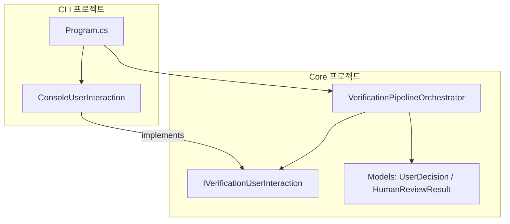

# 구현 계획서: Core와 CLI 계층 분리 및 모듈화 리팩토링

본 문서는 `ReSet` 솔루션 내의 비즈니스 로직(`ReSet.Core`)과 사용자 콘솔 인터페이스(`ReSet.Cli`) 간의 결합을 끊어내고 모듈형 아키텍처로 개선하기 위한 단계별 구현 계획을 설명합니다.

---

## 1. 아키텍처 다이어그램 및 흐름 개요

개선된 모듈형 아키텍처 구조는 다음과 같습니다:



---

## 2. 단계별 구현 계획

### [1단계] Core 공통 데이터 모델 및 인터페이스 정의
* **목표 (Goal)**: CLI와의 약속 역할을 할 데이터 모델과 상호작용 추상화 인터페이스를 `ReSet.Core` 프로젝트에 추가합니다.
* **변경 파일 (Changes)**:
  * **신규**: `src/ReSet.Core/Models/UserDecision.cs`
    ```csharp
    namespace ReSet.Core.Models
    {
        public enum UserDecision
        {
            Approve,          // 승인 및 최종 저장
            ProvideFeedback,    // 추가 보완 요청 피드백 입력
            Cancel            // 저장 없이 이탈
        }
    }
    ```
  * **신규**: `src/ReSet.Core/Models/HumanReviewResult.cs`
    ```csharp
    namespace ReSet.Core.Models
    {
        public class HumanReviewResult
        {
            public UserDecision Decision { get; set; }
            public string? UserFeedback { get; set; }
        }
    }
    ```
  * **신규**: `src/ReSet.Core/Services/IVerificationUserInteraction.cs`
    * `NotifyStatus(string message)`
    * `NotifyError(string message)`
    * `NotifyL1Errors(string selectedOption, int attempt, List<string> errors)`
    * `NotifyL2Defects(string selectedOption, int attempt, string feedbackComment)`
    * `NotifyValidationSuccess(string selectedOption)`
    * `Task<HumanReviewResult> RequestHumanReviewAsync(string selectedOption, string specificationMarkdown)`
* **검증 방법 (Verification)**:
  * Core 프로젝트 디렉터리에서 빌드를 수행하여 구문 오류가 없는지 검증합니다.
    ```bash
    dotnet build src/ReSet.Core/ReSet.Core.csproj
    ```

---

### [2단계] VerificationPipelineOrchestrator 구현
* **목표 (Goal)**: 기존 `Program.cs` 내에 산재해 있던 핵심 비즈니스 검증 파이프라인 흐름을 Core 프로젝트의 `VerificationPipelineOrchestrator` 클래스로 이전합니다. CLI TUI/배치 의존성을 제거하고, 생성자로 주입된 `IVerificationUserInteraction`을 활용하도록 수정합니다.
* **변경 파일 (Changes)**:
  * **신규**: `src/ReSet.Core/Services/VerificationPipelineOrchestrator.cs`
    * `VerificationPipelineOrchestrator` 클래스 추가 및 생성자 정의 (의존성 주입: `IDbMetadataService`, `IAiService`, `MechanicalValidator`, `IVerificationUserInteraction`)
    * `RunPipelineAsync(string connectionString, string schema, string name, int maxDepth, string provider, string instructions, bool isBatchMode)` 메서드 구현
* **검증 방법 (Verification)**:
  * Core 프로젝트의 컴파일 및 빌드 상태를 재확인합니다.
    ```bash
    dotnet build src/ReSet.Core/ReSet.Core.csproj
    ```

---

### [3단계] CLI 영역 구현체 선언 및 Program.cs 리팩토링
* **목표 (Goal)**: `ReSet.Cli` 프로젝트에 Spectre.Console을 활용한 `ConsoleUserInteraction` 구체 클래스를 선언하고, `Program.cs`에서 복잡한 파이프라인 로직을 제거한 뒤 오케스트레이터를 호출하는 구조로 개선합니다.
* **변경 파일 (Changes)**:
  * **신규**: `src/ReSet.Cli/ConsoleUserInteraction.cs`
    * `IVerificationUserInteraction` 구현
    * `Spectre.Console` 관련 출력 로직(`AnsiConsole.MarkupLine`, `AnsiConsole.Prompt` 등) 내재화
  * **수정**: `src/ReSet.Cli/Program.cs`
    * 기존의 `RunVerificationPipelineAsync` 메서드 및 비즈니스 루프 제거
    * `ConsoleUserInteraction` 및 `VerificationPipelineOrchestrator` 인스턴스 생성 및 연동
    * `SaveOutputsAsync` 호출을 통한 최종 산출물(I/O) 관리 집중화
* **검증 방법 (Verification)**:
  * Cli 프로젝트의 컴파일 및 빌드가 성공하는지 검증합니다.
    ```bash
    dotnet build src/ReSet.Cli/ReSet.Cli.csproj
    ```

---

### [4단계] NSubstitute를 활용한 단위 테스트 구축
* **목표 (Goal)**: Core와 CLI 계층이 분리되었으므로, 실제 UI 입력/출력이나 데이터베이스/AI API 호출 없이 `VerificationPipelineOrchestrator`의 핵심 제어 흐름에 대한 단위 테스트를 실행할 수 있도록 검증용 Mock 테스트를 구현합니다.
* **변경 파일 (Changes)**:
  * **신규**: `tests/ReSet.Core.Tests/VerificationPipelineOrchestratorTests.cs`
    * `NSubstitute`를 활용한 단위 테스트 케이스 구성
    * **시나리오 1**: 1차 분석 완료 후 L1/L2 자동 검증을 통과하여 바로 완료되는 경로
    * **시나리오 2**: L1 정적 검증 에러 발생 시 1차 자가 보완 루프 실행 후 성공하는 경로
    * **시나리오 3**: L2 AI 리뷰 결함 발견 시 1차 자가 보완 루프 실행 후 성공하는 경로
    * **시나리오 4**: L3 인간 승인 단계에서 'Feedback(보완)'을 선택하고 입력된 사용자 피드백을 적용하여 정상적으로 재생성 및 승인 완료되는 경로
    * **시나리오 5**: L3 인간 승인 단계에서 'Cancel(이탈)'을 선택하여 저장을 생략하고 반환되는 경로
* **검증 방법 (Verification)**:
  * 전체 테스트 프로젝트를 빌드하고 테스트 스위트를 실행하여 통과 여부를 검증합니다.
    ```bash
    dotnet test tests/ReSet.Core.Tests/ReSet.Core.Tests.csproj
    ```

---

### [5단계] 엔드투엔드(E2E) 통합 및 실행 검증
* **목표 (Goal)**: 빌드된 전체 패키지를 실행하여 대화형 TUI 모드 및 배치 모드의 정상 작동과 UI 깨짐 없음, 결과 파일 저장 유무를 확인합니다.
* **변경 파일 (Changes)**: 없음 (최종 구동 테스트)
* **검증 방법 (Verification)**:
  * **대화형 TUI 모드 구동**:
    ```bash
    dotnet run --project src/ReSet.Cli/ReSet.Cli.csproj
    ```
    * DB 로그인, SP 목록 로드, SP 선택 및 AI 명세서 생성 대기, Human Review 메뉴 화면이 Spectre.Console을 통해 올바르게 표시되고 상호작용이 되는지 확인합니다.
  * **배치 모드 구동**:
    ```bash
    dotnet run --project src/ReSet.Cli/ReSet.Cli.csproj -- --conn "Server=localhost;Database=master;..." --sp "dbo.TargetSp"
    ```
    * 대화형 메뉴 없이 백그라운드에서 기계적 검증 및 AI 교차 리뷰 후 산출물이 지정된 디렉터리에 저장되는지 검증합니다.
