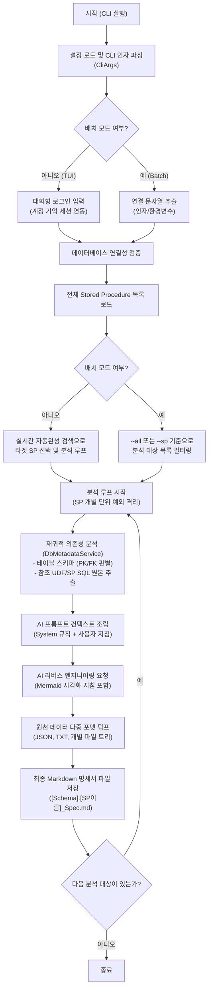

# Stored Procedure 리버스 엔지니어링 AI 에이전트 (SP Analyzer) 소개서

본 문서는 SQL Server Stored Procedure(SP)를 자율적으로 분석하고 명세화하는 **SP Analyzer 에이전트**의 역할, 특징, 그리고 상세한 실행 흐름을 설명합니다.

---

## 🤖 AI 에이전트로서의 역할 (Agent Role)

이 프로그램은 단순한 소스코드 파서나 API 래퍼를 넘어, 대상 환경(Database)과 동적으로 상호작용하고 자율적인 탐색 경로를 결정하여 최종 결과물을 도출하는 **태스크 지향적 AI 에이전트 (Task-Oriented AI Agent)**입니다.

1. **지식/환경 관측 및 수집 (Perception & Knowledge Gathering)**
   * 타겟 SP가 참조하는 외부 테이블의 구성 컬럼, 기본키(PK)/외래키(FK) 등 관계형 DB의 복잡한 스키마 메타데이터를 직접 질의하여 파악합니다.
   * 연동된 사용자 정의 함수(UDF)나 하위 프로시저의 DDL(정의문)을 실시간으로 가져와 코드 컨텍스트를 동적으로 확장합니다.
2. **자율적 참조 탐색 (Autonomous Recursive Traversal)**
   * 분석 깊이 제한 설정(`MaxDependencyDepth`) 내에서 깊이 우선 탐색(DFS) 알고리즘을 사용해 의존성 그래프를 스스로 구축합니다.
   * 순환 참조 및 중복 분석 방지 처리를 자율적으로 조율합니다.
3. **3단계 자가 검증 및 조율 (3-Stage Verification & Alignment)**
   * **L1 (기계 검사)**: 필수 섹션 누락 및 Mermaid 다이어그램 문법을 정적으로 린팅하여 오류를 잡습니다.
   * **L2 (AI 교차 리뷰)**: 검토관 역할을 지닌 AI 모델과 교차 리뷰를 수행하고 N=1회 자가 보완 재생성(`Self-Correction`)을 진행합니다.
   * **L3 (인간 승인)**: 개발자가 최종적으로 결과를 검토하여 승인(`Approve`)하거나 직접 자연어 보완 피드백(`Feedback`)을 주어 명세서를 정교하게 조율합니다.

---

## ✨ 핵심 특징 (Key Characteristics)

* **하이브리드 정보 주입 (Hybrid Knowledge Injection)**
  * 단순 SP의 쿼리 텍스트만 분석하는 AI 방식에서 탈피하여, 실제 가동 중인 데이터베이스 스키마와 참조 UDF 소스코드를 동시 주입해 분석의 무결성과 신뢰성을 극대화합니다.
* **3단계 신뢰성 검증 파이프라인 (Verification Pipeline)**
  * **Level 1 (정적 Linter)**: 정규식을 이용해 Mermaid 렌더링 문법 오류 유발 여부를 사전에 스크리닝합니다.
  * **Level 2 (교차 리뷰어)**: 수석 아키텍트 프롬프트로 리뷰어 AI를 가동하여, 1차 생성물의 누락과 비즈니스 해석 환각을 필터링하고 자가 수정합니다.
  * **Level 3 (인간 승인 피드백)**: CLI/TUI 상에서 개발자의 주도적 수정 요구 피드백을 전달할 수 있는 메뉴 기반 흐름을 지원합니다. (무인 배치 모드에서는 자동으로 생략)
* **유연한 다중 모드 지원 (Dual Execution Modes)**
  * **대화형 TUI 모드**: Spectre.Console 기반의 미려한 로그인 프롬프트, 실시간 자동완성 검색, 스피너 로딩 UI, 인간 개입형 검증 메뉴를 제공합니다.
  * **배치 및 CLI 자동화 모드**: 명령줄 아규먼트와 환경 변수를 활용해 TUI 화면을 건너뛰고 스케줄러 등을 통한 대량 무인 처리를 지원합니다.
* **오류 격리 및 소프트 페일 (Soft Fail / Fault Tolerance)**
  * 대량 일괄 분석을 수행하는 중 특정 SP 혹은 AI API 호출에서 장애가 발생하더라도, 해당 단계만 경고 로깅 후 스킵하여 전체 워크플로우가 멈추지 않는 격리 아키텍처를 가집니다.

---

## 📊 프로그램 실행 흐름 (Visual Execution Flow)

아래 다이어그램은 SP Analyzer 프로그램이 기동되어 설정 파싱, 데이터베이스 메타데이터 재귀 수집, AI 분석 및 3단계 파이프라인 검증을 거쳐 결과물이 최종 저장되기까지의 전체 자율 실행 흐름을 시각적으로 나타냅니다.

---

## 📈 활용 분야 및 기대 효과

* **레거시 시스템 마이그레이션**: 오랜 기간 정비되지 않은 대규모 레거시 Stored Procedure의 비즈니스 로직을 빠르게 문서화하고 도식화합니다.
* **신입 개발자 온보딩**: 복잡한 데이터베이스 의존 관계를 AI 에이전트가 탐색하여 다이어그램과 함께 구조적으로 해설하므로 개발 지식 전파 비용을 대폭 낮춥니다.
* **CI/CD 파이프라인 자동화**: 주기적으로 배치 모드를 실행하여 데이터베이스 스키마와 프로시저 변경 이력을 명세서로 자동 추적하고 변경 감지 리포트를 산출할 수 있습니다.
